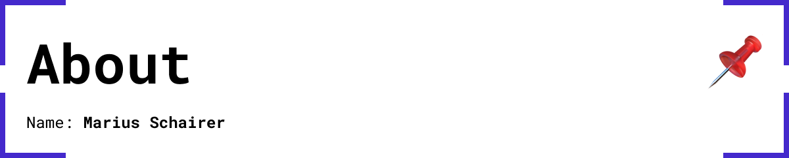

# About Mar~~iu~~s

I am currently starting a journey through the MDEF program. You can follow me here and I will share my thoughts and experiences. 
My path has led from a technical school to an Internet of Things (IoT) degree program, where I mainly designed Projects that were sustainable and socially driven, to a master degree program focused in the field of research, knowledge sharing and communities, in Barcelona. I am new to the open source field which I am extremely excited about. I hope to learn methods to tackle any problem.

<iframe src="https://www.google.com/maps/embed?pb=!1m34!1m12!1m3!1d168185.27869113037!2d9.328949003725342!3d48.8029829753773!2m3!1f0!2f0!3f0!3m2!1i1024!2i768!4f13.1!4m19!3e2!4m5!1s0x4799db34c1ad8fd3%3A0x79d5c11c7791cfe4!2sStuttgart%2C%20Germany!3m2!1d48.7758459!2d9.1829321!4m5!1s0x4799c8aee152840b%3A0x4c4f056db689e927!2sWaiblingen%2C%20Germany!3m2!1d48.8293519!2d9.318573899999999!4m5!1s0x4799080b4400e09d%3A0x41ffd3c8d096fd0!2zU2Nod8OkYmlzY2ggR23DvG5kLCBHZXJtYW55!3m2!1d48.7994019!2d9.8045704!5e0!3m2!1sen!2ses!4v1699304700250!5m2!1sen!2ses" width="100%" height="500" style="border:0;" allowfullscreen="" loading="lazy" referrerpolicy="no-referrer-when-downgrade"></iframe>

**[my Portfolio website](https://www.mariusschairer.com/)**

<iframe style="border-radius:12px" src="https://open.spotify.com/embed/playlist/6hfl8Ws2zd0xMwQdGiF8dG?utm_source=generator&theme=0" width="100%" height="352" frameBorder="0" allowfullscreen="" allow="autoplay; clipboard-write; encrypted-media; fullscreen; picture-in-picture" loading="lazy"></iframe>