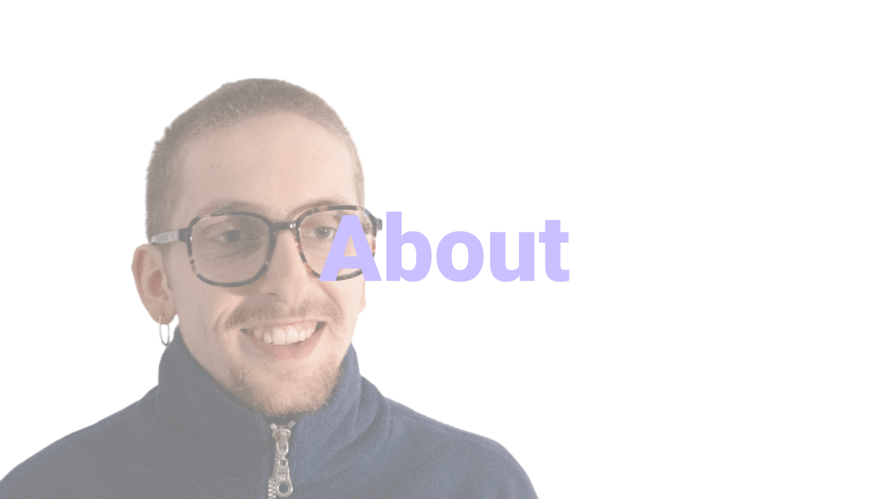
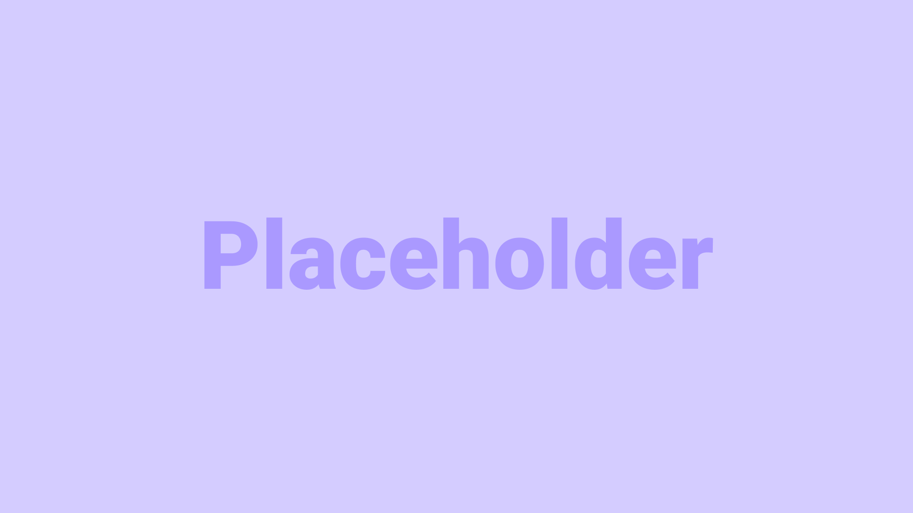

`currently changing the structure of the Landing Page`
# Welcome to my MDEF Documentation
This website is a documentation of reflections and developments from the personal perspective of one individual belonging to the group of the MDEF 2023-2025 study program, which deals with collaboration, community building and sustainable development.

    

    
    <h2 style="color: #181040; position: absolute">About Me</h2>
    </img>
    

    Where I come from and who I am
    <a style="color: rgb(88, 28, 167); font-weight: bold;" href="https://marius-schairer.github.io/MDEF_Documentation/about/me/">see more</a>
    

    

## Term 1

    

    
    <h2 style="color: #181040">Landing</h2>
    </img>
    

    The first week at IaaC. 
    <a style="color: rgb(88, 28, 167); font-weight: bold;" href="https://marius-schairer.github.io/MDEF_Documentation/term1/Landing/landing/">see more</a>
    

    

    

    
    <h2 style="color: #181040">Documenting Design</h2>
    </img>
    

    How to Document Design
    <a style="color: rgb(88, 28, 167); font-weight: bold;" href="https://marius-schairer.github.io/MDEF_Documentation/">see more</a>
    

    

    

    
    <h2 style="color: #181040">Roles of Prototyping</h2>
    </img>
    

    4 different prototyping approaches
    <a style="color: rgb(88, 28, 167); font-weight: bold;" href="https://marius-schairer.github.io/MDEF_Documentation/term1/Design/DesignStudio01/">see more</a>
    

    

    

    
    <h2 style="color: #181040">Atlas of Week Signals</h2>
    </img>
    

    My personal design space 
    <a style="color: rgb(88, 28, 167); font-weight: bold;" href="https://marius-schairer.github.io/MDEF_Documentation/term1/Design/AtlasofWeakSignals/">see more</a>
    

    

    

    
    <h2 style="color: #181040">The Machine Paradox</h2>
    </img>
    

    A group prototyping work 
    <a style="color: rgb(88, 28, 167); font-weight: bold;" href="https://marius-schairer.github.io/MDEF_Documentation/term1/Design/MachineParadox/md">see more</a>
    

    

    

    
    <h2 style="color: #181040">Collective Design Space</h2>
    </img>
    

    A first group intervention about undergounds air pollution
    <a style="color: rgb(88, 28, 167); font-weight: bold;" href="https://marius-schairer.github.io/MDEF_Documentation/term1/Design/CollectiveDesignSpace/">see more</a>
    

    

    

    
    <h2 style="color: #181040">Living With Your Own Ideas</h2>
    </img>
    

    My experiment from the first-person perspective
    <a style="color: rgb(88, 28, 167); font-weight: bold;" href="https://marius-schairer.github.io/MDEF_Documentation/term1/Design/LwYoI/">see more</a>
    

    

    

    
    <h2 style="color: #181040">Bio Zero</h2>
    </img>
    

    First experiments in Microbiology
    <a style="color: rgb(88, 28, 167); font-weight: bold;" href="https://marius-schairer.github.io/MDEF_Documentation/term1/Design/LwYoI/">see more</a>
    

    

    

    
    <h2 style="color: #181040">Agri Zero</h2>
    </img>
    

    Agriculture and Valldaura Field Trip
    <a style="color: rgb(88, 28, 167); font-weight: bold;" href="https://marius-schairer.github.io/MDEF_Documentation/term1/Design/LwYoI/">see more</a>
    

    

    

    
    <h2 style="color: #181040">GMO</h2>
    </img>
    

    First research about a Genetic Modified Organism
    <a style="color: rgb(88, 28, 167); font-weight: bold;" href="https://marius-schairer.github.io/MDEF_Documentation/term1/Design/LwYoI/">see more</a>
    

    

