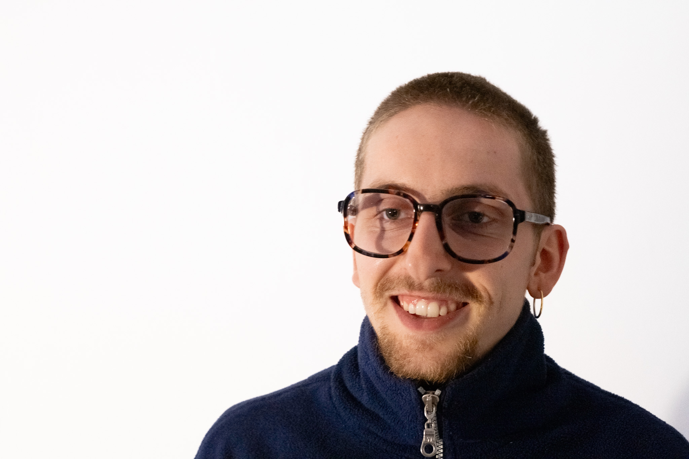

## Welcome to my MDEF Documentation

I'm Marius

I am currently starting a journey through the MDEF program. You can follow me here and I will share my thoughts and experiences. 
My path has led from a technical school to an Internet of Things (IoT) degree program, where I mainly designed Projects that were sustainable and socially driven, to a master degree program focused in the field of research, knowledge sharing and communities, in Barcelona. I am new to the open source field which I am extremely excited about. I hope to learn methods to tackle any problem regardless of location or medium, to be able to push projects wherever help is needed and where my future path will take me.
