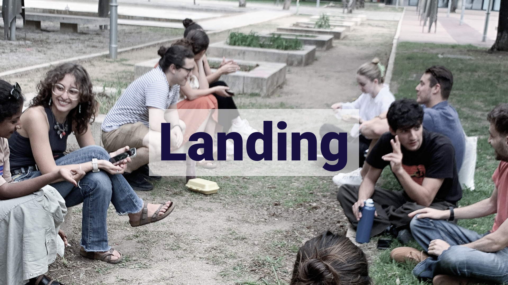
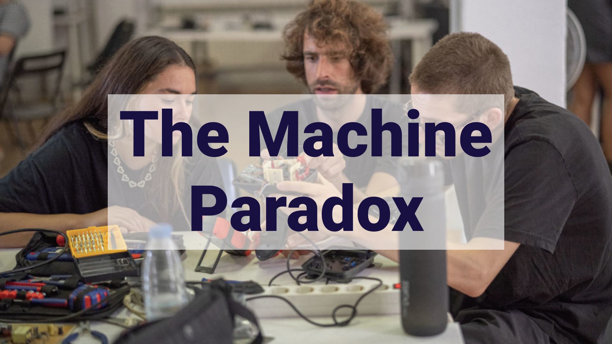

# Welcome to my MDEF Documentation

    <a style="box-shadow: 5px 5px 0px 0px #181040; display: flex; flex-direction: row; align-items: flex-start; width: 100%; height: 100%; object-fit: cover; background-color: #CABFFF" href="https://marius-schairer.github.io/MDEF_Documentation/about/me/">
        

            </img>
        

        

        This website is a documentation of reflections and developments from my personal perspective of the MDEF 2023-2025 study program, which deals with collaboration, community building and sustainable development. See more about me on this page.
        

    </a>

## Design Studio

    <a style="box-shadow: 5px 5px 0px 0px #181040; display: flex; flex-direction: column; align-items: flex-start; width: 48%; height: 100%; object-fit: cover; background-color: #CABFFF" href="https://marius-schairer.github.io/MDEF_Documentation/term1/Design/RolesofPrototyping/">
    

    </img>
    

    </a>
    <a style="box-shadow: 5px 5px 0px 0px #181040; display: flex; flex-direction: column; align-items: flex-start; width: 48%; height: 100%; object-fit: cover; background-color: #CABFFF" href="https://marius-schairer.github.io/MDEF_Documentation/term1/Design/CollectiveDesignSpace/">
    

    </img>
    

    </a>
    <a style="box-shadow: 5px 5px 0px 0px #181040; display: flex; flex-direction: column; align-items: flex-start; width: 48%; height: 100%; object-fit: cover; background-color: #CABFFF" href="https://marius-schairer.github.io/MDEF_Documentation/term1/Design/Narratives/">
    

    </img>
    

    </a>
    <a style="box-shadow: 5px 5px 0px 0px #181040; display: flex; flex-direction: column; align-items: flex-start; width: 48%; height: 100%; object-fit: cover; background-color: #CABFFF" href="https://marius-schairer.github.io/MDEF_Documentation/term1/Design/CollectiveIntervention/">
    

    </img>
    

    </a>

## Reflections
### Term 1

    <a style="box-shadow: 5px 5px 0px 0px #181040; display: flex; flex-direction: column; align-items: flex-start; width: 48%; height: 100%; object-fit: cover; background-color: #CABFFF" href="https://marius-schairer.github.io/MDEF_Documentation/term1/Landing/landing/">
    

        </img>
    

    </a>
    <a style="box-shadow: 5px 5px 0px 0px #181040; display: flex; flex-direction: column; align-items: flex-start; width: 48%; height: 100%; object-fit: cover; background-color: #CABFFF" href="https://marius-schairer.github.io/MDEF_Documentation/">
    

    </img>
    

    </a>
    <a style="box-shadow: 5px 5px 0px 0px #181040; display: flex; flex-direction: column; align-items: flex-start; width: 48%; height: 100%; object-fit: cover; background-color: #CABFFF" href="https://marius-schairer.github.io/MDEF_Documentation/term1/Design/AtlasofWeakSignals/">
    

    </img>
    

    </a>
    <a style="box-shadow: 5px 5px 0px 0px #181040; display: flex; flex-direction: column; align-items: flex-start; width: 48%; height: 100%; object-fit: cover; background-color: #CABFFF" href="https://marius-schairer.github.io/MDEF_Documentation/term1/Design/MachineParadox/md">
    

    </img>
    

    </a>
    <a style="box-shadow: 5px 5px 0px 0px #181040; display: flex; flex-direction: column; align-items: flex-start; width: 48%; height: 100%; object-fit: cover; background-color: #CABFFF" href="https://marius-schairer.github.io/MDEF_Documentation/term1/Design/LwYoI/">
    

    </img>
    

    </a>
    <a style="box-shadow: 5px 5px 0px 0px #181040; display: flex; flex-direction: column; align-items: flex-start; width: 48%; height: 100%; object-fit: cover; background-color: #CABFFF"  href="https://marius-schairer.github.io/MDEF_Documentation/term1/Design/BioZero/">
    

    </img>
    

    </a>
    <a style="box-shadow: 5px 5px 0px 0px #181040; display: flex; flex-direction: column; align-items: flex-start; width: 48%; height: 100%; object-fit: cover; background-color: #CABFFF" href="https://marius-schairer.github.io/MDEF_Documentation/term1/Design/AgriZero/">
    

    </img>
    

    </a>
    <a style="box-shadow: 5px 5px 0px 0px #181040; display: flex; flex-direction: column; align-items: flex-start; width: 48%; height: 100%; object-fit: cover; background-color: #CABFFF" href="https://marius-schairer.github.io/MDEF_Documentation/term1/Design/GMO/">
    

    </img>
    

    </a>
    <a style="box-shadow: 5px 5px 0px 0px #181040; display: flex; flex-direction: column; align-items: flex-start; width: 48%; height: 100%; object-fit: cover; background-color: #CABFFF" href="https://marius-schairer.github.io/MDEF_Documentation/term1/Design/DesignWithOthers">
    

    </img>
    

    </a>
    <a style="box-shadow: 5px 5px 0px 0px #181040; display: flex; flex-direction: column; align-items: flex-start; width: 48%; height: 100%; object-fit: cover; background-color: #CABFFF" href="https://marius-schairer.github.io/MDEF_Documentation/term1/Design/ExtendedIntelligences">
    

    </img>
    

    </a>

