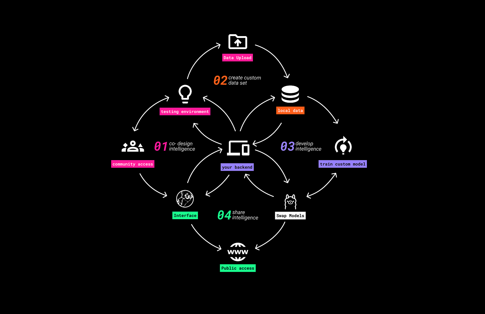

# WELCOME TO MY PORTFOLIO

    <a class="content-tile large" href="thesis_project/">
        
        

        
Thesis Project/CGAI

        <h4>Collaborative AI Frameworks</h4>
        
#collaboration #communitygovernedintelligences #develpmet #ai #interactiondesign #dataownership

        

    </a>
    <a class="content-tile" href="about/me/">
        
        
About Me/

        <h4>Mars</h4>
        
#community #technology #ai #education #development

    </a>

## --------

# Year 2 

    <a class="content-tile" href="year2/Emerging_Economies/">
        
        
Emerging Economies/ Session 1-5

        <h4>Economies</h4>
        
#regenerative #distributed

    </a>
    <a class="content-tile" href="year2/Co-CreatingPublicSpaces/">
        
        
Co-Creating Public Spaces/

        <h4>Co-Creating</h4>
        
#architecture #observation

    </a>
    <a class="content-tile" href="year2/InteractionPrototyping/">
        
        
Interaction & Prototyping/

        <h4>LLUM 2025</h4>
        
#interactiondesign #ai #development

    </a>

## --------

# Year 1

## Design Studio

    <a class="content-tile" href="term1/Design/RolesofPrototyping/">
        
        
Design Studio/Roles of Prototyping

        <h4>Roles of Prototyping</h4>
        
#

    </a>
    <a class="content-tile" href="term1/Design/CollectiveDesignSpace/">
        
        <h4>Collective Design Space</h4>
        
#

    </a>
    <a class="content-tile" href="term1/Design/Narratives/">
        
        <h4>Narratives</h4>
        
#

    </a>
    <a class="content-tile" href="term1/Design/CollectiveIntervention/">
        
        <h4>Collective Intervention</h4>
        
#

    </a>
    <a class="content-tile" href="term2/DesignStudio02/Dialogues/">
        
        <h4>Design Dialogues</h4>
        
#

    </a>
    <a class="content-tile" href="term2/DesignStudio02/Intervention01/">
        
        <h4>Intervention 01</h4>
        
#

    </a>
    <a class="content-tile" href="term2/DesignStudio02/Intervention02/">
        
        <h4>Intervention 02</h4>
        
#

    </a>
    <a class="content-tile" href="term2/DesignStudio02/Intervention03/">
        
        <h4>Intervention 03</h4>
        
#

    </a>
    <a class="content-tile" href="term3/DesignStudio03/intervention1/">
        
        <h4>Connect with Community's</h4>
    </a>
    <a class="content-tile" href="term3/DesignStudio03/intervention2/">
        
        <h4>Workshops</h4>
        
#

    </a>

## Reflections

    <a class="content-tile" href="term2/ResearchTrip/">
        
        <h4>Research Trip</h4>
        
#

    </a>
    <a class="content-tile" href="term3/LAIAProject/">
        
        <h4>LAIA Project</h4>
        
#

    </a>
    <a class="content-tile" href="term1/Design/RolesofPrototyping/">
        
        <h4>Roles of Prototyping</h4>
        
#

    </a>
    <a class="content-tile" href="term1/Design/CollectiveDesignSpace/">
        
        <h4>Collective Design Space</h4>
        
#

    </a>
    <a class="content-tile" href="term1/Design/Narratives/">
        
        <h4>Narratives</h4>
        
#

    </a>
    <a class="content-tile" href="term1/Design/CollectiveIntervention/">
        
        <h4>Collective Intervention</h4>
        
#

    </a>
    <a class="content-tile" href="term1/Reflections/DocumentingDesign/">
        
        <h4>Documenting Design</h4>
        
#

    </a>
    <a class="content-tile" href="term1/Reflections/AtlasofWeakSignals/">
        
        <h4>Atlas of Weak Signals</h4>
        
#

    </a>
    <a class="content-tile" href="term1/Reflections/MachineParadox/md">
        
        <h4>Machine Paradox</h4>
        
#

    </a>
    <a class="content-tile" href="term1/Reflections/LwYoI/">
        
        <h4>Learning with Your Own Intelligence</h4>
        
#

    </a>
    <a class="content-tile" href="term1/Reflections/BioZero/">
        
        <h4>Bio Zero</h4>
        
#

    </a>
    <a class="content-tile" href="term1/Reflections/AgriZero/">
        
        <h4>Agri Zero</h4>
        
#

    </a>
    <a class="content-tile" href="term1/Reflections/GMO/">
        
        <h4>GMO</h4>
        
#

    </a>
    <a class="content-tile" href="term1/Reflections/DesignWithOthers">
        
        <h4>Design With Others</h4>
        
#

    </a>
    <a class="content-tile" href="term1/Reflections/ExtendedIntelligences/">
        
        <h4>Extended Intelligences</h4>
        
#

    </a>
    <a class="content-tile" href="term1/Landing/landing/">
        
        <h4>Landing</h4>
        
#

    </a>
    <a class="content-tile" href="term1/Reflections/DocumentingDesign/">
        
        <h4>Documenting Design</h4>
        
#

    </a>

## --------

# Hosted by Fablab

    <a class="content-tile" href="year2/BioChrome/">
        
        <h4>Biochromes</h4>
    </a>
    <a class="content-tile" href="year2/Soft-Robotics/">
        
        <h4>Soft Robotics</h4>
    </a>
    <a class="content-tile" href="year2/Fabacademy/electronics/">
        
        <h4>Electronics</h4>
    </a>
    <a class="content-tile" href="term1/Reflections/MachineParadox/">
        
        <h4>Machine Paradox</h4>
    </a>

