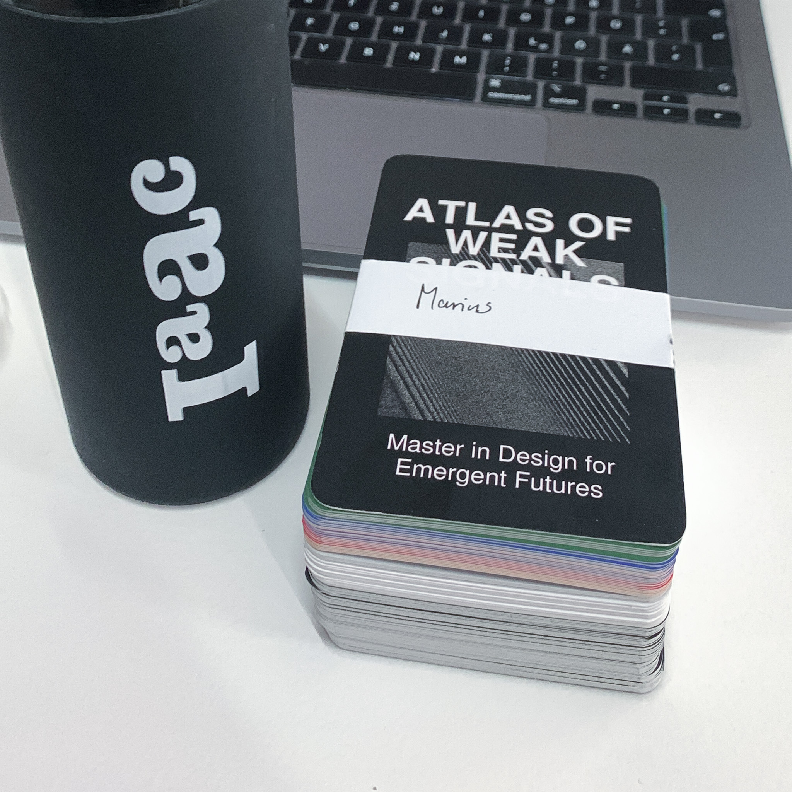
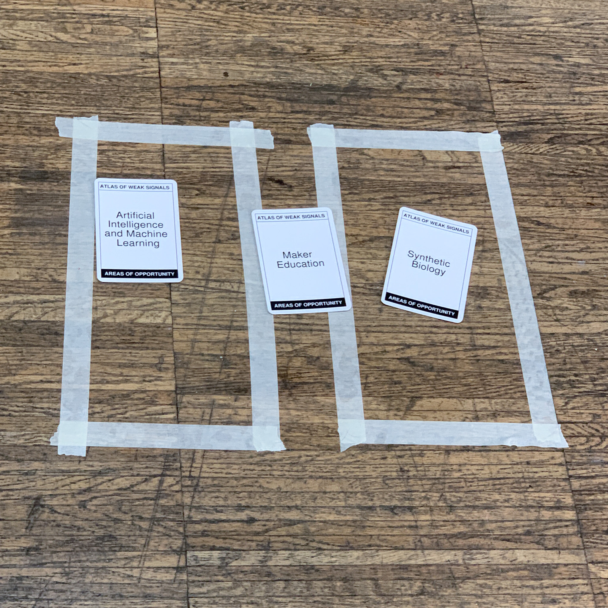
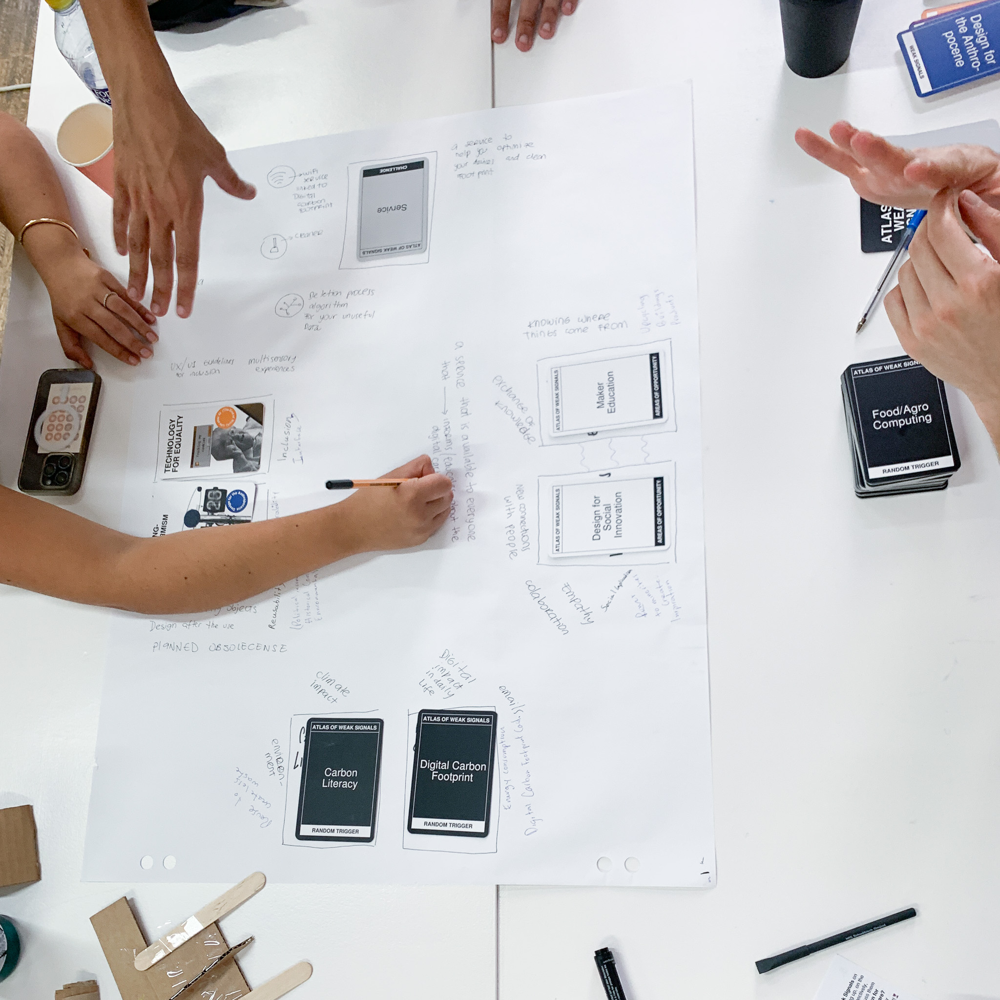
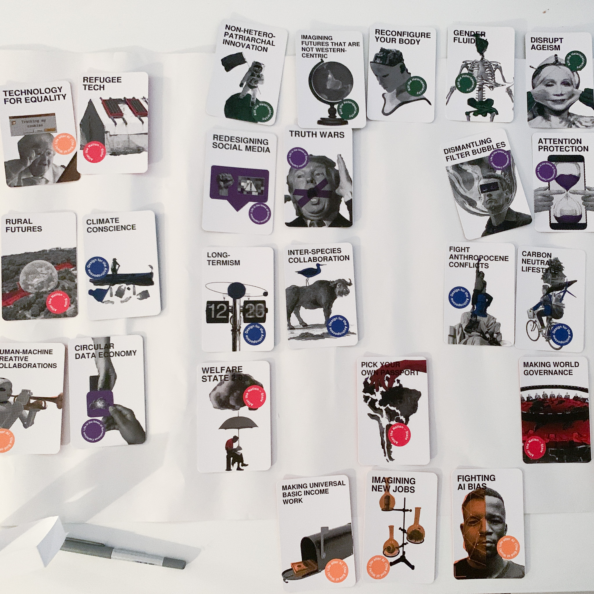
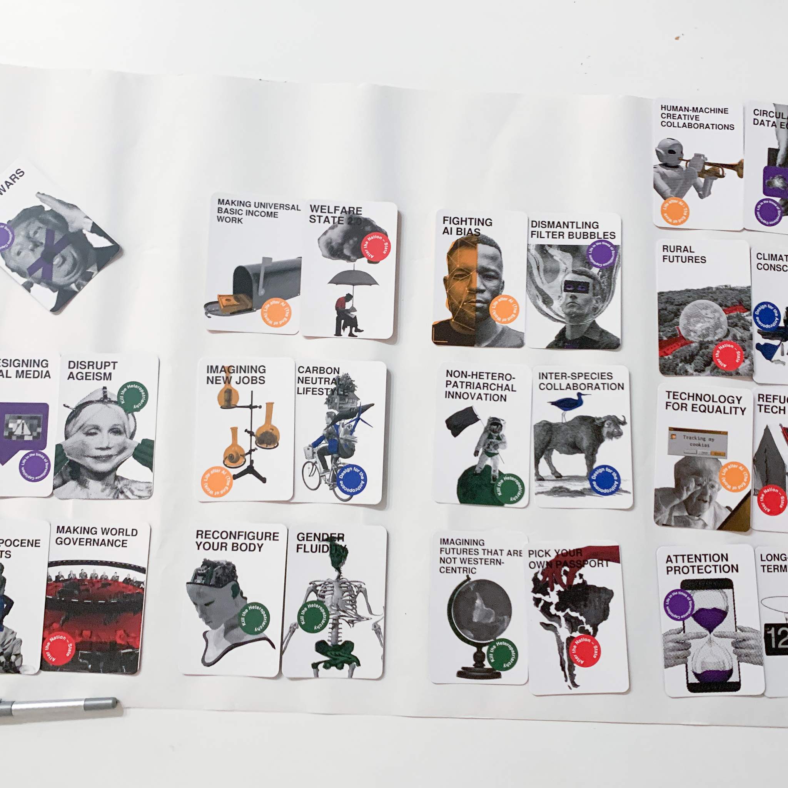
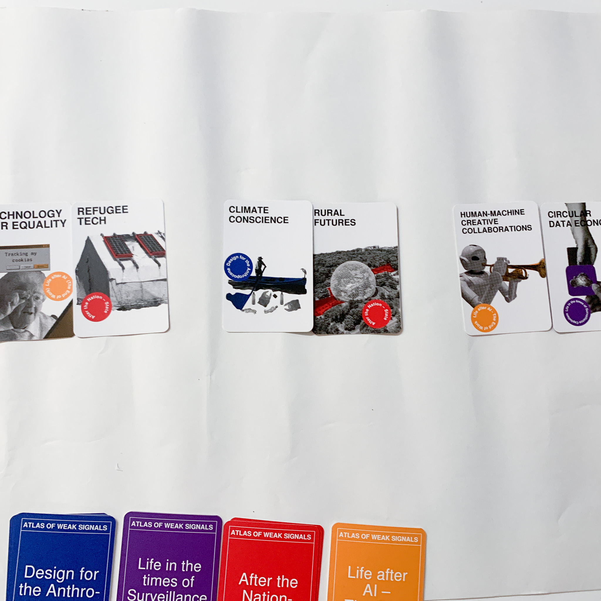
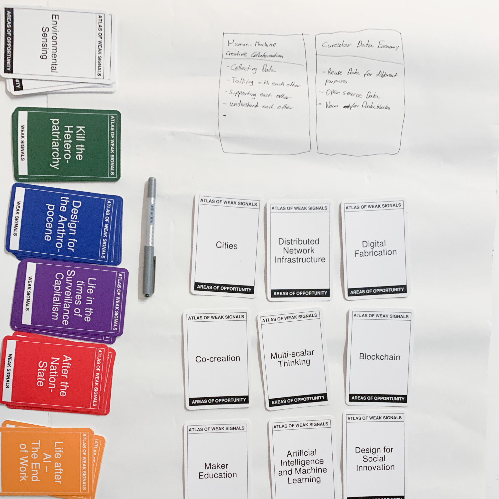
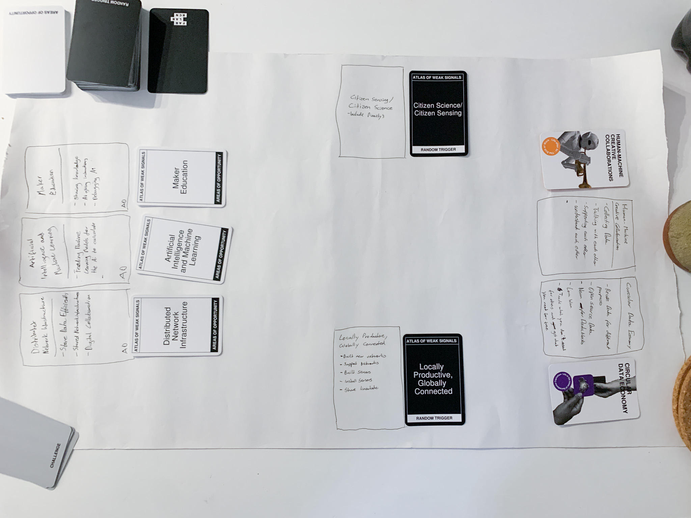
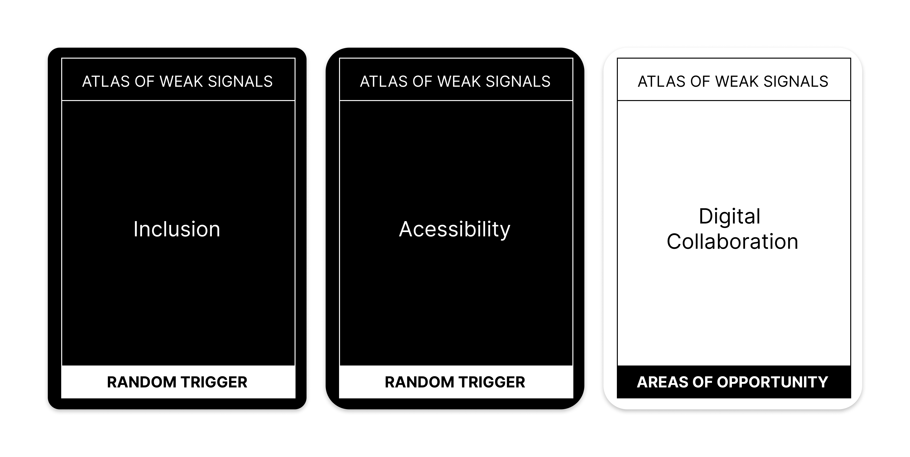

---
hide:
    - toc
---

## Atlas of Weak Signals

In the first design class, after an initial explanation of how to use the atlas of weak signals to work out future research areas, we were given our own deck of cards.

#01 Collective Excercice

In the Big Round, to be honest, I didn't understand and contribute too much, both acoustically and thematically. Nevertheless, it helped me to understand the approach of the methodology.

After that, we tested the method again in the group and had a successful brainstorming round and drew cards that were much better for me thematically. I was therefore very excited to put together my own atlas and to find the right cards and topics for me.

#02 Personal AoWS

As a first step, I looked through all the cards and formed pairs that resulted in interesting themes for me, which I then sorted out and found 3 favorite pairs. the decision to choose a final pair was not really easy for me, because I found all the themes very interesting. 

#03 Additions

In addition to the existing cards, i have considered one opportunity area and two random triggers that i have personally encountered in the past and that are very important to me. One is the topic of digital collaboration, which came about at the time of the pandemic and required pure remote collaboration and has proven to be a new opportunity area for many technologies. the other is the topic of inclusion and accessibility. Both of these could actually be opportunity areas as well, but I have classified them as random triggers because I think they should actually be considered in all opportunity areas. The separation of the "similar" topics is also consciously chosen because inclusion is often quickly labeled as an accessibility topic, but actually also includes cultural inclusion, linguistic inclusion, gender inclusion and much more. actually, these topics are included in the areas of equality and anti-heteropatriarchy, but in my opinion were not directly visible among the proposed topics.

#04 Multiscalar Personal Design Space

I have merged my personal AoWS with my previous personal experience and toolset to create a multi scalar design space. I collected first references and projects that match my interests and the chosen topic area and put methods, courses, weak signals, infrastructures and possible intervention areas into context from my point of view. 

#05 the "Final" Design Space

#06 Reflection on AoWS

