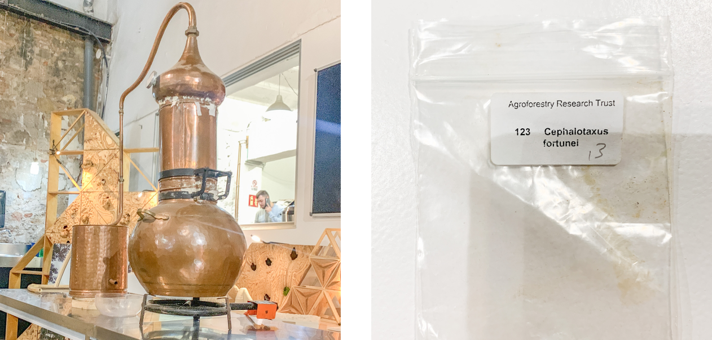

# Testing page for further changes

`testing a hover effect`

`

    Hover over me.

    I am shown when someone hovers over the img above.

`

    Hover over me.</img>
    I am shown when someone hovers over the img above.</img>

