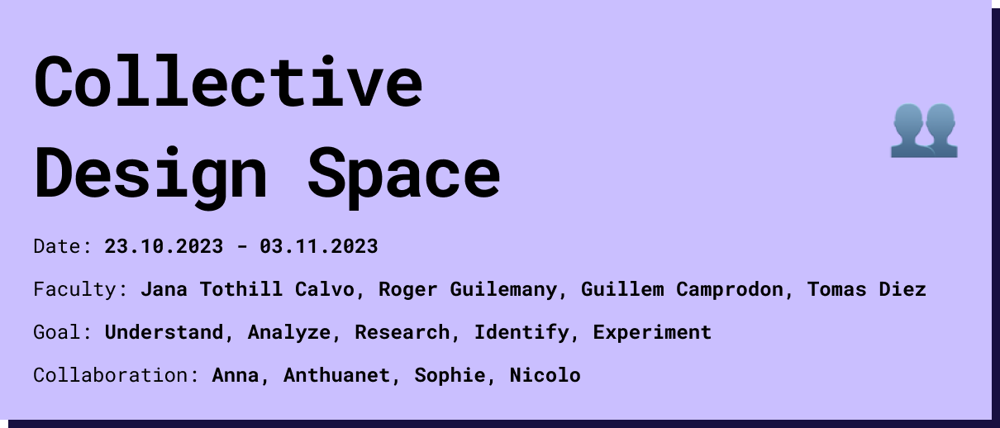

# Areas of Intervention in a Multiscalar Design Space

## Collective Design Space
Unfortunately, I couldn't take part in the class activity because I was ill, but afterwards I had the opportunity to take a look at the completed collective designspace. i was able to find some points that I also have in my personal design space. I was also able to get to know some of the groups and project ideas that emerged, but I was happy to be able to create a new space with the other people who were missing, which suited us all better. Overall, the exercise still helped me to understand in which areas my classmates have skills and/or are interested. 

## Shared Design Space

To get us on the same page as a group, we first exchanged ideas verbally on the roof of iaac, which meant that at first glance we didn't have too much in common. Nevertheless, we decided to work together and not attach ourselves to a completed team. In order to bring our design spaces together independently of the class, we started by introducing our individual design spaces to each other and put all the cards on the table that were included in the card deck. We immediately noticed connections when several people used the same card to explain something or when topics were close and connections were made. 

## Intervention
For our intervention, we have chosen a scenario area that connects many areas and therefore us. Our interest in non-human intelligence, environmental sensing and inter-species collaboration led us to underground public transportation. The underground is interesting from the perspective of shared space with other people, but also with bacteria, noise, stress, leisure, education and more. People from every imaginable background travel by public transport and are therefore automatically confronted with the circumstances associated with it. We had many different ideas to encourage interaction between people or to address issues in this collaborative space. but in the end, because of our other interests in low tech and environmental sensing, we decided to use an air quality sensor and take some measurements. We found some studies on air quality in london and newyork tramways and heard about the health consequences. So we wanted to take huge steps right away and visualize the data we were measuring to trigger interpersonal interaction and address an issue that many people don't know about. how sustainable is our sustainable mode of transport in the end for our bodies? But we quickly realized that for the first intervention we had to limit our idea and maybe start by testing the values before visualizing them, which is what we ended up doing.

<iframe width="100%" height="500" src="https://www.youtube.com/embed/Ne5-GCfkPns?si=X3s68XgcQwe1-W4G" title="YouTube video player" frameborder="0" allow="accelerometer; autoplay; clipboard-write; encrypted-media; gyroscope; picture-in-picture; web-share" allowfullscreen></iframe>

## Personal Design Space

<iframe width="100%" height="500" src="https://miro.com/app/live-embed/uXjVNci-3Ac=/?moveToViewport=11345,2400,1969,1007&embedId=28723828594" frameborder="0" scrolling="no" allow="fullscreen; clipboard-read; clipboard-write" allowfullscreen></iframe>
