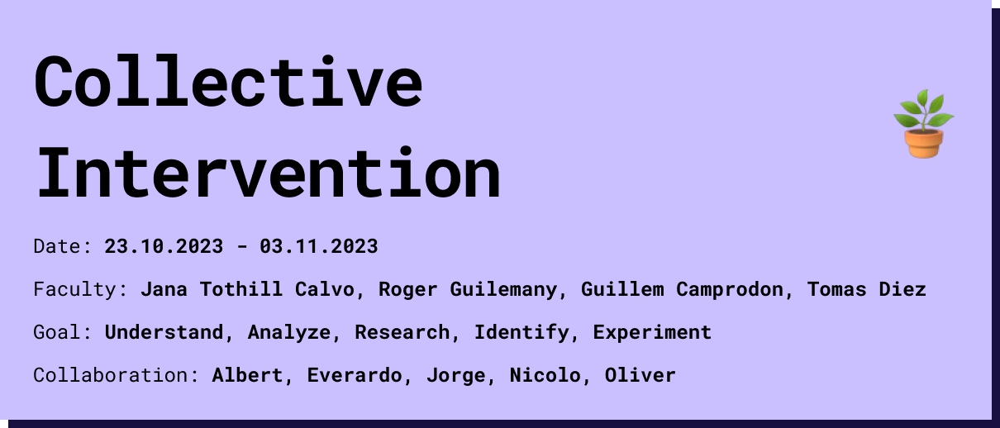

# Reflection
During these two weeks, we formed new groups and carried out another intervention in the field of plant computing. For me personally, the influence of the previous weeks in the field of interspecies collaboration and non-human intelligences made it interesting to try to understand how these organisms work and whether it is possible to communicate with them without making genetic modifications. During the research, I realized how many approaches there are that are not comprehensible and that I was motivated by the direction of education and starter kits to simplify complexity and motivate more people to experiment. The intervention also opened up many new questions to me in the field of plant computing and non-human intelligences. How can we understand not only human-induced signals but also noise? and How do different organisms communicate with each other? 

<iframe width="100%" height="400px" src="https://www.youtube.com/embed/v7DfLnNG7B8?si=34pE_OTaQWWSfACo" title="YouTube video player" frameborder="0" allow="accelerometer; autoplay; clipboard-write; encrypted-media; gyroscope; picture-in-picture; web-share" allowfullscreen></iframe>