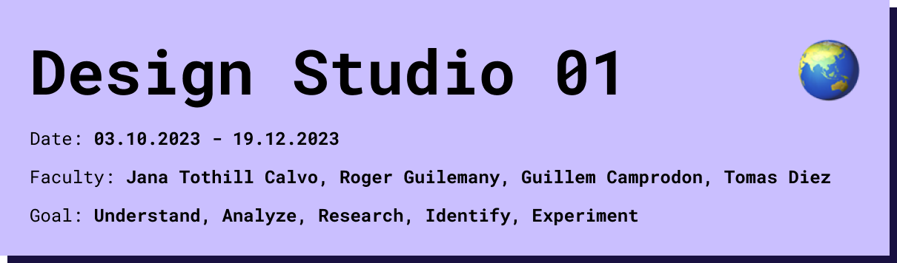

## Main Roles of Prototyping
Reflecting on my past experiences, I've come to recognize the significance of the different roles that prototypes can play in the creative process. I used most of the prototyping roles already in my previous work but not that conciously and some of them only conceptual and with a small amount of people.

Role 1:The prototype as an experimental component 
selftest
This role is mainly used to check assumptions in order to test the application. I would use this role mainly to test a concept or idea, but at a later stage of the project process. It is often the easiest and fastest way to prototype, but of course does not take into account other people's opinions, which can be used, but is not the only approach. Especially in a project discovery phase, this method can limit the research space and design space.
Most of the people I have worked with in the past have used this prototyping approach. This is also what I learned at my university.
for example, I used it to test an app with clickdummy prototypes or for small proof of concepts in the form of an Arduino prototype. 

Role 2: The prototype as a means of inquiry
I sometimes used it in the form of a questionnaire at the beginning of the project.  Most of the time, however, we already knew what we wanted here and approached the questionnaire in a certain way. 
The real approach is not knowing the end goal.
To ask and receive questions.
Example: I did a research project on sustainable food for 4 months. The goal was to develop an idea and a low-fi prototype. We were really inexperienced in this field and we opened one topic after another and ended up where we didn't expect it before. Of course, also because the theme was very extensive for 4 months. I think this role takes time. It is also important to analyze everything considering the circumstances and the environment.

Role 3: The prototype as a reasearch archetype
As a tool to express a problem/topic.
Give information and trigger thinking
I know it mostly from exhibitions.
Example: Exhibition Amsterdam a room with cameras which is tracking faces and interpreting peoples connection. Let people question privacy and monitoring

Role 4: The process of prototyping as a vehicle for inquiry
This Role of Prototyping is usefull to answer questions by making. 
Example: i explored in one semester with planting system, and tested  multiple ways to make home growing food more efficient but we also got tips from experts which lead us in a specific direction.

## Group exercice

We did a little exercise in our group to better understand the roles of prototyping. We talked about past projects and classified them into the different roles. We noticed that in many projects we saw several roles of prototyping and we unconsciously used them simultaneously or distributed in the design process. Then we built a quick alternative prototype for a different person in the group. I built a porototype for Jorghe. he had a project for an alternative lint roller that worked like a razor and therefore had almost no wear parts. We put his project in role 1, because he tested it himself. I made a test kit to analyze the intuition of different users as well as the approach to different fabrics. This prototype is type role 4, because you don't know where the result will lead you and you approach the users with a question.

## My Extended Workspace

As a further exercise, everyone created their own personal extended workspace. My workspace is divided into 2 sides, on the one hand collaborative possibilities with my network and things I can do at home alone. I have mainly worked on my laptop and designed digital products, but I have also gained some experience in 3d printing when I needed a case for an arduino prototype. Most of the things on the collaborative side are possibilities I have little or no experience in and hopefully will learn more about soon. The visualization shows me pretty clearly how much knowledge there is in collaboration with the people around me and in which fields I can learn a lot.