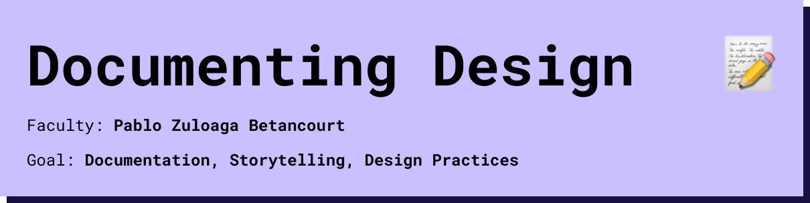
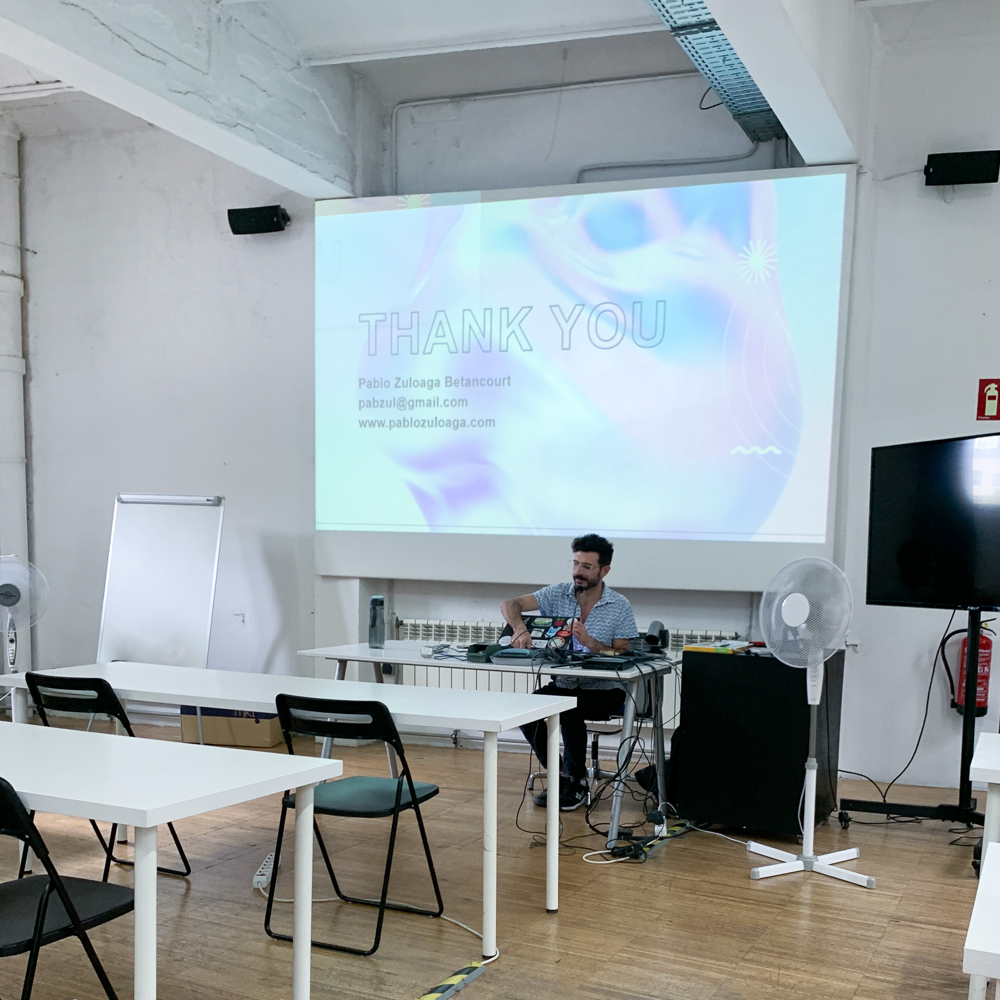

# Documenting Design

## Session 1

In the first lesson of Documenting Design we learned about how to Document a Research Project. The Documentations I wrote for previous Projects were mostly created in the last weeks of the Project looking back to what happened and only showing only the Highlights and what was usefull for the end result. So this lesson changed my perspective to document and show everything to create a clear picture about the path of thoughts. Also to document failures so other people won't fail at the same point and can understand decitions better, makes sense to me. 

## Session 1
In the second session we looked at all the websites of the mdef class together and pablo commented on what works well and what can be improved. The session inspired me to change a few things on my website and apply them there too. 