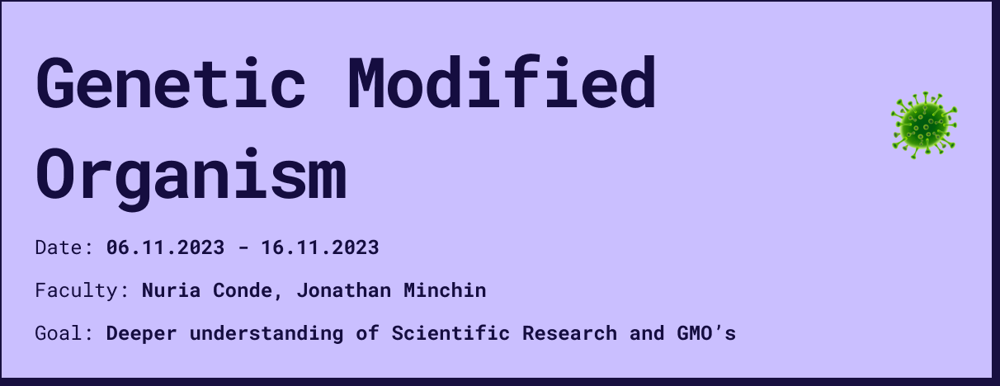
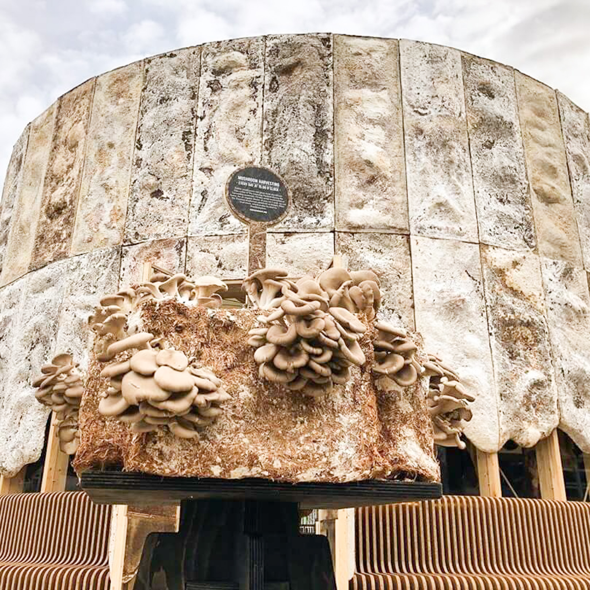

# Reflection
The topic of microorganisms and non-human intelligences has generally become a topic of great interest to me over the last few weeks. Especially I find the cooperation between nature and technology and different intelligences very interesting. However, the topic of genetic modifications has raised some ethical questions that I am not yet able to answer. I still don't know what I think about the intervening of natural evolution, as it has many advantages but also many risks. The last few weeks and the exercise of designing a GMO has triggered me to think about it and in my opinion it should be covered in education as the technology is already present and evolving and we as humanity will soon have to make collaborative and global decisions about it. 

## 1. What is a GMO ?
A genetically modified organism (GMO) is an organism whose genetic material has been altered using genetic engineering techniques. This is often done to introduce a desirable trait from one organism into another, such as making a plant resistant to pests or a crop more nutritious. GMOs can be plants, animals, or microorganisms, and they are used in various fields including agriculture, medicine, and research.

GMOs are primarily used in agriculture for various purposes, including:

**Resistance to Insect Damage**: GMO crops are developed to be resistant to insect damage, allowing farmers to apply fewer spray pesticides to protect the crops, thus reducing the environmental impact of pesticide use.

**Tolerance to Herbicides**: GMO crops that are tolerant to herbicides help farmers control weeds without damaging the crops. This reduces the need for tillage, which helps maintain soil health and lower fuel and labor use.

**Resistance to Plant Viruses**: GMO crops, such as the Rainbow papaya, have been developed to be resistant to specific plant viruses, thereby preventing crop loss due to viral infections.

**Improving Yields and Nutritional Quality**: GMO technologies offer more rapid crop improvement and novel genetic strategies for crop improvement, addressing the challenge of improving yields and nutritional quality to meet the growing demand for food in a sustainable way.

**Feed for Animals**: Most GMO crops are used in food for animals like cows, chickens, and fish, contributing to the production of feed ingredients used in food.

**Reduced Need for Pesticides** : Genetic engineering in agriculture has led to reduced costs for food production, reduced need for pesticides, and enhanced nutritional content in some crops.

## 2. How can we sustainably maintain clean cities with "natural" organisms?

### 2.1. How can we improve air quality in the urban underground using absorbing microorganisms? 

#### 2.1.1. Problem
Studies have shown that in the urban underground rail systems of many large cities there are increased levels of particulate matter, which we also tested in our last intervention in the design studio. These increased levels lead to poor air quality and increase the risk of asthma and cancer for daily passengers.

#### 2.1.2. Research on Absorbing Bad Air Quality

While there is research on using plants to improve air quality, such as in indoor environments, there is limited information specifically on using fungi, moss, or other organisms to absorb bad air quality in underground spaces. However, there is ongoing research on the use of plants and microorganisms to improve air quality in various settings, which could provide valuable insights.

<a style="color: rgb(88, 28, 167); font-weight: bold;" href="https://www.nbcnews.com/id/wbna21313185">Plant genes modified to fight air polution</a>

<a style="color: rgb(88, 28, 167); font-weight: bold;" href="https://new.nsf.gov/news/genetic-modification-poplar-trees-saves-air">Genetic modification of poplar trees saves air quality</a>

<a style="color: rgb(88, 28, 167); font-weight: bold;" href="https://www.isaaa.org/kc/cropbiotechupdate/article/default.asp?ID=19876">Genetic modified Houseplant Pothos to reduce Indoor Air Pollution</a>

#### 2.1.3. Considerations
Creating an organism to absorb bad air quality in underground spaces would involve identifying or engineering an organism with the ability to effectively absorb pollutants and thrive in underground conditions. This could potentially involve genetic modification to enhance the organism's natural abilities or introduce new ones. Additionally, considerations such as the organism's impact on the surrounding environment and its ability to survive and reproduce in underground conditions need to be addressed.

#### 2.1.4. How would it be possible ?

**Mushroom-Filled Wall Tiles**: A design student at Brunel University in London has developed honeycomb tiles made from mycelium, the part of mushrooms that grows underground. These tiles, called Myco-Hex, are designed to absorb harmful hydrocarbon air pollution caused by traffic emissions and burning fossil fuels. The mycelium-fused fungi in the tiles safely absorbs hydrocarbons, helping to create cleaner air in towns and cities.
<a style="color: rgb(88, 28, 167); font-weight: bold;" href="https://www.imnovation-hub.com/construction/solution-air-pollution/?_adin=11551547647">see more</a>

**Reishi Mushroom Extract**: Research has shown that reishi mushroom extract can prevent the transmigration of particulate matter into the bloodstream, ultimately preventing oxidative stress caused by pollution exposure. This suggests the potential for using mushroom extracts to protect the body against damage caused by air pollution.
<a style="color: rgb(88, 28, 167); font-weight: bold;" href="https://learnyourland.com/reishi-mushroom-protects-against-damage-caused-by-air-pollution/">see more</a>

**Mycelium-Based Building Materials**: The Growing Pavilion, a building in the Netherlands, is made from mycelium, the roots of mushrooms. As it grows, it helps to clean the air. Mycelium-based building materials are being used to create environmentally-friendly structures that contribute to air purification.
<a style="color: rgb(88, 28, 167); font-weight: bold;" href="https://www.livekindly.com/building-mushroom-clean-air/">see more</a>

#### 2.1.5. Conclusion
The genetic modification of plants for air quality improvement involves the introduction of specific genes responsible for enhancing the plant's ability to capture and process air pollutants. In the case of the Neo P1 houseplant, the plant was genetically engineered to produce cytochrome P450 2E1 (2E1), a key enzyme in mammals that helps clear toxins from the body. This enzyme is involved in breaking down volatile organic compounds (VOCs) such as formaldehyde, benzene, and chloroform, which are common indoor air pollutants.

The specific gene responsible for encoding the cytochrome P450 2E1 enzyme was introduced into the pothos plant, enabling it to produce this enzyme and enhance its air purification capabilities. The genetic modification process likely involved the use of synthetic biology, metabolism engineering, and directed evolution of the root microbiome to achieve the desired air purification traits in the plant.
Regarding the potential for transferring this snippet of DNA responsible for air purification from plants to mushrooms, the search results did not provide specific information on this topic. However, the transfer of specific genes or genetic elements from one organism to another, including from plants to fungi, is a concept within the realm of genetic engineering and biotechnology. The process of transferring genetic material between different organisms, known as transgenesis, has been a fundamental technique in genetic modification and biotechnology.
The search results did not provide specific information on the genetic mechanisms responsible for how mushrooms absorb pollution. However, the potential for genetically modifying mushrooms or mycelium for air quality improvement would likely involve identifying and introducing specific genes or genetic elements responsible for enhancing the organism's ability to capture and process air pollutants. This process would require in-depth understanding of the genetic and biochemical mechanisms involved in pollutant absorption and metabolism in mushrooms or mycelium.
In summary, the genetic modification of plants for air quality improvement involves the introduction of specific genes responsible for enhancing the plant's air purification capabilities. The potential for transferring these genetic traits to mushrooms or mycelium would involve the transfer of specific genes or genetic elements related to pollutant absorption and metabolism, requiring a comprehensive understanding of the genetic mechanisms involved in air quality improvement in fungi.
Certain types of mushrooms and mycelium are adaptable to urban environments, including underground settings, and have the potential to contribute to air quality improvement. Their ability to grow without natural light and their capacity to absorb pollutants from the air make them promising candidates for environmental applications in urban and subterranean contexts.

however, during my research i realized that both fungi and plants already have the ability to improve the air and that genetic modification can only enhance this function to clean the air faster, but this does not offer the organism any new function. Furthermore, there is already some proof that it works. that's why i tackled a second question, because the bacteria and pollutants are not only in the air but can also be found on streets and walls.

### 2.2. How can a natural alternative to chlorine help us clean the streets of big cities?

#### 2.2.1. Problem
The most commonly used cleaning method in Barcelona involves the use of chlor-based cleaning agents sprayed on the streets at night. The impact of this method on the environment and human health is a concern. Chlor-based cleaning agents can have negative effects on the environment, including harming aquatic life and disrupting ecosystems. Additionally, exposure to chlor-based cleaning agents can pose health risks to humans, such as respiratory irritation and other health issues.

#### 2.2.2. Alternative Organisms for Street Cleaning
When considering alternative organisms or bacteria to clean the streets, it's important to focus on those that can absorb harmful bacteria without negatively impacting other species or the environment. Some potential options include using bacteria or organisms that have the ability to absorb harmful bacteria found in urban environments. These organisms could be applied in cleaning detergents or used to create an antibacterial layer on the streets. However, it's crucial to ensure that these alternative organisms do not harm beneficial species and ecosystems in the city.

#### 2.2.3. Considerations
There are various research projects and initiatives exploring the use of genetically modified organisms (GMOs) for different purposes, including environmental remediation and public health. However, it's essential to consider the ethical implications and potential consequences of using GMOs in urban environments. Ethical questions that need to be addressed include the potential impact on biodiversity, unintended ecological consequences, and public acceptance of GMOs in urban settings. Additionally, it's important to conduct thorough risk assessments and engage in transparent communication with the public regarding the use of GMOs in city cleaning initiatives.

#### 2.2.4. How would it be possible ?
I have not found any existing research specific to this problem, but I have come up with three Opportunity areas that I have researched more deeply. 

The first option would be to stick with the method and try to treat bacteria daily but with some kind of natural cleaning agent.

**Baking Soda**: Baking soda is an excellent cleaner and deodorizer that can be used for various cleaning purposes, including removing clogs and softening water.

**White Vinegar**: Due to its high acidity, white vinegar can reduce surface bacteria, making it a safe alternative to bleach.

**Essential Oils**: Certain essential oils, such as lemon, have antibacterial properties and can be used as natural disinfectants.

**Unscented Soap**: Biodegradable unscented soap can be used as a natural cleaning solution for a variety of surfaces.

However, this option requires a lot of work and the alternative cleaning agents found do not seem to be cheap or better for our human health. 

The second option would be to collect the bacteria and break them down into a kind of compost.

**Bioremediation Microorganisms**: Certain naturally occurring microorganisms have the ability to break down and consume pollutants, including hydrocarbons and other contaminants found on urban streets. These microorganisms could be harnessed for their bioremediation capabilities to help clean and restore urban environments.

**Mycelium**: Mycelium, the vegetative part of a fungus, has been explored for its potential in bioremediation and environmental cleanup. It has been used to absorb and digest a variety of pollutants, including hydrocarbons and heavy metals, and could potentially be applied to urban street cleaning as a self-recovering organism.

**Algae**: Algae have been studied for their ability to absorb pollutants and contaminants from various environments. Certain species of algae have been shown to effectively remove heavy metals and other pollutants from water, and their potential for urban street cleaning could be further explored.

With this option, the compost could even be further utilized to generate energy or promote plant growth for food production.

The third option would be to apply a kind of permanent film, which would make the daily worry about bacteria redundant. 

**Microbial Biofilms**: Certain types of microbial biofilms, composed of diverse microorganisms, have been found to thrive in urban environments and exhibit self-recovering properties. These biofilms can form invisible layers on surfaces and have the ability to adapt to varying environmental conditions, including dry heat and wet seasons.

**Endophytic Bacteria and Fungi**: Endophytic bacteria and fungi, which reside within plant tissues, have been studied for their potential in environmental remediation and could potentially be harnessed for street cleaning. These organisms are often invisible and can adapt to different environmental conditions, making them potential candidates for self-recovering street cleaning solutions.

**Biodegradable Polymers**: While not organisms in the traditional sense, certain biodegradable polymers have been designed to mimic the self-recovering properties of living organisms. These polymers can be engineered to withstand dry heat and wet conditions while providing a sustainable and invisible solution for street cleaning.

This Opportunity Area also offers the greatest potential for a GMO, as different disinfecting species of organisms could be crossed to get the best result, which is harmless to both humans and other important species in the urban environment, but at the same time absorbs harmful bacteria. with the right optimization, this film could possibly also be applied to the first question of air pollution and thus solve the overarching question "How can we sustainably maintain clean cities with "natural" organisms?".  

#### 2.2.5. Conclusion
In conclusion, the use of alternative organisms or bacteria, including GMOs, for cleaning urban environments such as Barcelona requires careful consideration of environmental impact, human health, and ethical implications. It's essential to conduct thorough research, risk assessments, and public engagement to ensure the responsible and sustainable implementation of such initiatives.