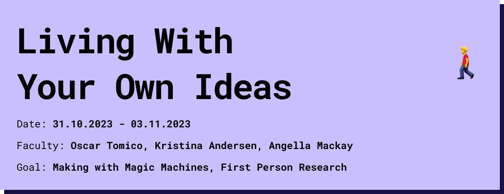

# Living with Your Own Ideas

## First Person Perspective
In short, the first person perspective is to involve yourself in a design space and actively experience it in order to shape it. You become part of the community that develops the idea and design not for others but with others. Everything that surrounds you can and will influence your project. The first person perspective makes it possible to think by testing and experiencing. 

## Magic Machines

### what you had to do

For the first workshop, led by Kristina Andersen, we brought junk from home that could be used for prototyping to build a Low Fi prototype of a Companion. An object that accompanies us in everyday life but is not specifically adapted to us. To get started quickly with a prototype, we chose one of the 16 basic human desires. 

### What did it end up being, and what materials did you use ?

For my prototype I used a pencil, foam rubber wooden sticks and an old hairdryer to build a food spinner that can be modularly limited but can also randomly decide on a meal to cook or buy.

### What were you Thinking ?
The first thought that came to my mind on the subject of "need of food" was to randomly try new things. At the same time, it struck me how many decisions you can make about food when you try to break it down to its basic building blocks. and that you'll add more and more building blocks to bring in more randomness, but at the same time you'll control the randomness again. 

### Why does it matter ?
When using the magic machine, I realized that I had limited myself through the modularity and categorization. With the basic ingredients I chose, I still came up with dishes I already knew, which in retrospect is logical because I wrote down the categories while I was thinking about different dishes I knew. So the prototype was too controlled and couldn't give me new cooking ideas or create more variety. 

## 1PP Research - Embodying your ideas
I put myself in the Ai area for a day and tried to solve everything with ai. I only used ai to do the research, so I couldn't watch a video tutorial on youtube made by a human. I only followed the ai instructions.  

### What happens when you involve yourself ? 
involving myself in the topic helped me to understand where i stand in the topic, what assumptions and prejudices i have and how much i still don't know. I already knew about chat Gpt and Perplexity ai, so I started researching straight away. I come from a UI/UX background, so I already knew a bit about what was possible, but I hadn't tried it myself yet. I immediately tried to take giant steps and **test** the ai without knowing which and how to use the tools. This naturally influenced the experiment, which meant that I was only able to detach myself from it late on and start from 0.

### What happens when you use yourself as an instrument ?
Using myself as an instrument has helped me to change my perception of the subject. I suddenly saw the ai much more as a kind of companion who now accompanies me permanently and tries to understand how the au "feels" the ai, how it tastes, how it sounds, how it thinks and how it looks. It has inspired me and triggered my imagination, giving me initial ideas on how to abstract it. Accepting that I am now actively working with the ai on a permanent basis and seeing her as a companion has raised new questions for me and shown me that with my initial approach I actually only wanted to take from the ai and facilitate my work without giving anything back, which is quite atypical for a well-functioning cycle. What if I helped the ai and did tasks for it so that it could develop and we could ultimately develop together? what if there was an ai concept in which not just a few super-smart developers defined how the ai should develop, how it should think and what its limits are? What if there was a distributed citizen-participatory ai development ?

### Did anything change about the way of working ?
Because I worked alone and the experiment had no specific goal other than to put myself in the subject, I was not restricted in my thinking and could follow every thought no matter how long it took or how crazy it was. I learned to come to terms with my own abilities and to understand that assumptions in an idea can be quickly disproved in active experience. 

### What does it mean for your future work ?
In my future work i will mainly use the method to start a new project and gain a quick and deep understanding. So far, I have tended to tackle huge topics such as sustainable nutrition or inclusion in mobility, which always required external expert knowledge. In retrospect, the first-person perspective would have helped me to find a direction more quickly and to generate knowledge in order to then approach the right experts that I need for my project and to avoid unnecessary questions or to discover things that an expert might overlook due to their long experience. Of course, I wouldn't put all my faith in one way of thinking and no longer believe in experts, but I will use it in a hybrid format to be able to change my perspective in a project. Another possible application would be to use the first person perspective to help other people change their perspective, for example in a workshop format.

### After seeing the videos of your design space collective, how does it change your understanding of it, present new opportunities or inspire new possibilities for collaboration ?

Seeing the experiments of others helped me to understand how simple a setup can be and that I often approach things far too complicated. Thematically, I was able to recognize myself in many areas. on the one hand, of course, with people who also played with perception and made themselves intensely dependent on one thing, but on the other hand also people who tackled topics that I also address in my designspace.