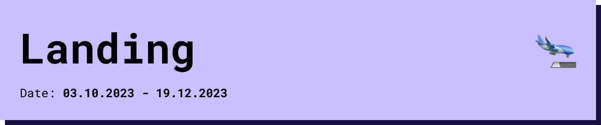

# Landing Week

## Kick Off
The Kick of was a great summary of what we will do in the studies of MDEF and for me personally also a confirmation that it is how I understood from reading the booklet and Website and that it will be exciting.

## Walk around

We did a walk around at Poblenou and visited some open community Hubs. It really helped to get some examples about what happens in the district of Poblenou and faculty of MDEF.

## Building Website

To Document all of our Work,Experiences and Progress we had to Setup a Git Repository with a Website to share information. I learned some coding basics in my previous studies but it still took me a while to setup the Website.

## Mini Fab Lab

## Directors research agenda 

### Elisava
