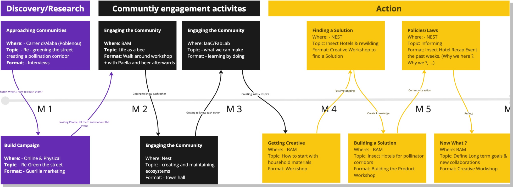

# Reflection
This week has answered some questions that have accumulated over the previous weeks. What is possible ? how can you become a part ? And how does a community project really work? In order to design concepts with others, you first have to understand how other projects have worked. The week felt like a kikoff for the rest of the year, as it was the first time you really got into action and did a community engagement intervention. At the same time, the workshops and the theme we ultimately chose for our intervention reminded me on my awareness of my surroundings.

## Design alone -> Design with others
Tuesday - Soil, Wednesday - Land, Thursday - Connect, Friday - Intervene

A discourse about why we should design with others. 

This week explored different spaces, where people come together in diverse and 
different fields. With the aspects of collaborative design in mind we discovered the layers of community driven spaces, like a shared community house called “La Borda” and took part in various workshops focused on community engagement. SOIL and LAND were two 
paradox concepts that we were introduced to as well. 

Soil as nature’s own community, where plants, insects, and microorganisms exist and live together. A living system. Land as a vast natural playground where a mix of human -made systems and nature takes place. 

While listening to some presentations in the workshops, questions like: “Why we should re-consider our roles while designing?” and “How do we approach designing in complex and entangled contexts?” were trigger questions or ideas that we explored throughout the week. 

The module “Designing for Others” was led by Adria and Markel from Holon. Holon is a non profit cooperative “helping many organizations become the new normal through design”. It is based in Cooperlis, Barcelona. 

### Friction

</img>
</img>
</img>

As mentioned before we examined the concepts both of SOIL and LAND, to see how we 
could design within the communities dependent on both. We explored our role in these complex systems. As an one hour exercise in the beginning of the module we explored our surroundings (500 meters) in the neighborhood of Sants and analyzed it to find friction points to document. These points were triggers that showed tension and conflict. 

I concentrated on three themes that were very visual for me in my immediate surroundings: Trash, Reuse and decomposition. “A cycle of life” -> Trash hiding in between green spots, nature blooming around and in a community garden next to 
a construction site. And simple reusing techniques around the area. As using old plastic in efficient different ways or letting other materials decay. It was a living system of paradoxes within itself. After finding our personal friction points we split into groups based on the direction of thematically findings.

Within our group, our primary emphasis revolved around the deterioration of soil and land in urban areas. The recurring pattern of construction followed by environmental neglect deeply resonated with us, prompting an inquiry into its correlation with political cycles and its implications for the well-being of the community.

### La Borda

Together with Adria we visited La Borda, a cooperative housing complex in Barcelona. 
La Borda is a social housing project, where you can share the space collaboratively. It began 2012 where a group of neighbors decided to self-organize collectively to go up against the housing crisis in Barcelona. La Borda is constructed modular, so individuality is given, with almost zero energy consumption and the structure of six floors made solely out of CLT. 

This was particularly interesting for me to think about communal living models, the realization and maintenance of such living systems and their potential in expanding the idea of alternative housing concepts to go up against the housing crisis we all are facing. 

## Group Intervention

<iframe width="100%" height="400px" src="https://www.youtube.com/embed/FUPg-zJ5T0o?si=tG1KQdK2MLHoE8iA" title="YouTube video player" frameborder="0" allow="accelerometer; autoplay; clipboard-write; encrypted-media; gyroscope; picture-in-picture; web-share" allowfullscreen></iframe>

Our group was dedicated to the revitalization and repurposing of our neighborhood through regreening efforts. After exploring various concepts, we decided to create a workshop series aimed at transforming streets and connecting two parks or greenspaces. The overarching goal is to create more habitats for bees and other insects, thereby enhancing the greenery of our streets.

The workshop series kicks off with an engaging gathering activity and a neighborhood walk, adopting a bee workshop approach to foster connections and brainstorm directions. These workshops are carefully designed to inspire and involve people's creativity in constructing insect housing while collaboratively discovering innovative solutions. To raise awareness for the event, we've also developed an initial campaign to inform and engage the neighborhood.

