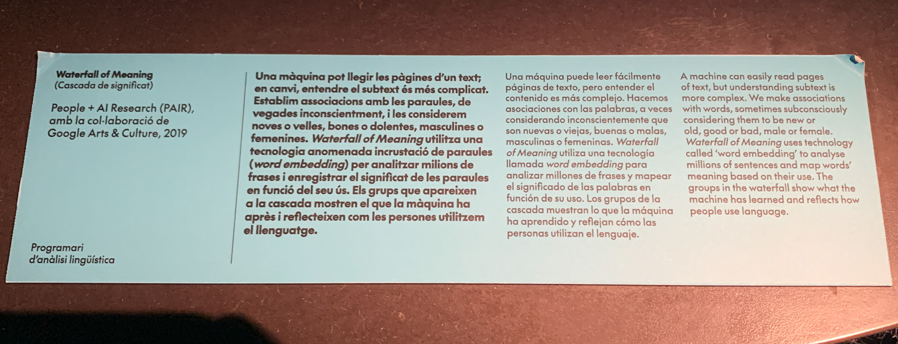
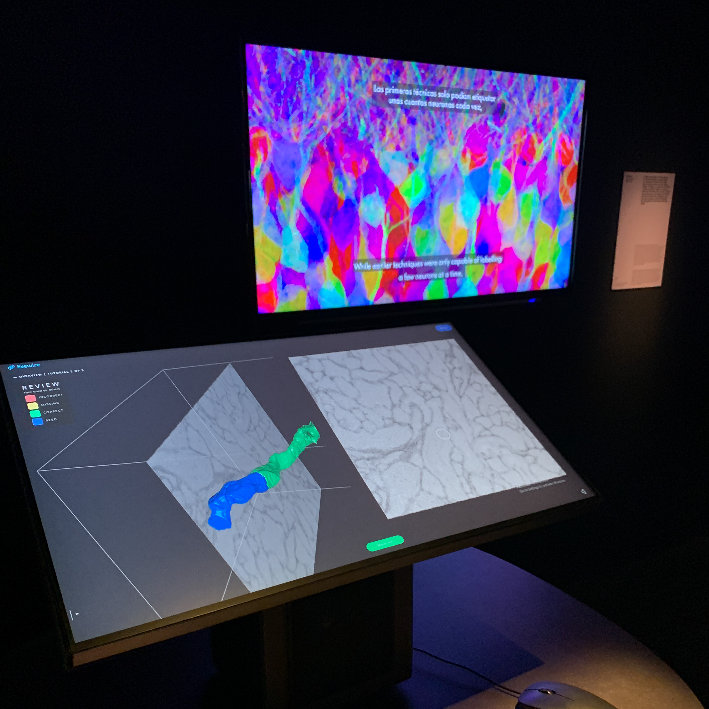
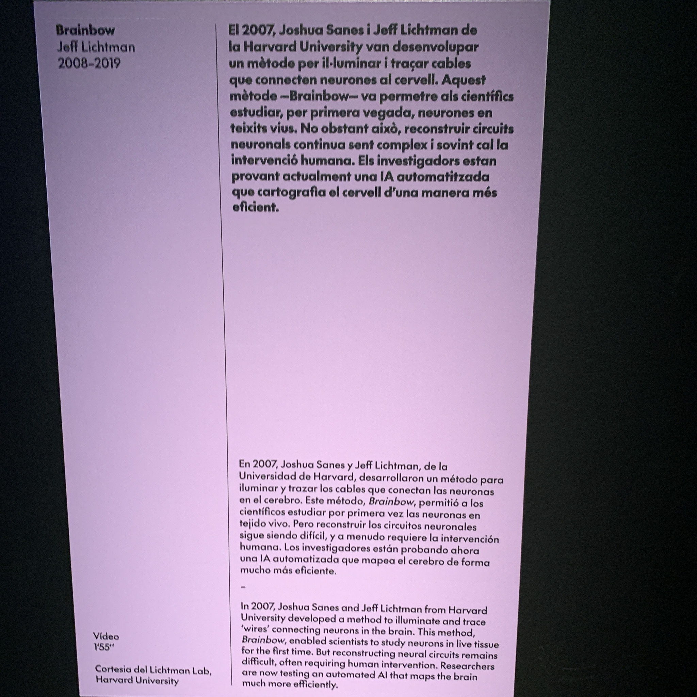
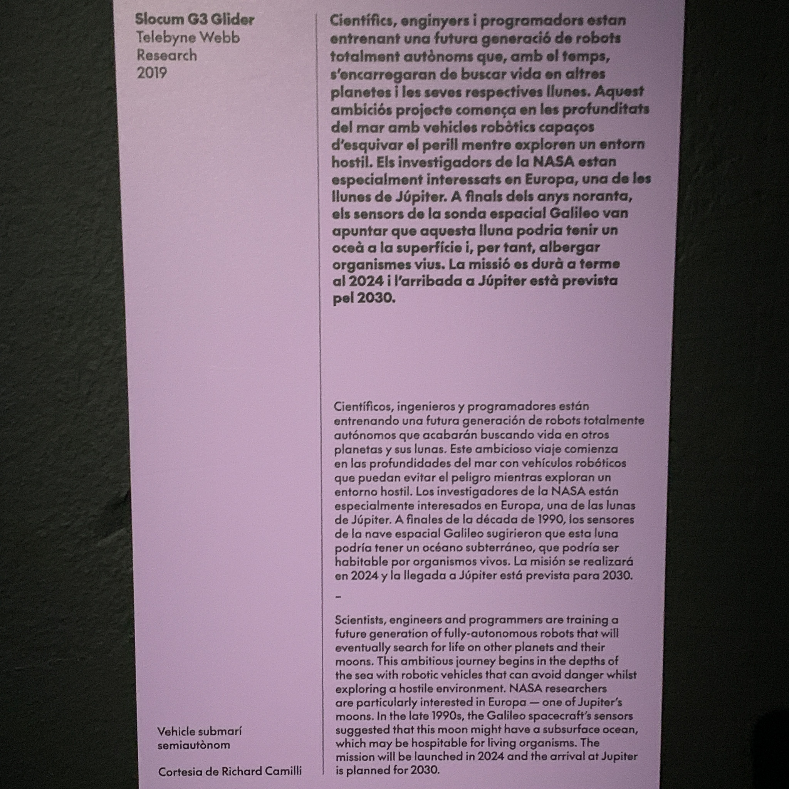
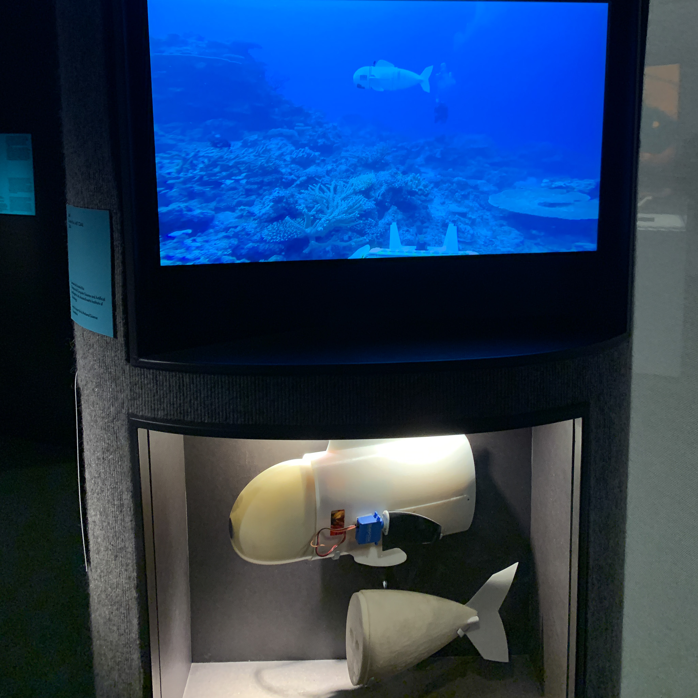
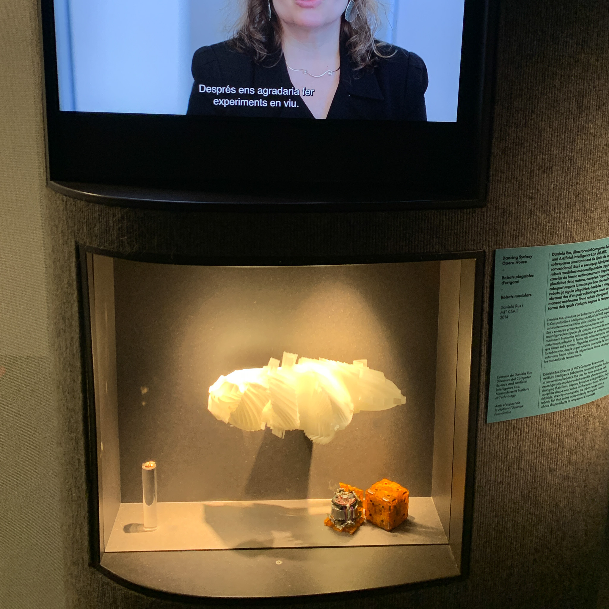

`this page is in progress`
# Reflection
This week we have heard a lot of theory on extended intelligences from Pao and Daniel and thanks to their effort to present in an easy to understand way, we have gained a basic understanding of neural networks, machine learning models, pipelines and databases. This enables us to communicate with developers and understand the difference and interplay between different subcategories of AI.

## Exhibition
I found 4 exhibits at the exhibition particularly interesting. 
### Waterfall of meaning

on the one hand, the assessment of an artistic intelligence about the meaning of individual words. which was also an inspiration for our group project. 
### Brainbow

an ai that can help to illuminate and trace connections between neurons.
### Slocum G3 Glider

ai combined with softrobotics to perform tasks underwater or in space that humans cannot do. 
### Robots Modulars

## Group Project

In our group intervention we tried to develop a text bias detector. We looked at and tested different databases and pipelines. One pipeline was able to calculate the probability that the entire text was biased. the second pipeline that we ended up using was able to highlight individual words in the input text. This application could help us to write texts ourselves or as a browser extension to analyze texts. However, the database with which the model was tainted was not sufficient. for an application like this, it is particularly important to use a database that covers all perspectives and is maintained by different locations and people. A possible next step would also be to categorize biases and mark them differently. 