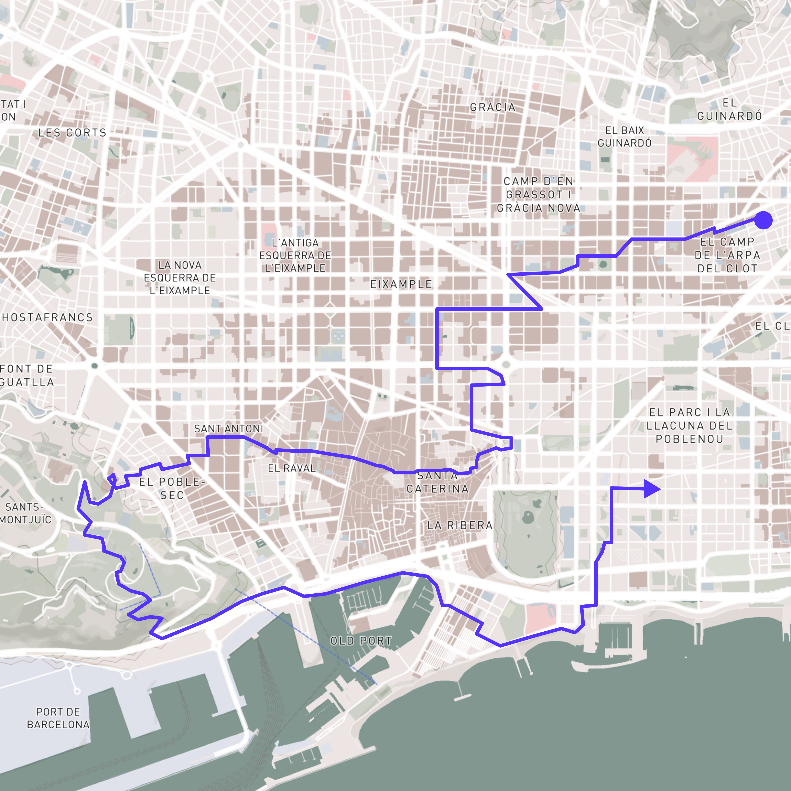
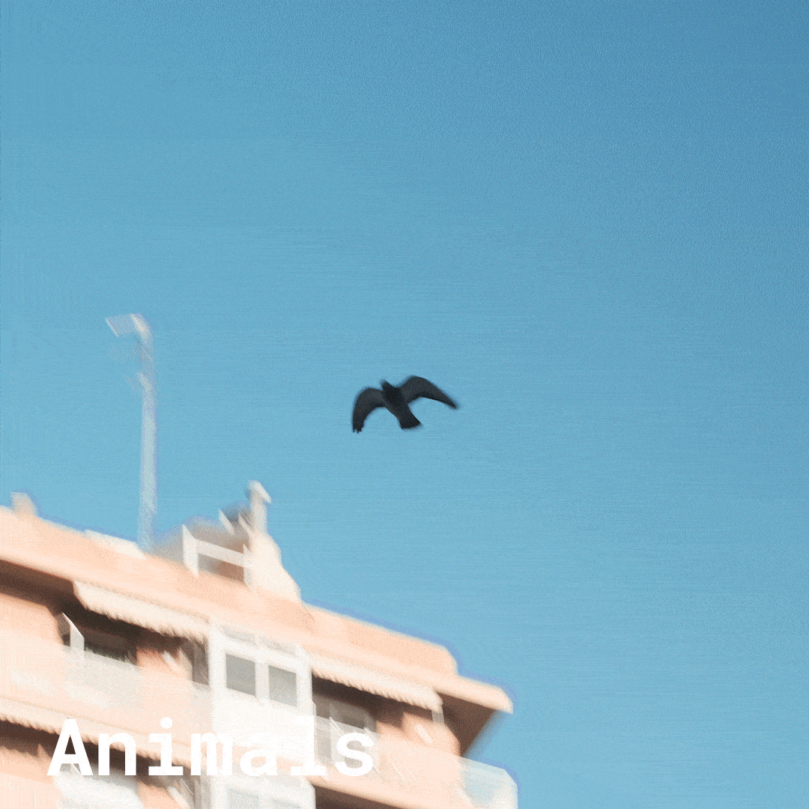
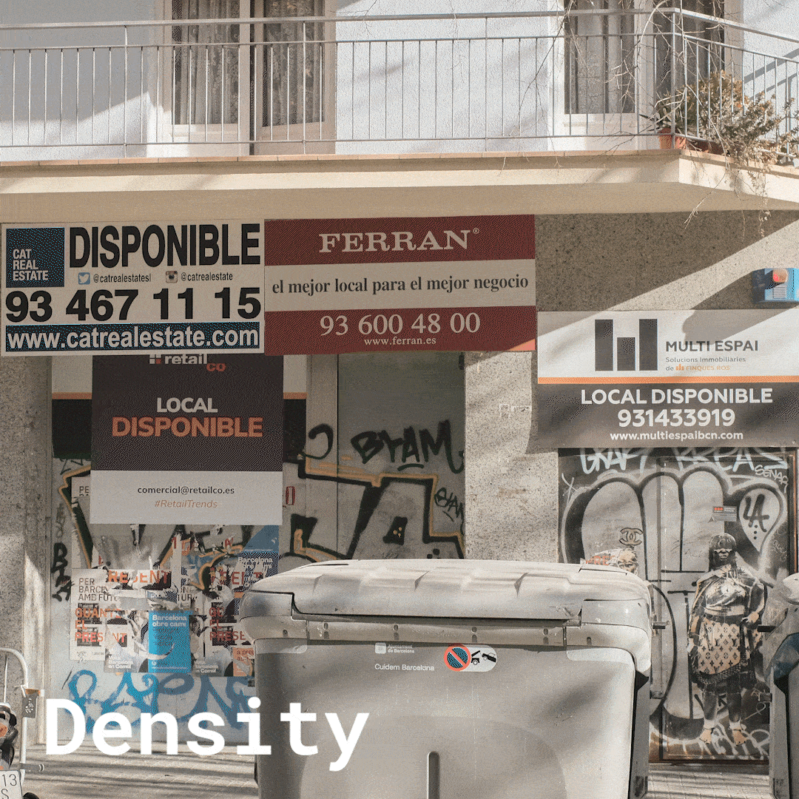
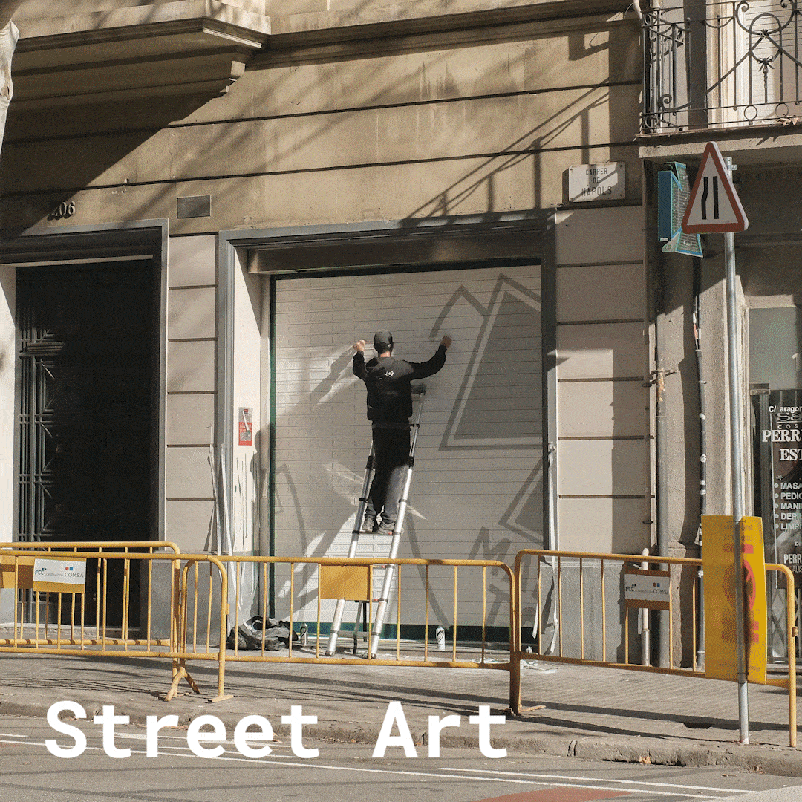

# Reflection
As I want to do research in the field of cities and intelligences, in my first intervention I tried to build better contact with my surroundings and the city I want to interact with. I walked through the city with my phone on flight mode but ready to record audio and my camera without any music distractions, transportation or digital navigation, if possible without looking at my watch. i immediately became more aware of my surroundings within the first few meters. On the way, I captured everything that might be interesting. i thought about species, tensions and movements. On the way, I was already thinking in my head whether I could form groups of events that I could capture.  i didn't expect much from a sunday, but there was a lot to see. i found it surprising how things were happening at the same place at the same time. the city felt multi-layered from the perspective i had taken. I also realized how much sound influences my mood. 

## Route

## Captured Topics
`more content (pictures and audio) coming soon`

## Next Steps
the intervention has inspired me, however, i think there is much more to discover depending on the season, time of the week or time of day and the possibility of better recording. i will try to integrate and continue this awareness in my everyday life and use my phone as a documentation tool. 