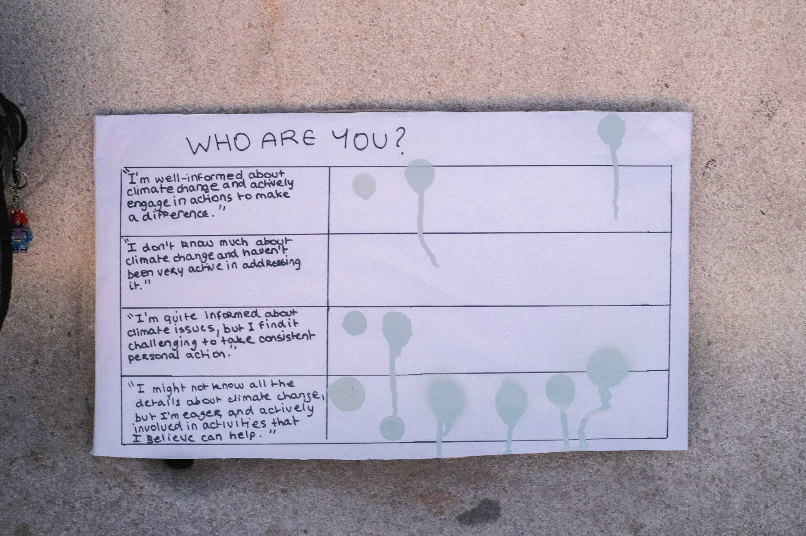
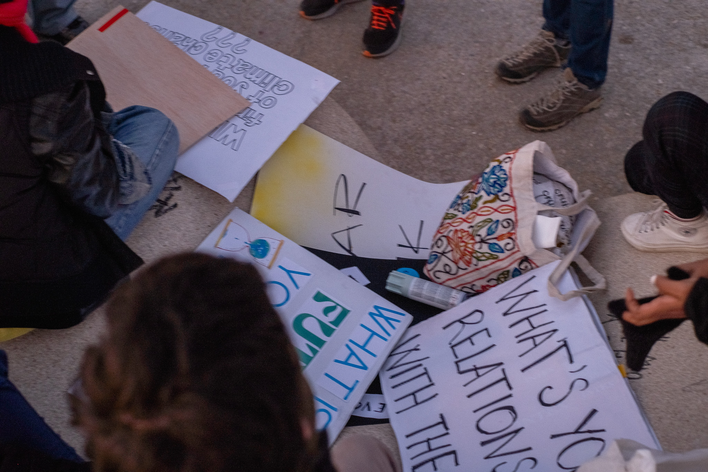

'in progress'

# Reflection
All in all i like the idea of degrowth but i think it must be done through replacing consumption goods with better alternatives. I see it as unrealistic that people would voluntarily lower their consumption and live with less life quality than before, even if that would be the easiest option. The week inspired me a lot and reminded me on the relation of crisis and in which time we‘re living in. 

## Consumtion or production whats the problem ? 
Both in a waay but if the production would not be there people can not consume that much. And if there would not be the request of consumption there wouldn’t be a need of big production. Lowering the production could end up in making goods precious and only available for privileged people, but at the same time it would force people to find replacements and local solutions. People have to consciously decide to consume less to lower the production.

## When we talk about degrowth, what is really growing ? 
If we talk about degrowth of energy or water consumption the average lifequality for people who previously didn’t had access to goods is growing but for people who consumed a lot before lifequality is degrowing. The balance between the consumption of people is growing. If material values degrow, non material values are growing. 

# Intervention

