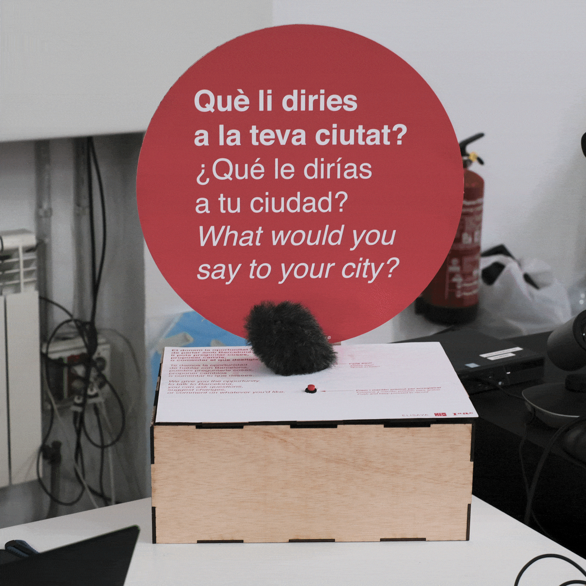

# Reflection
The microchallenge helped us with our further project, we were forced to come up with a solution quickly and therefore had to make decisions quickly which in retrospect actually made sense, in any case we will continue with the prototype in the next challenge. We have learned a new tool (Raspberry pi) which has caused us some challenges but has also opened up a new cosmos of possibilities. 

[Hack MD Report](https://hackmd.io/87FLKjMZTy2C9XVeFio_cQ?both)
 
[GitHub Repository](https://github.com/marius-schairer/MicroChallenge/blob/main)