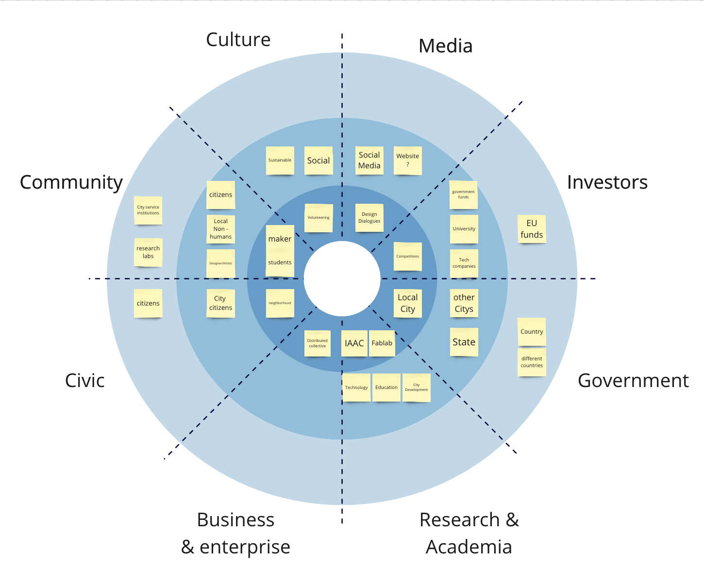

# Reflection
The golden circle and the steakholder radar helped me to understand how I should approach the next steps of my project and what possible levers and topics for interventions could be. the steakholder radar made it especially clear to me in which order I should approach which people and where I still need to network to find the right stakeholders.

## Golden Circle

### What? 
Collect and process Data, including intelligences to adapt them into a dynamically regenerative city development.
### How?
Create social innovation in a Participatory, educative and circular way through digital collaboration, human machine collaboration and open source technology.
### Why?
To find balance in resources and society for a Sustainable future.

## Stakeholders Radar
