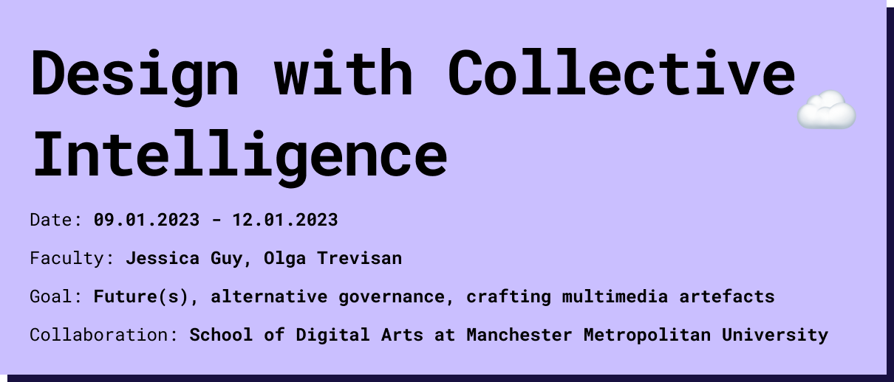

# Reflection
The week was very inspiring. I had only heard about blockchain, NFTs and smart contracts in passing, but never looked at them in detail. I am surprised how easy it was to create an NFT in the end. The approach of tackling a topic with an artifact was new and inspiring for me. 
 

## Creative Commons
In collaboration with FabLab BCN, Manchester Metropolitan University and SODA, we explored the potential of Web3 technologies such as blockchain, NFTs, DAOs and smart contracts. The aim was to explore how these technologies could reshape the creative industries landscape and governance models.

## Web3 technologies
Blockchain, at its core, acts as a decentralized and secure ledger that provides an immutable record of transactions and data. NFTs (Non-Fungible Tokens) serve as unique digital assets that certify ownership and authenticity. DAOs (Decentralized Autonomous Organizations) represent a new form of governance where decision-making is encoded in smart contracts and executed autonomously. Smart contracts automate the execution of predefined agreements and eliminate the need for intermediaries.

## Dafne+ platform
Dafne+ is a joint project of SODA and Fablab BCN that offers a promising solution to revolutionize the distribution of content using Web3 technologies. This platform gives creators the opportunity to secure their intellectual property rights by minting NFTs. These NFTs ensure transparent and immutable records of ownership and transactions on the blockchain, promoting trust and fairness in the creative ecosystem.

## Collaborative project - fascination:
Our collaborative project focused on tackling the resurgence of fascism through an innovative VR educational game on the Dafne+ platform. Players are immersed in a simulated city under fascist rule, where they observe, interact and analyze the social dynamics. Their observations are recorded in the blockchain and promote discussions and insights on how to combat extremist ideologies.

Proceeds generated from the minting of NFT avatars within the game fund de-radicalization efforts through a DAO. This decentralized approach empowers NFT owners with decision-making authority, ensuring community-driven initiatives in the fight against radicalization.
In summary, our exploration of Web3 technologies and the implementation of the Dafne+ platform exemplify a paradigm shift in intellectual property rights management and content distribution. Through collaborative efforts and innovative solutions, we strive to foster a more equitable and inclusive creative ecosystem while addressing pressing societal challenges.

Profits from in-game minting of NFT avatars are invested in counter-radicalization efforts through a DAO. This decentralized approach empowers NFT owners and ensures community-driven initiatives in the fight against radicalization.
In summary, our exploration of Web3 technologies and the implementation of the Dafne+ platform represent a paradigm shift in the management of intellectual property rights and content distribution. Through collaborative efforts and innovative solutions, we aim to foster a more equitable and inclusive creative ecosystem, while at the same time improving the societal challenges.

## Group Project
<iframe src="https://drive.google.com/file/d/19M2VD74vYPUiIi_hya16Q64a9ntTRiID/view?usp=sharing" width="100%" height="500px"></iframe>
