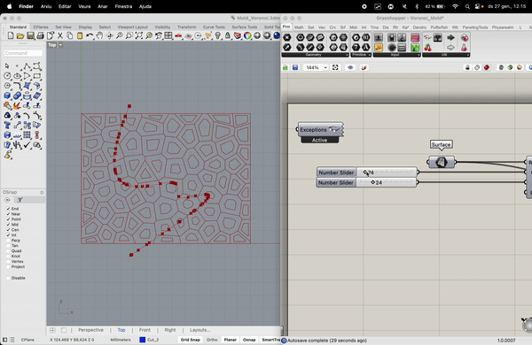
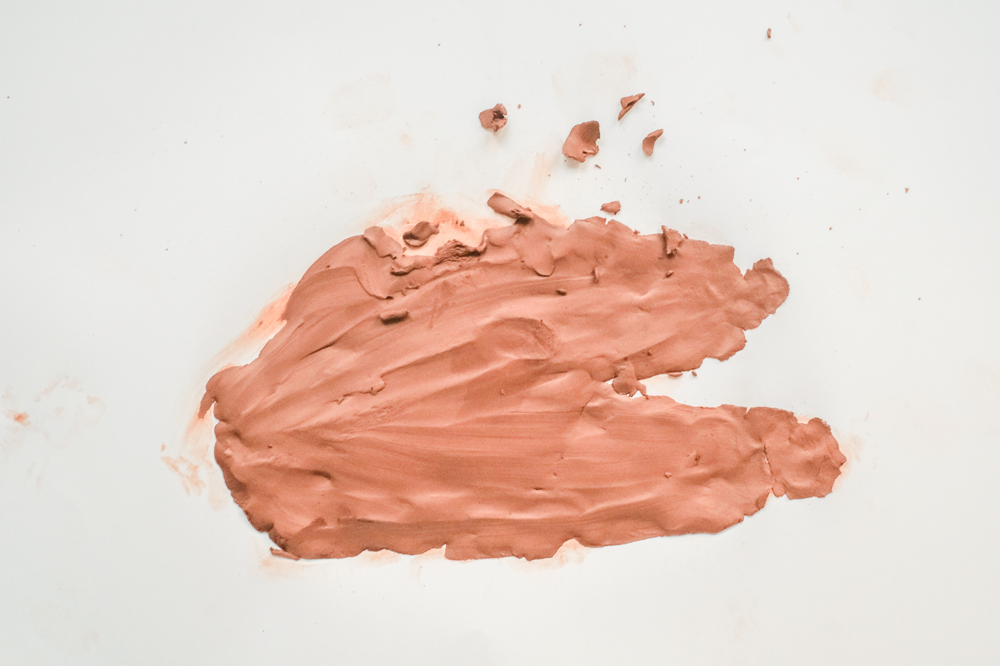
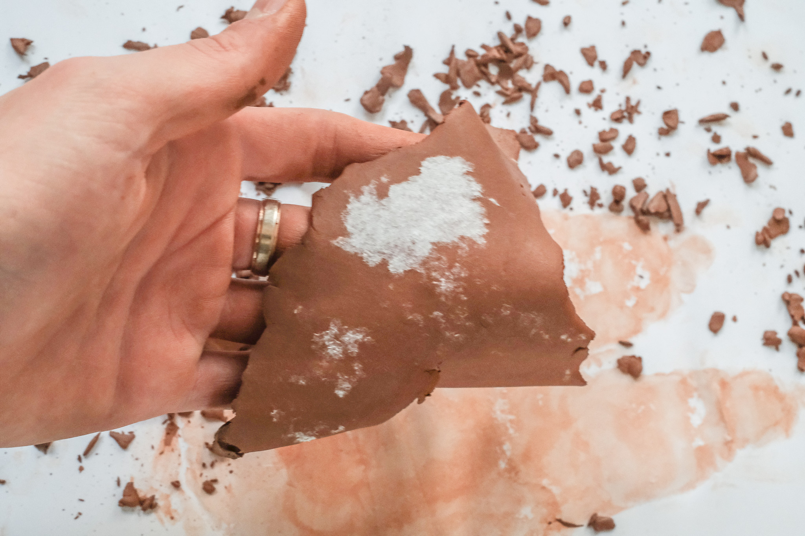
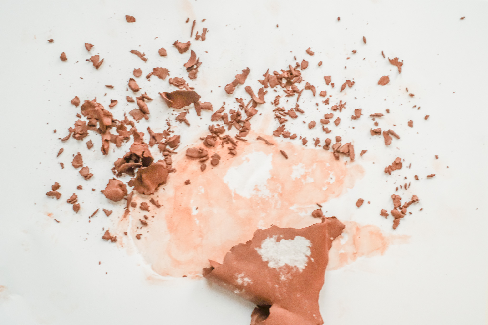
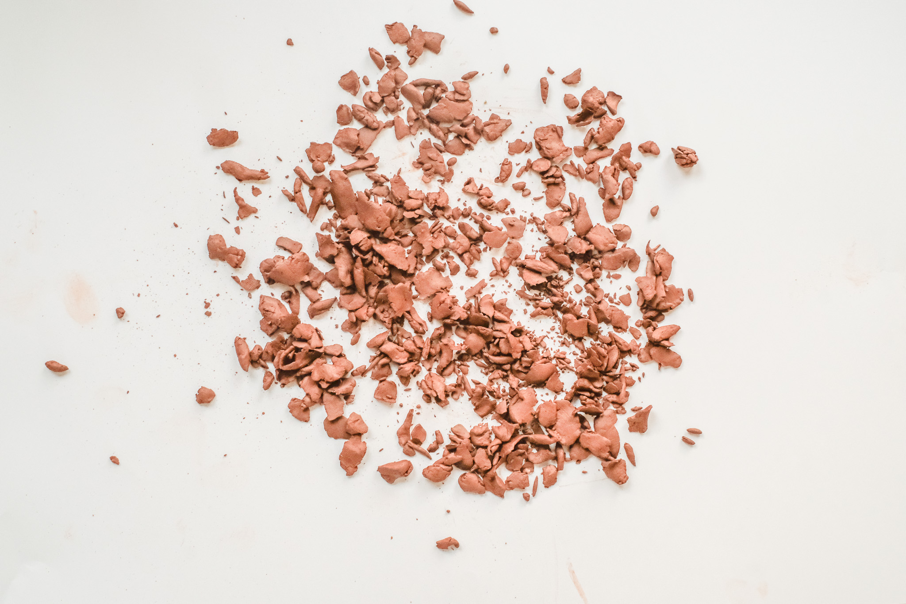
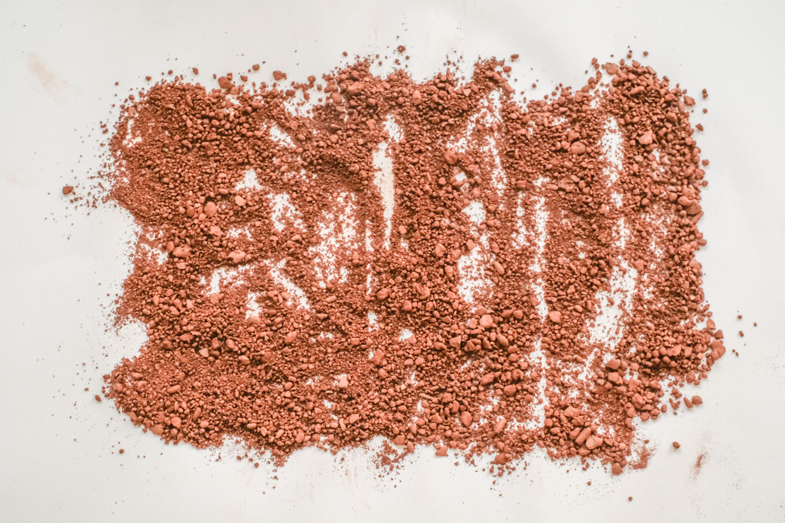
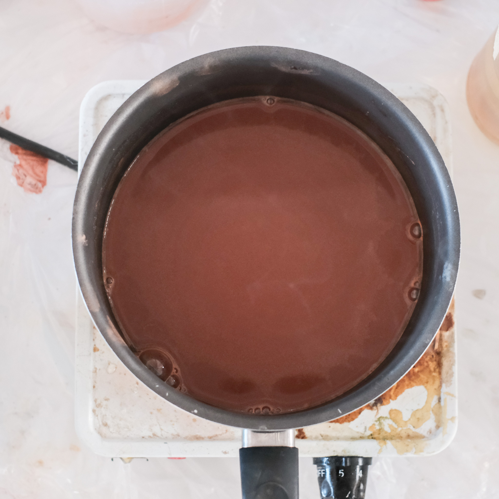
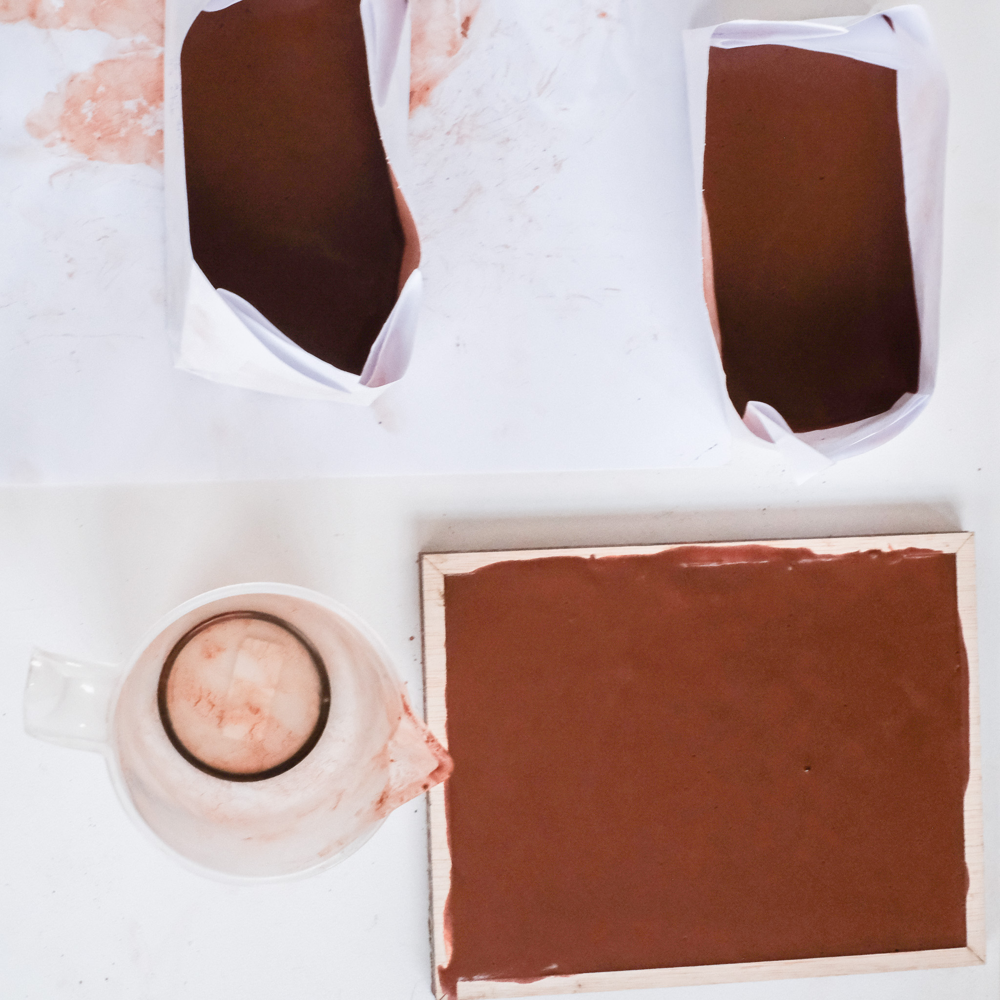
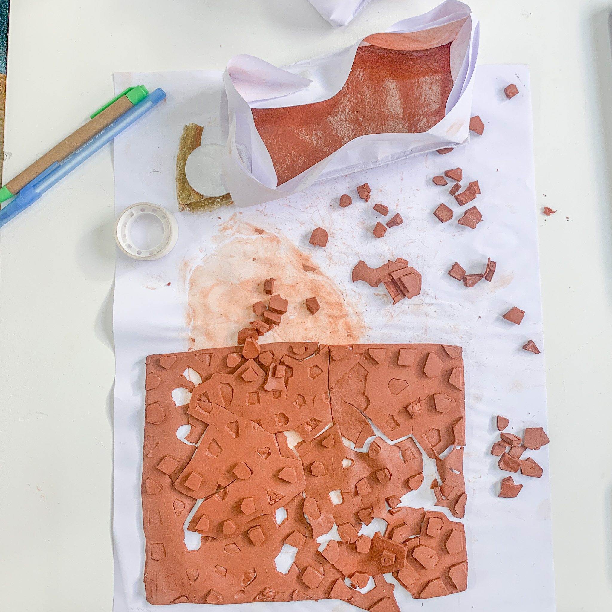

# Reflection
For the first challenge, we tried to cast a kind of biomaterial with agar agar and cley. we built an organic 3d mold with grasshopper and then cut it out with the laser cutter. the shape was inspired by dry clay soil. Unfortunately, the end result was a bit different. but we tested different proportions of glycerin and hoped that it would be more or less flexible. the end result was difficult to compare but had a similar strength. Overall, however, we learned a lot in the process.

## Process

