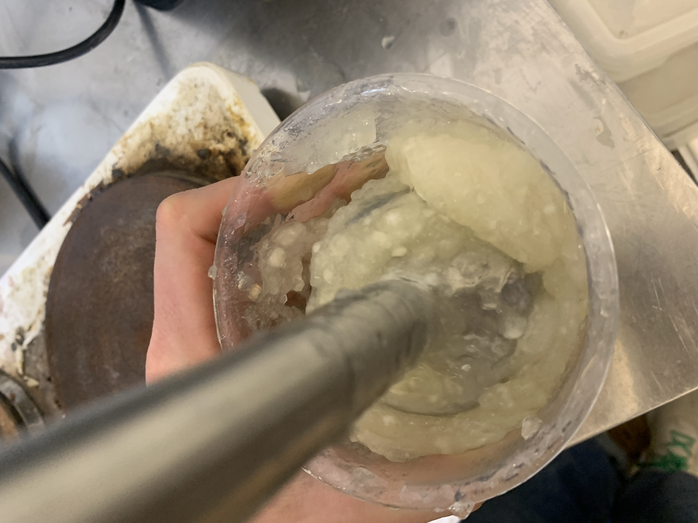
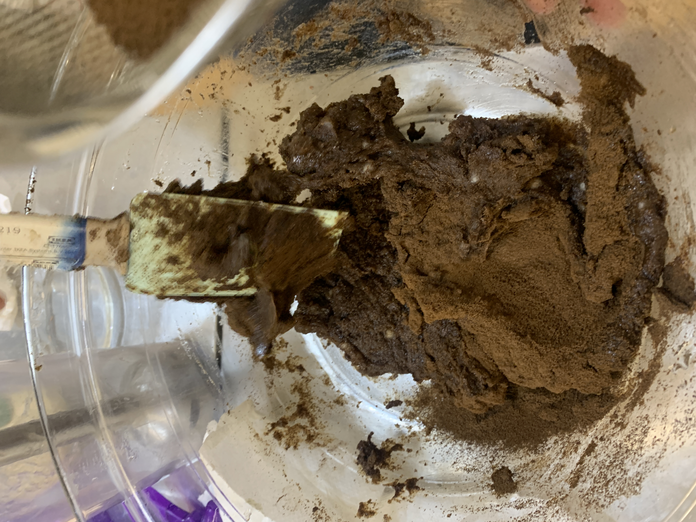
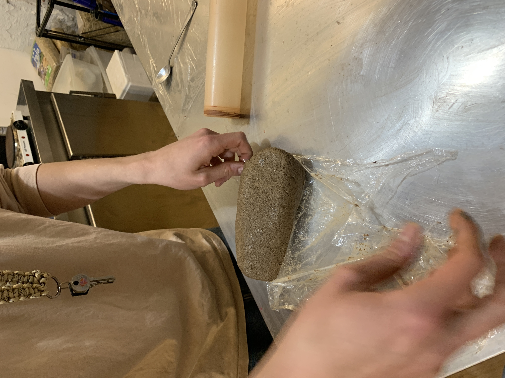
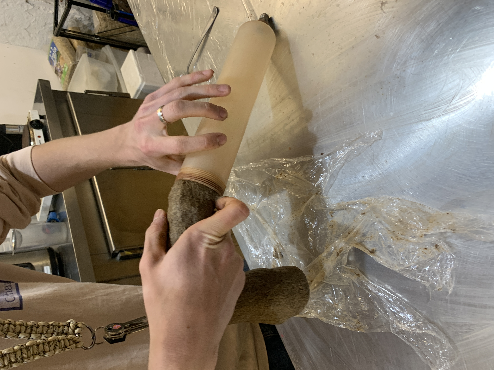
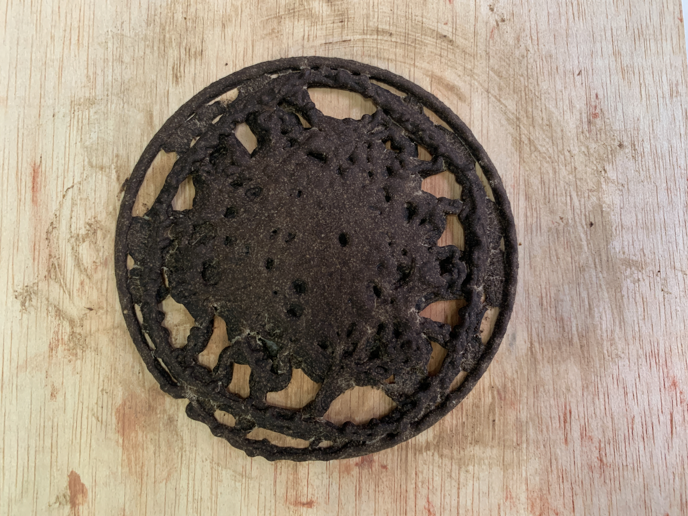

## Reflection 
In this challenge we tried to print 3d with the leftovers of the coffee grounds. We asked itnig for their leftover coffee and thought we could print a kind of coffee coaster as a test print to give something back as they were quite curious what we would do with it. unfortunately the end result wasn't quite what we had hoped for but we learned a lot in the process.

## Process

