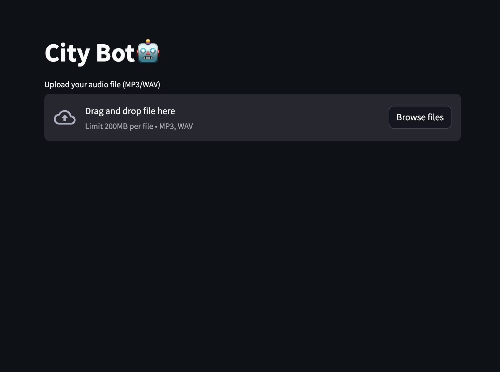

# Reflection
The course brought me and our design studio project a huge step forward and gave us a deeper understanding of the topic of ai. the prepared tools and their transparency lowered the entry barrier for tackling an ai project dramatically. We were able to use the modmatrix stack as inspiration in the micro challenge the following week and adapt it for our city bot on our raspberri pi. I will definitely design more Ai experiments and try to realize them.

<iframe src="https://drive.google.com/drive/folders/16Fwfwts214tbNe_TgxYFemcpDY0XSb7i" width="100%" height="500px"></iframe>