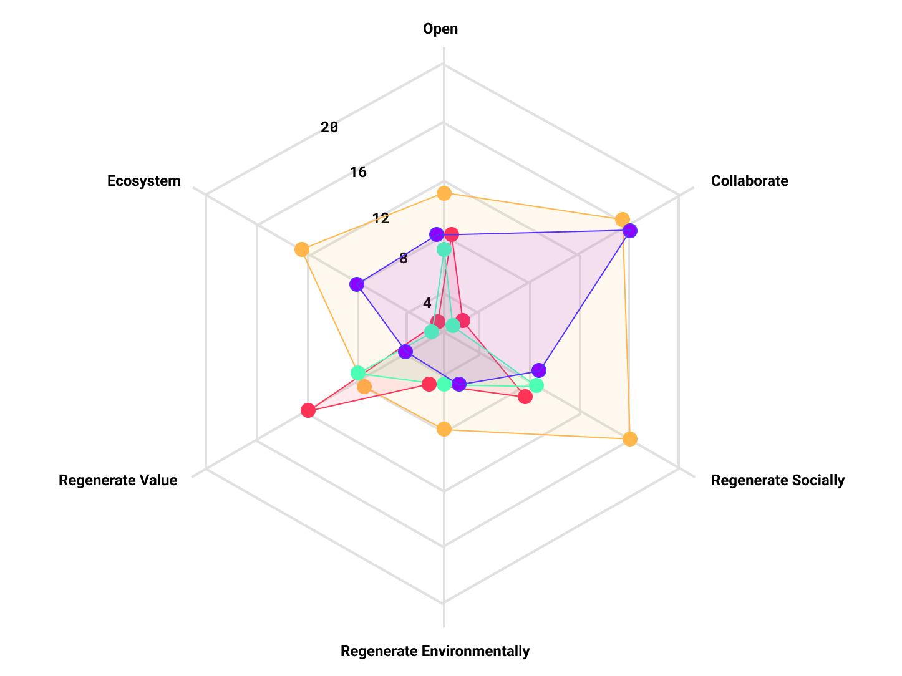

# Reflection 
I found the reflection exercise quite helpful and will use it in the future. I reflected on different projects and looked at them from a new perspective and found a lot of things that I didn't consider at the time. The template sometimes becomes difficult to interpret when it is a digital product that works on existing systems. But looking back, there are of course also approaches on how to make digital products more sustainable or accessible and how to plan for the end of product life or how it affects the physical world.

