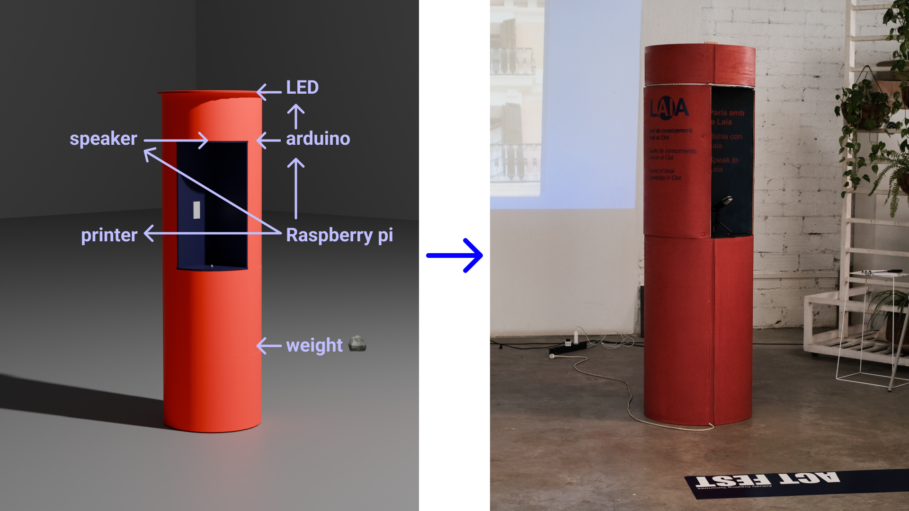

# Reflection
For the CNC Challenge, Nuria and I built a new structure for the MDEF Fest exhibition for our research project LAIA. Given the scale of the imagined structure, we wanted to make it robust and modular so that it could be adapted and reused for further interventions and iterations. Inspired by cable reels and advertising columns, we built a 2 meter high round column structure consisting of 4 modules. We built the cladding from flexible wood and cork so that it could also be used as a pinboard. The project gave me a deeper understanding of the use of cnc machines. File preparation was the most important part of the process, as we were working with more expensive materials than in previous projects due to their profile depth and didn't want to make any mistakes, so we were very careful with tolerances, which we had to sand down afterwards 🙃. in the end, the structure is very stable despite the height, even without the planned weighting with sand or stones in the lower area.

<iframe src="https://drive.google.com/file/d/1dtR_wF1UVMq9Dgq04qaGHV-XRhvPtxAn/preview" width="640" height="480" allow="autoplay"></iframe>
[Fabrication Files ->](https://drive.google.com/drive/folders/1zbs4yTX24mIfkxFVc0-EblyyYPEv2KrE?usp=sharing)

