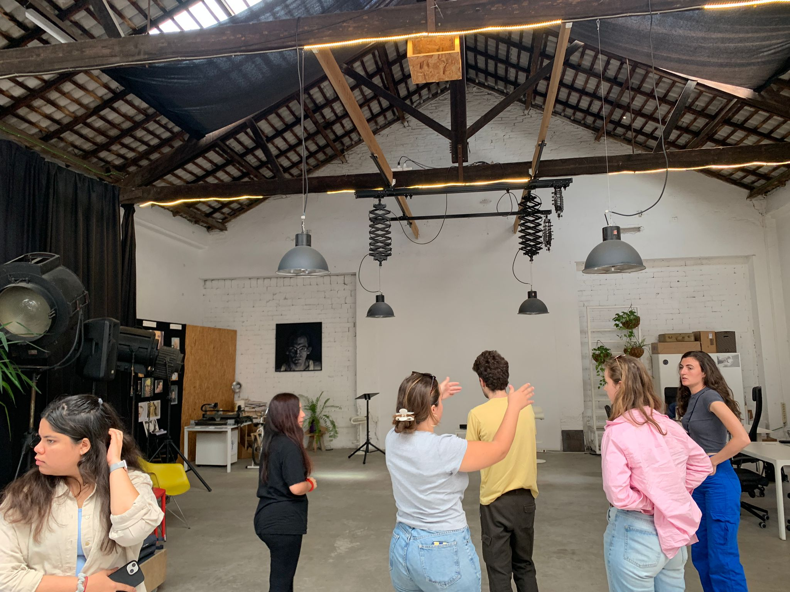
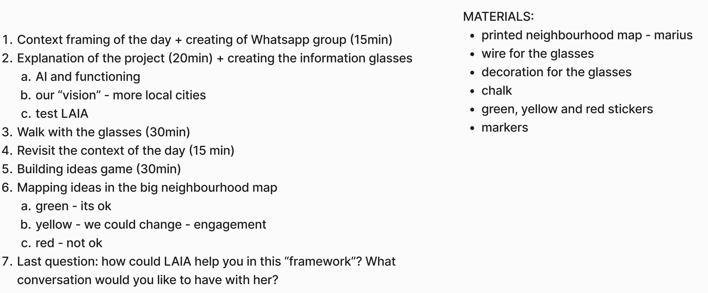
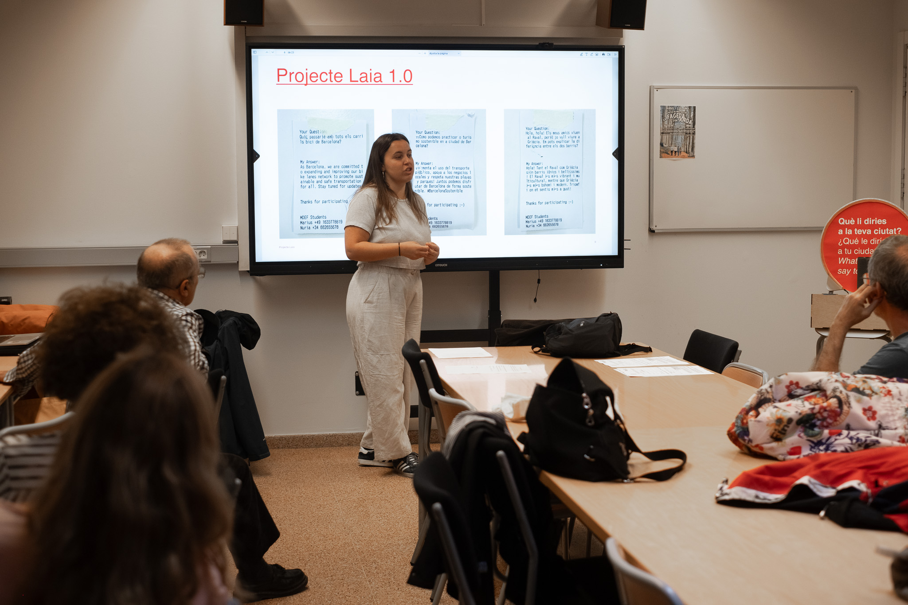
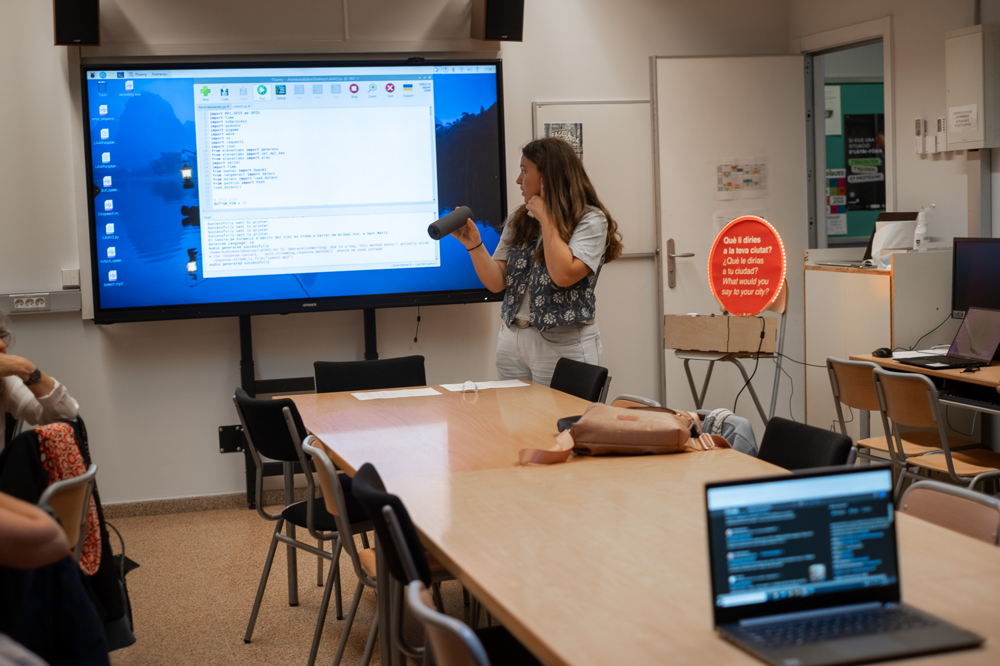
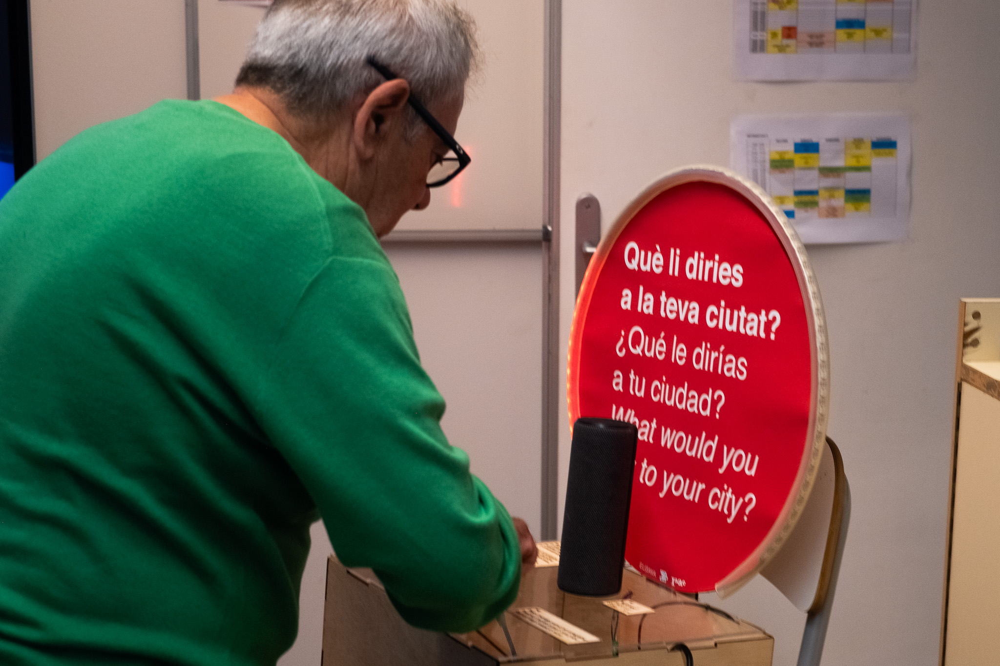
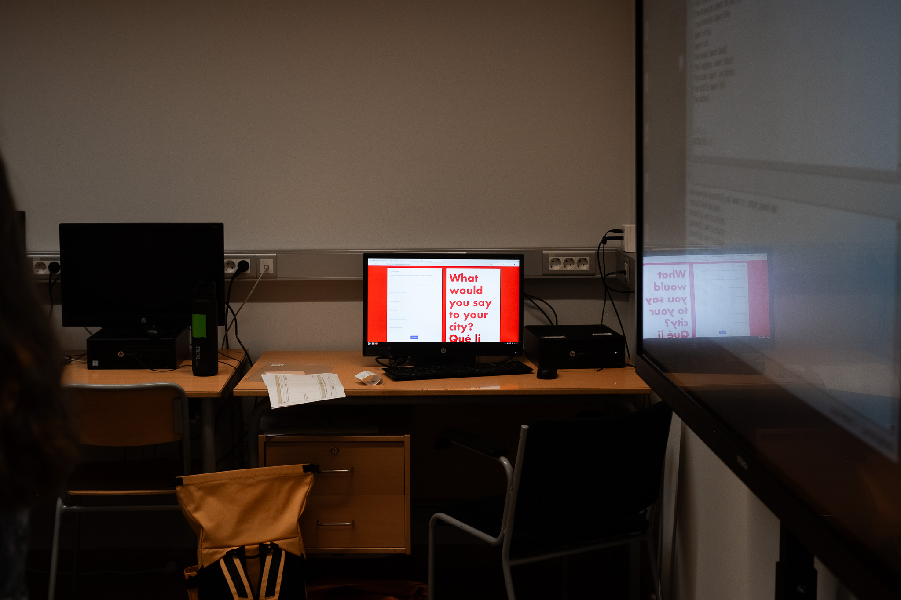
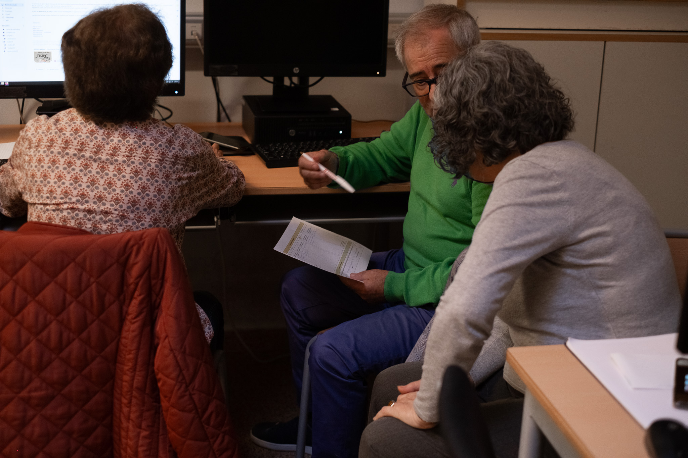
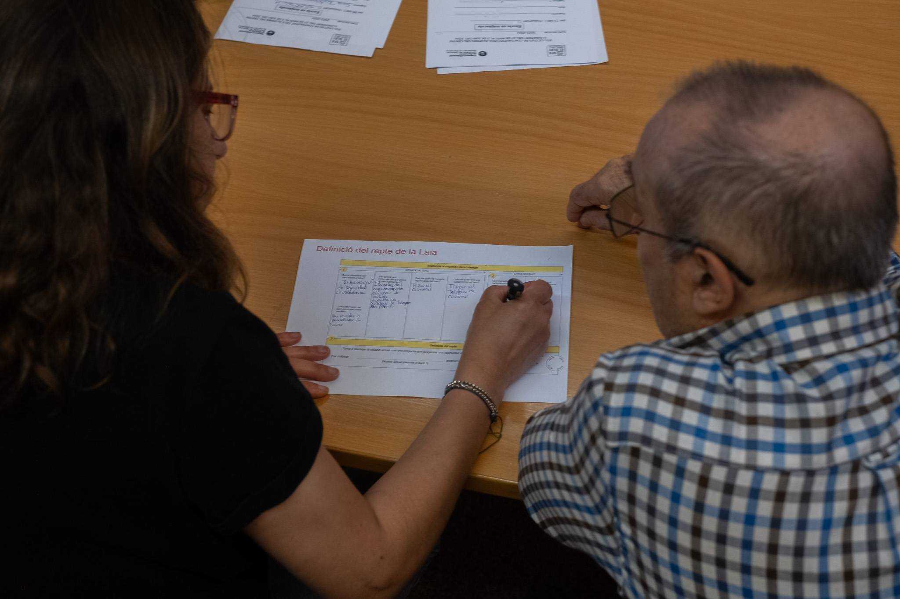
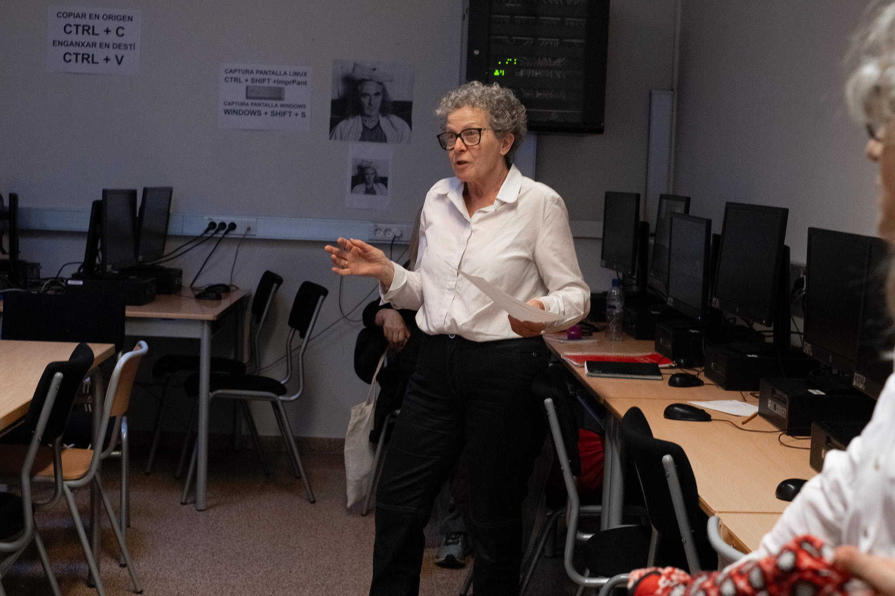

# Connecting to communities

As a first intervention this semester we contacted akasha to plan workshops and get a potential location for the MDEF festival. We visited Carmen, brought our bot and showed her our current status. she was directly very invested and connected us with some communities in el clot. as a result, we have now narrowed down the project to this neighborhood for the next steps. We are still in contact with the various communities and are trying to arrange workshops. 

# Hosting Workshops

To evaluate our project and start discussions we started a series of workshops. our first attempt took place with the scouts from barcelona, our approach was very open to take any possible feedback, however it was too broad and we didn't get much feedback on our development but insights on the neighborhood and more, which made us rethink our approach. 

In the second and third workshop at the adult school, we first gave an introduction to the topic of Ki and let the group interact with the artifact, which gave us much more topic-specific feedback and insights that could be addressed with our framework

