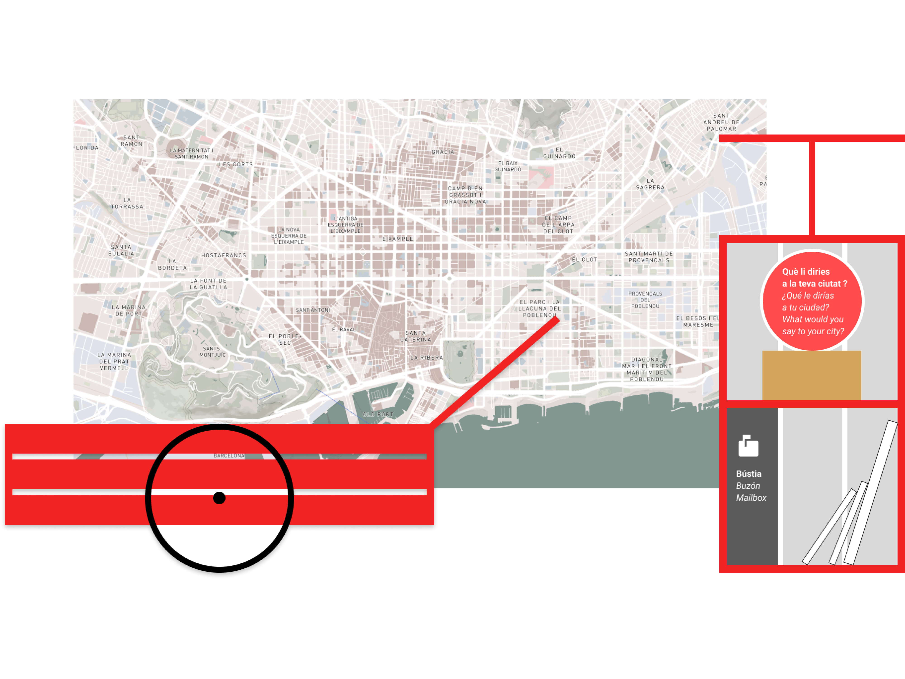

# The Project

Laia Project responds to the gentrification of cities like Barcelona, focusing on preserving local knowledge. As cities globalize, communities weaken, covered by a focus on productivity. Online platforms replace traditional networks, taking the role of local institutions. Globalized media fuses cultural tastes, risking the loss of local identity.

Laia addresses these challenges by empowering communities to reconnect and engage in neighborhood initiatives. By utilizing technology mindfully, the project transforms it into a tool for collective intelligence. By tackling the root causes of neighborhood disconnection, Laia aims to create more resilient, sustainable, and equitable communities.

The Laia project started with a machine that asked people: “What would you say to your city?”. As the prototype progressed, we enabled transcribing user responses. To improve, we focused on defining Barcelona’s voice, starting with the neighborhood of El Clot. Akasha Hub, a community in El Clot, provided essential references and became our first collaborator.

We are reaching out to associations of El Clot while developing Laia. Laia’s third version included an online form for residents to share their knowledge, ensuring answers incorporated collective wisdom.

Currently, we conduct workshops with the community, gathering feedback to shape Laia’s future versions. Our ongoing engagement aims to refine Laia and better serve the neighborhood’s needs.

Until beggining of 2025, we plan on expanding Laia with El Clot community to gain local recognition and become a reference for everyone. We aim to build a final prototype that can be used in the public space without supervision.

Looking ahead on the long term, we envision the project evolving into a scalable platform that can be implemented in diverse urban contexts around the world. We would like to create a “Laia Guide” to collect and group all the steps we have done with the project in El Clot and make the project open source.

## Context

The development of the Laia project began with the creation of a machine that could pose a question: “What would you say to your city?” Users could record their answers in audio format, and the machine would store these audio files. It functioned almost like a confessional, offering a speculative way for people to express their thoughts. You can find all the documentation for the first prototype in the [MicroChallenge I](https://hackmd.io/87FLKjMZTy2C9XVeFio_cQ?both) page.

## Developments
As the prototype evolved, we incorporated OpenAI technology into the machine through API calls. This enabled us to transcribe the user’s audio responses, send them to ChatGPT, and play back an audio response. While this made the machine more “useful,” the generated answers from OpenAI were not sufficiently interesting. They tended to be standard and corporate, lacking real engagement with the user. You can find all the documentation for the second prototype in the [MicroChallange II](https://hackmd.io/vz8t1qg0T2yzbrudc_p6dw?view)page.

To address this issue, we began researching what voice Barcelona would have. However, this question proved challenging to answer due to the city’s vast scale. To simplify our approach, we decided to focus on a specific neighborhood and community. We reached out to Akasha Hub, a community of designers and makers in El Clot, Barcelona. They provided us with community references and other relevant information, becoming our first collaborators.

With a focus on El Clot established, we familiarized ourselves with the area and began making contacts with associations recommended by Akasha Hub. During this period, we concurrently worked on both the community workshops and the technical aspects of the project. We developed a third version of the Tool. In this version, we created an online form accessible for everyone, allowing residents of El Clot to “teach” Laia their knowledge. This ensured that when people from El Clot interacted with Laia, they would receive answers that incorporated the collective knowledge of their neighbors.

## Next Steps
For the rest of this year and beggining of 2025, we plan on expanding Laia within El Clot community to gain more recognition form the locals and become a reference for everyone, and also so we can design a final version of Laia. We aim to build a final prototype that can be used in the public spce without supervision.

Looking ahead on the long term, we envision the Laia project evolving into a scalable platform that can be implemented in diverse urban contexts around the world. We would like to create a “Laia Guide” to collect and group all the steps we have done with the project in El Clot. From the initial research of communities, the communication with them, the data collection from the City Council, the development of the prototype (hardware and software) and other relevant information to reproduce the framework in another context.

By making the Laia framework an open source and reproducable project, we are committed to creating more resilient, sustainable, and equitable cities for future generations.

## Submit your knowledge (currently limited to el Clot)
[LAIA Website](https://laia-github.github.io/LaiaWeb/)
<iframe style='border:none;width:100%;' height='1200px' src='https://laia-github.github.io/LaiaWeb/'></iframe>
[LAIA Instagram](https://www.instagram.com/laia.collectiu/)
