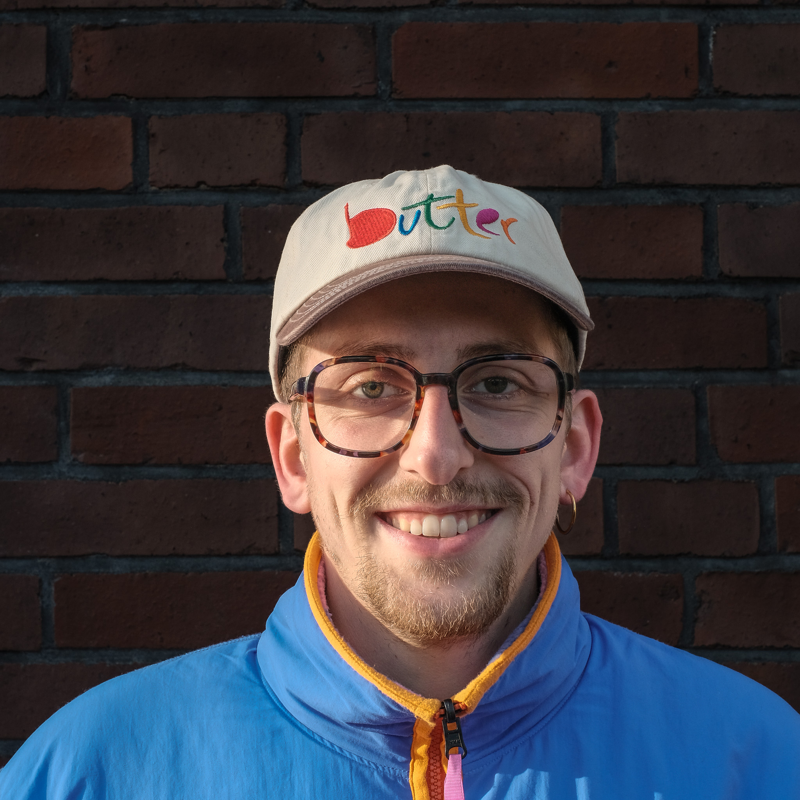
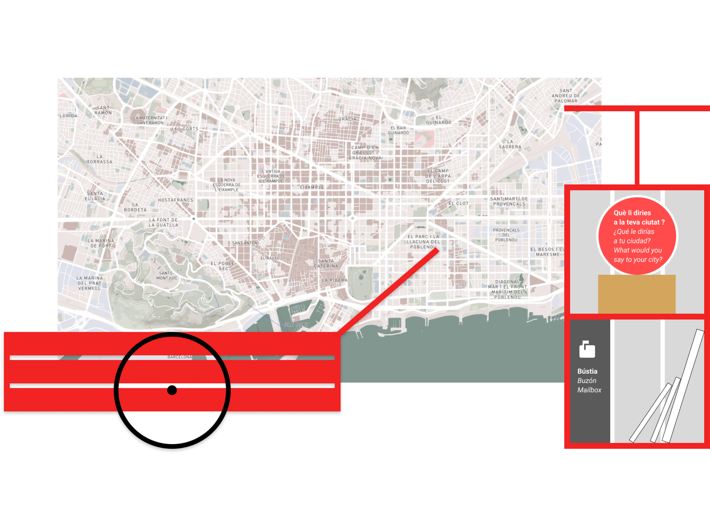

<!-- filepath: /Users/mars/Documents/GitHub/MDEF_Documentation/docs/term3/LAIAProject.md -->

    <a href="/">Home</a> / 
    <a href="/MDEF_Docmentation/term3">Term 3</a> / 
    LAIA Project

<link href="https://fonts.googleapis.com/css2?family=Inter:wght@300;400;500;600;700&family=JetBrains+Mono:wght@400;500&display=swap" rel="stylesheet">
<link href="https://fonts.googleapis.com/icon?family=Material+Symbols+Outlined" rel="stylesheet">

<!-- Article Hero Section -->
<section class="bg-bg-primary py-16 md:py-24">
  

    <!-- Project Hero Section -->
    

      

        <!-- Project Details -->
        

          <h1 class="text-5xl md:text-6xl mb-6 text-theme-primary font-human">LAIA</h1>
          

            A 6-month community intervention exploring local AI versus global search systems in Barcelona's El
            Clot neighborhood. Investigating how AI can serve local communities rather than extracting value for
            distant algorithms.
          

          <!-- Tags -->
          

            Local AI
            Community
            RAG
            Barcelona
            Neighborhood
          

        

        <!-- Project Stats -->
        

          

            

              
When?

              
2023 - Now

            

            

              
Stage

              
Prototype

            

            

              <a href="https://github.com/laia-github" target="_blank"
                class="text-theme-primary hover:text-accent transition-colors flex">
                

                  

                    
                  

                  

                    
GitHub

                    
Repository

                  

                

              </a>
            

            

              <a href="https://laia-github.github.io/LaiaWeb/" target="_blank"
                class="text-theme-primary hover:text-accent transition-colors flex">
                

                  
Explore

                  
LAIA Project

                

              </a>
            

          

          <!-- Collaborators Section -->
          

            

              

                

                  

                    

                      
                    

                    

                      <h4 class="text-xl font-bold text-theme-primary">Nuria Valsells</h4>
                      
Communication & Design

                    

                  

                

                

                  

                    

                      
                    

                    

                      <h4 class="text-xl font-bold text-theme-primary">IAAC</h4>
                      
Hosting Institution

                    

                  

                

                

                  

                    

                      
                    

                    

                      <h4 class="text-xl font-bold text-theme-primary">Marius Schairer</h4>
                      
Prototyping & Development

                    

                  

                

                

                  

                    

                      
                    

                    

                      <h4 class="text-xl font-bold text-theme-primary">Akasha Hub</h4>
                      
Collaboration & Exhibition

                    

                  

                

              

            

          

        

      

      <!-- Section Navigation -->
      

        <a href="#concept" class="hero-nav-btn px-4 py-2 border rounded-full transition-all flex items-center">
          Concept keyboard_arrow_down
        </a>
        <a href="#setup" class="hero-nav-btn px-4 py-2 border rounded-full transition-all flex items-center">
          Setup keyboard_arrow_down
        </a>
        <a href="#intervention" class="hero-nav-btn px-4 py-2 border rounded-full transition-all flex items-center">
          Intervention keyboard_arrow_down
        </a>
        <a href="#highlights" class="hero-nav-btn px-4 py-2 border rounded-full transition-all flex items-center">
          Highlights keyboard_arrow_down
        </a>
      

      <!-- Main project image -->
      

        

          
        

        

          
Local AI systems serving the El Clot neighborhood community

        

      

    

  

</section>

## Concept {#concept}
*Local AI vs global extraction*

LAIA emerged from a critical question: **What happens when AI systems serve local communities instead of extracting data for global platforms?** Through a 6-month collaboration with Nuria at IAAC/Fablab Barcelona, we explored this tension between local and global AI in El Clot, a vibrant neighborhood in Barcelona.

The project challenged the dominant paradigm where AI search systems like Google funnel local queries through global algorithms, extracting value from communities while returning generic results. Instead, we investigated how retrieval-augmented generation (RAG) could create neighborhood-specific AI systems.

Working directly with residents, students, and local organizations, LAIA became both a technical experiment and a community intervention—exploring how AI can amplify local knowledge rather than replace it with algorithmic abstractions.

## Setup {#setup}
*Technical infrastructure and community partnerships*

### Technical Infrastructure
We built a localized RAG system using neighborhood-specific data sources: local business directories, community event listings, resident interviews, and historical documentation about El Clot. The system prioritized hyperlocal knowledge over global search results.

Rather than relying on massive datasets, we created a curated knowledge base that reflected the lived experience of the neighborhood—from the best local bakeries to community organizing strategies.

### Community Partnership
The collaboration with IAAC/Fablab Barcelona provided both technical resources and deep community connections. Nuria's local expertise was essential for navigating neighborhood dynamics and building trust with residents.

We established partnerships with local schools, adult education centers, and community organizations to ensure the project served real needs rather than imposing external solutions.

<iframe src="https://player.vimeo.com/video/948664337?badge=0&amp;autopause=0&amp;player_id=0&amp;app_id=58479" frameborder="0" allow="autoplay; fullscreen; picture-in-picture; clipboard-write" style="position:absolute;top:0;left:0;width:100%;height:100%;" title="LAIA, insta video draft"></iframe>

## Intervention {#intervention}
*Community workshops and public engagement*

### Student Workshops
We conducted hands-on workshops with local students, teaching them to question AI systems and understand how algorithms shape their access to information. Students learned to compare local AI responses with global search results, developing critical digital literacy skills.

### Adult School Engagement
Adult education sessions focused on practical applications: How could local AI help with job searches, housing information, or navigating city services? Participants shared their expertise while learning to interrogate algorithmic decision-making.

### Public Exhibition
LAIA was exhibited at the ACT Festival at Akasha Hub, demonstrating the project's findings to a broader audience. The exhibition showcased the contrast between generic AI responses and hyperlocal knowledge, sparking conversations about digital sovereignty and community autonomy.

## Highlights & Insights {#highlights}
*Key learnings and project impact*

### Community Knowledge vs. Global Algorithms
The project revealed how global AI systems often miss nuanced local knowledge—the informal networks, cultural practices, and community wisdom that actually make neighborhoods function. Local AI provided more relevant, contextual responses to resident queries.

### Digital Sovereignty in Practice
LAIA demonstrated that communities can develop their own AI tools rather than accepting algorithmic colonization. By maintaining control over data and training processes, neighborhoods can preserve their autonomy while benefiting from AI assistance.

### Educational Impact
Students and adults developed critical thinking skills about AI systems, learning to question algorithmic authority and understand how technology shapes their daily lives. The workshops created lasting awareness about digital literacy and technological choice.

### Scalable Model
The LAIA methodology provides a template for other communities seeking technological autonomy. The project's approach—combining technical development with community engagement—offers a replicable framework for local AI initiatives.

## Interactive Platform

Experience LAIA's community knowledge system and contribute your own local insights:

<iframe style='border:none;width:100%;' height='1200px' src='https://laia-github.github.io/LaiaWeb/'></iframe>

## Connect with LAIA

- **Website**: [LAIA Platform](https://laia-github.github.io/LaiaWeb/)
- **Instagram**: [@laia.collectiu](https://www.instagram.com/laia.collectiu/)
- **GitHub**: [LAIA Repository](https://github.com/laia-github)

---

*LAIA continues to evolve as a model for community-controlled AI, demonstrating that technology can serve local needs while preserving neighborhood autonomy and cultural identity.*
