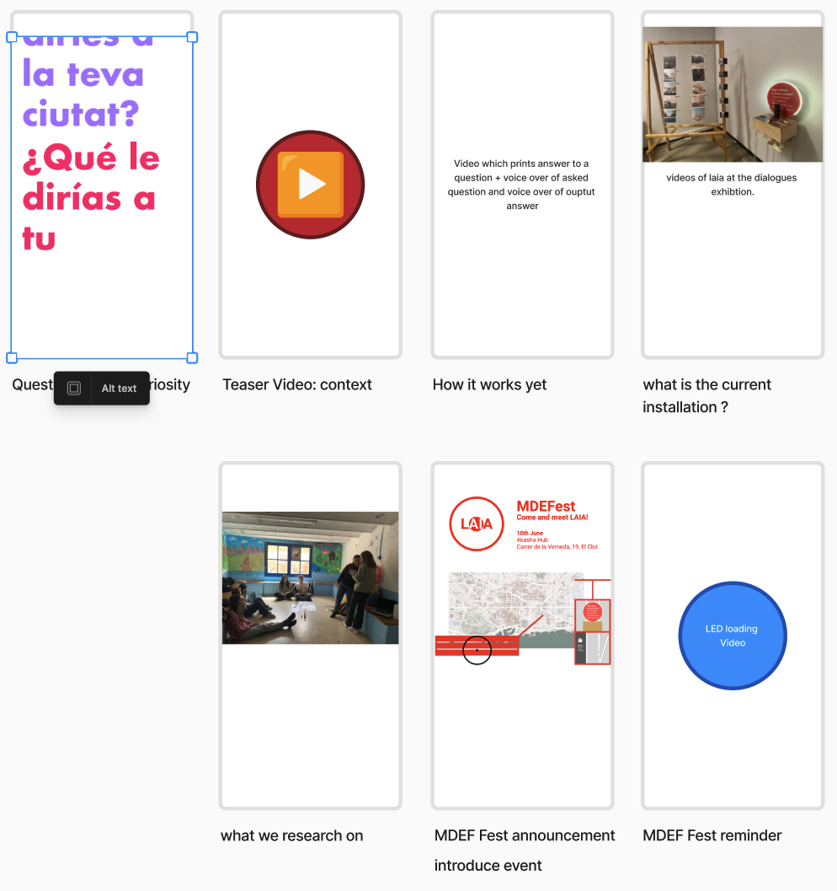

# Reflection
`Work in Progress`
During this term, we were able to apply communicating ideas directly to our research project. We have learned to formulate more precisely and for the community to break down our huge ideas and find the core message. 

## Explaining the Project in x Words
### In a paragraph
The Project is questioning how we use methodologies/technologies, to change the perception and engagement of citizens within their surroundings.
### 16 Words
The Project is questioning how we use technologies, to change engagement of citizens within their surroundings.
### 8 Words
The Project changes perception and engagement of citizens.

## Project Positioning

## Social Media Plan

