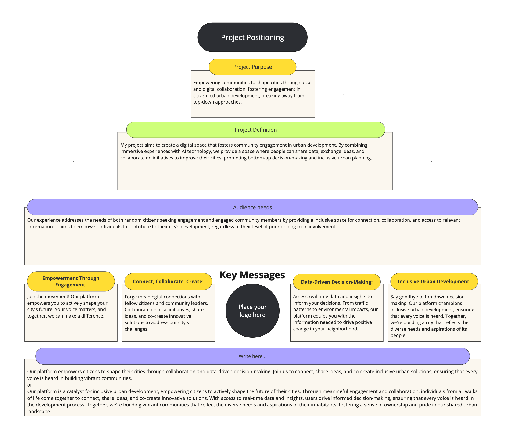
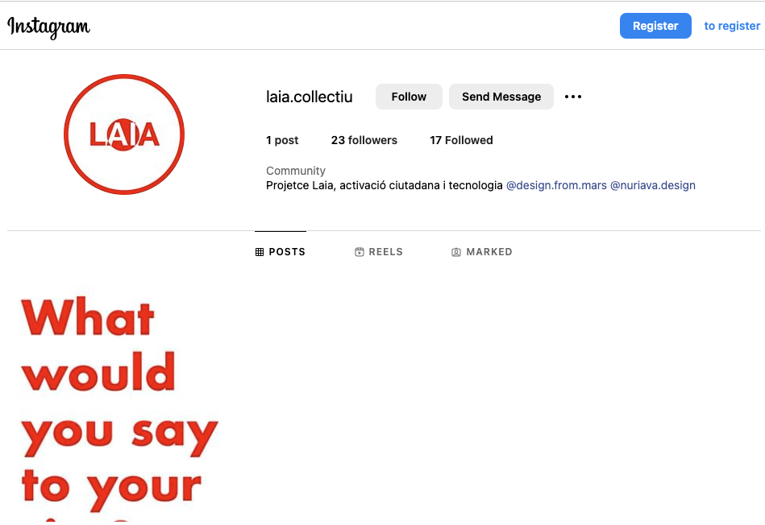

# Reflection
`Work in Progress`
During this term, we were able to apply communicating ideas directly to our research project. We have learned to formulate more precisely and for the community to break down our huge ideas and find the core message. 

