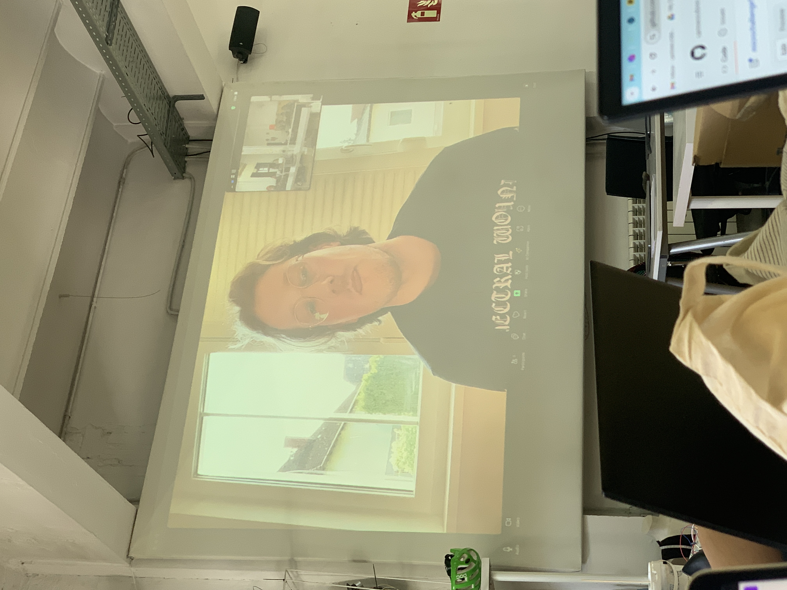

# Reflection

In his talk, Krzysztof Wronski shared his journey during and after MDEF. He discussed how he applies principles like co-design, participation, and collaboration in his work. He founded Tree Centred Design and has a residency at the Planet Ecology Research Lab in Lausanne, Switzerland, where he conducts workshops on human-tree interactions.

Krzysztof highlighted projects like “Aerial Relocation Assistance” for species migration and “ProtestPilze” (Protest Mushrooms), addressing environmental degradation through creative exhibitions using Scobie (kombucha). These projects reflect his commitment to integrating design, ecology, and collaborative practices.

He emphasized that MDEF doesn't provide an easy, employable profile, requiring effort to pursue what interests us. However, this hybrid skill set allows us to adapt to various industries and shape them. The key is effectively communicating this value, despite the challenges, because nothing worthwhile is ever easy.