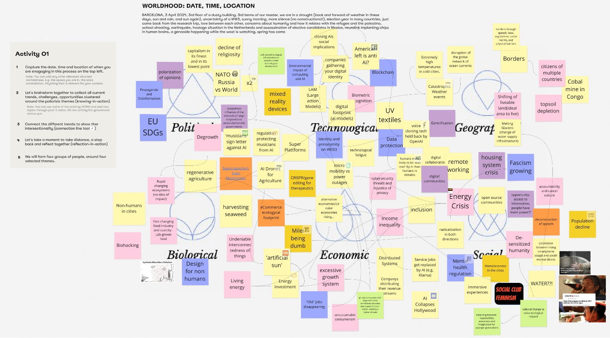
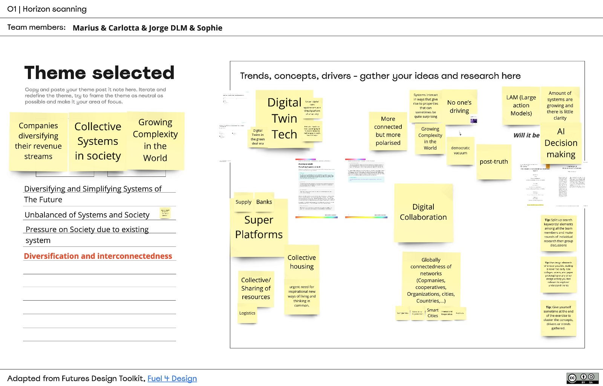
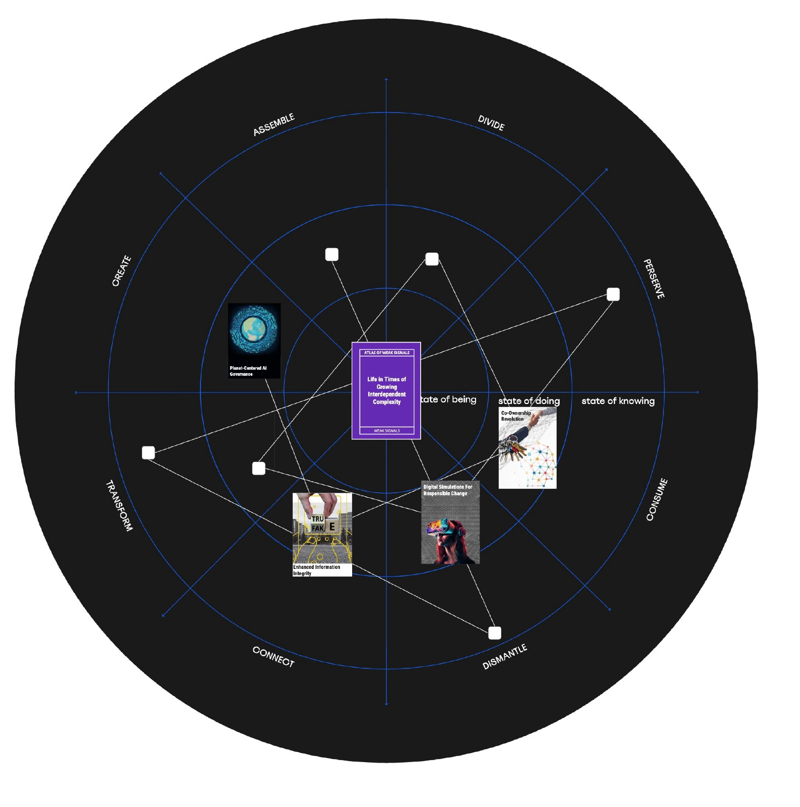
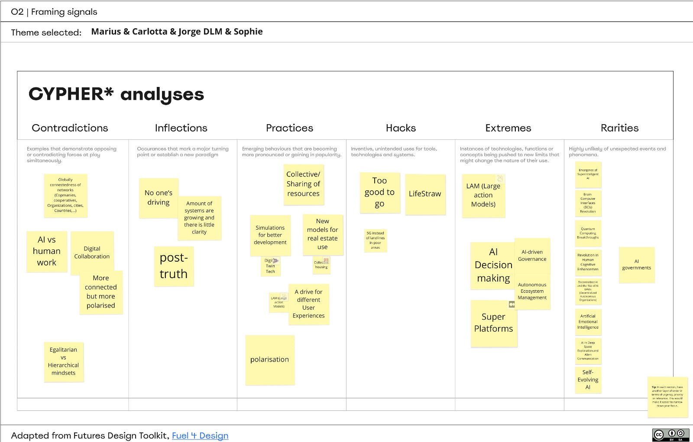
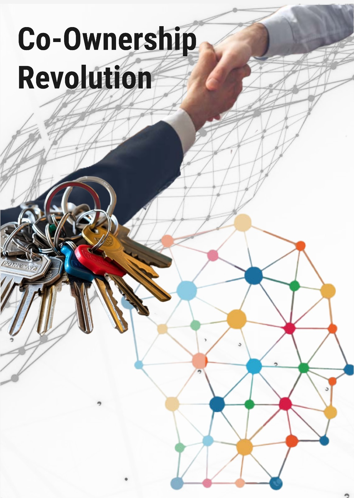
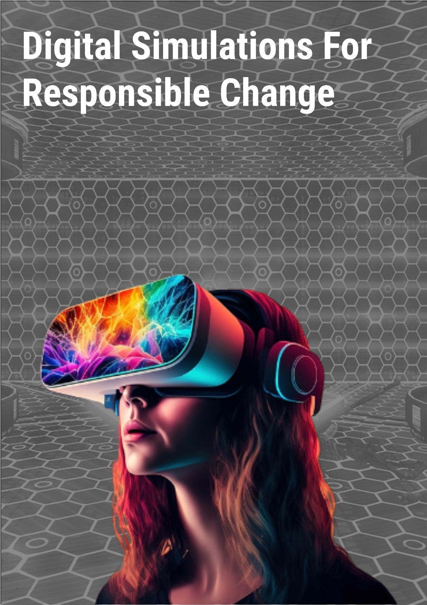
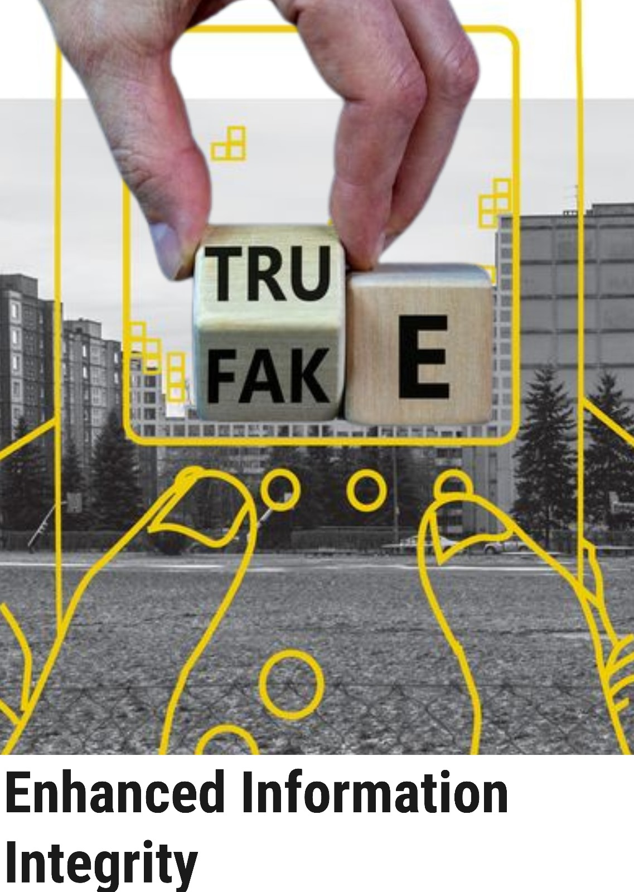
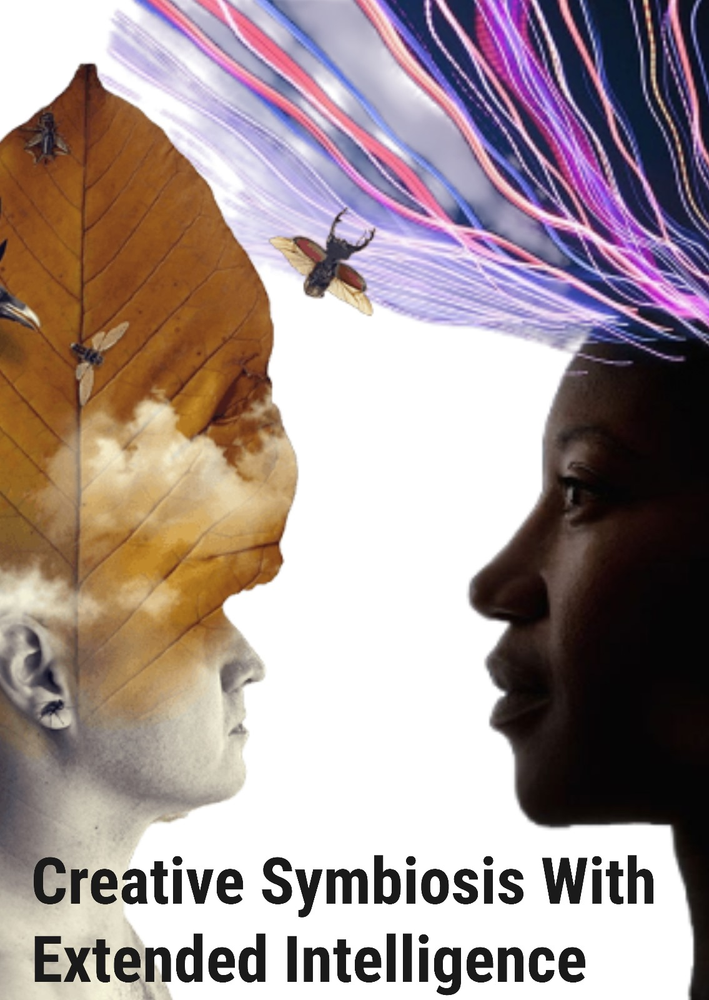

# Reflection
The Wrokshop was a lot of fun and was set well in time. We hadn't used the previous card stack for a long time and have now defined our design space and done a good amount of research. The workshop format allowed us to quickly throw in new topics and generate new cards. I think the process itself can be a helpful approach to finding core topics for your design space that you want to research. Perhaps it could also be interesting to test the process at the beginning of the MDEF year.

Our group has been interested in the increasing complexity of things. Networks are growing organically and distributed and digital structures are becoming more complicated to understand and develop, which brings both advantages and disadvantages. We tried to create cards that were neither positive nor negative in order to leave room for interpretation.  

