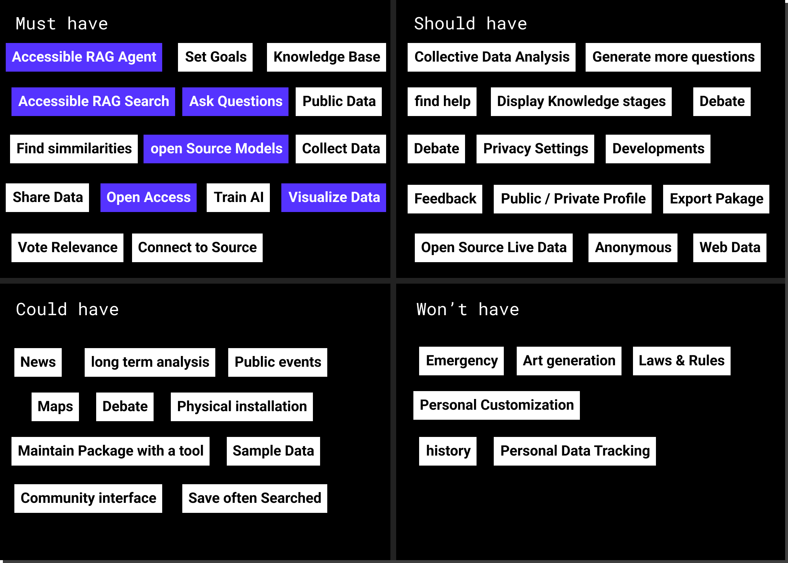
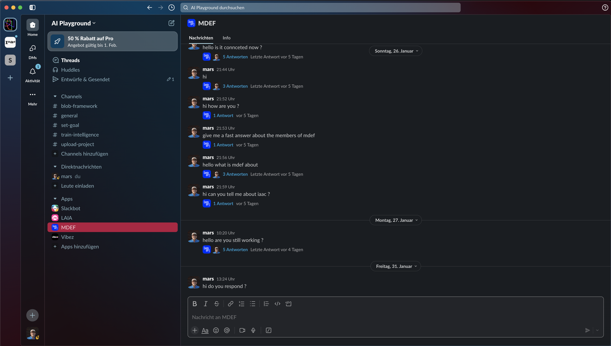

    <a href="/">Home</a> / Thesis

# Collaborative AI Frameworks

    <a class="content-tile large" href="research/">
        
        

        
Thesis/Research/

        <h4>Research</h4>
        
Literature review and methodology

        

    </a>
    <a class="content-tile" href="methodology/">
        
        
Thesis/Methodology/

        <h4>Defining Project</h4>
        
Results and future directions

    </a>
    <a class="content-tile" href="experiments/">
        
        
Thesis/Experiments/

        <h4>Experiments</h4>
        
Testing and feedback sessions

    </a>
    <a class="content-tile large" href="thesis_playground/">
        
        

        
Thesis/Playground/

        <h4>BLOB</h4>
        
Technical implementation and iterations

        

    </a>
    <a class="content-tile large" href="exhibition/">
        
        

        
Thesis/Public/

        <h4>Project Presentations</h4>
        
Results and future directions

        

    </a>
    <a class="content-tile" href="manifesto/">
        
        
Thesis/Manifesto/

        <h4>Manifesto</h4>
        
Technical implementation and iterations

    </a>

## To Do's

- [ ] Task 1
- [ ] Task 2
- [ ] Task 3
- [ ] Task 4
- [ ] Task 5
