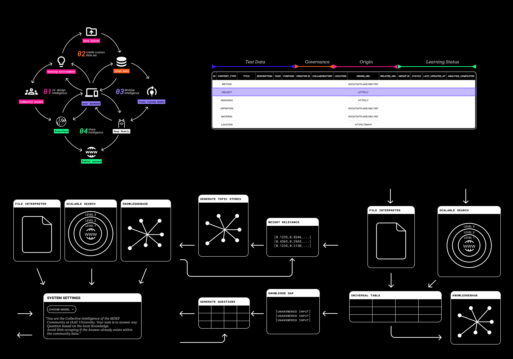
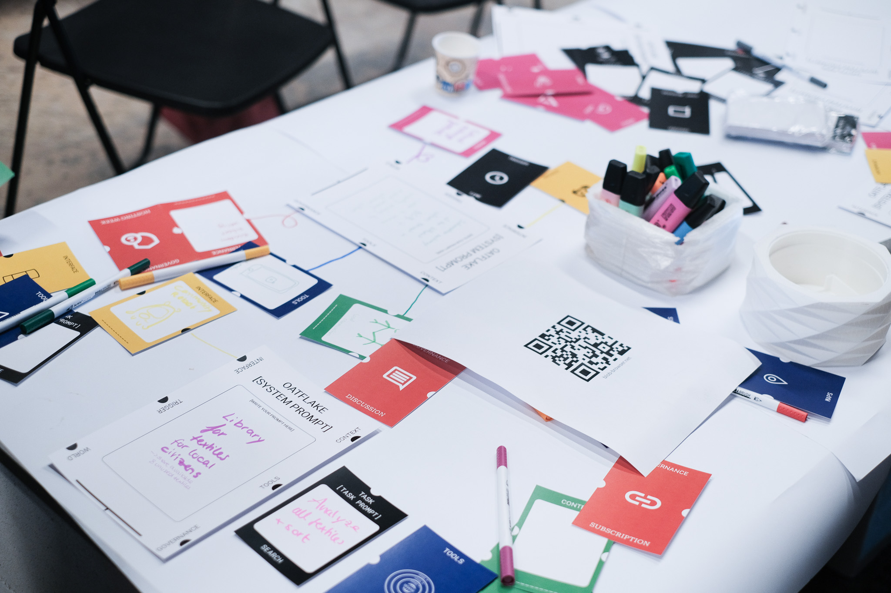
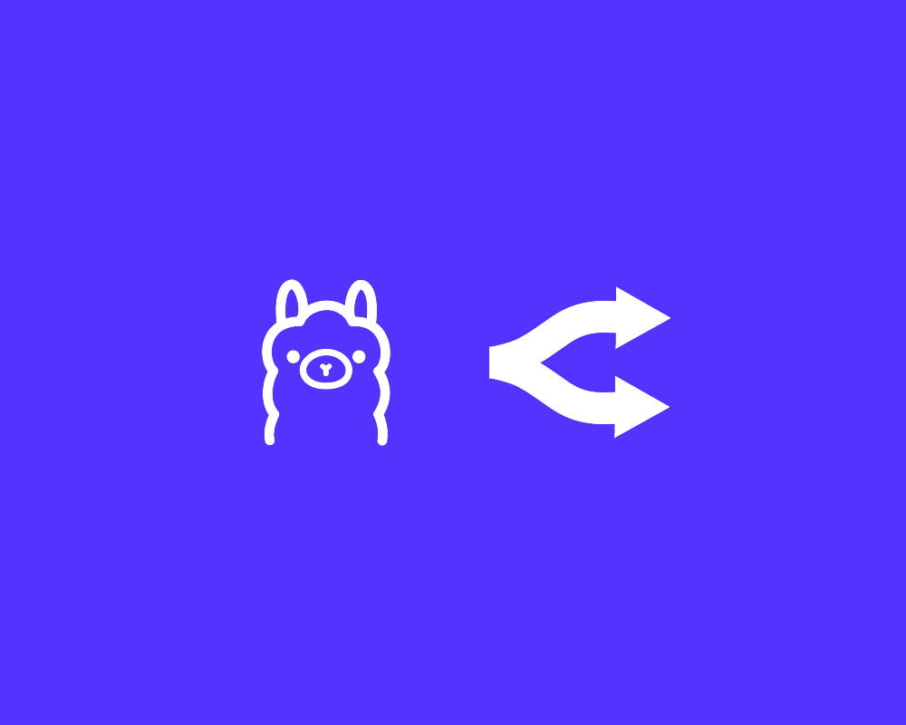
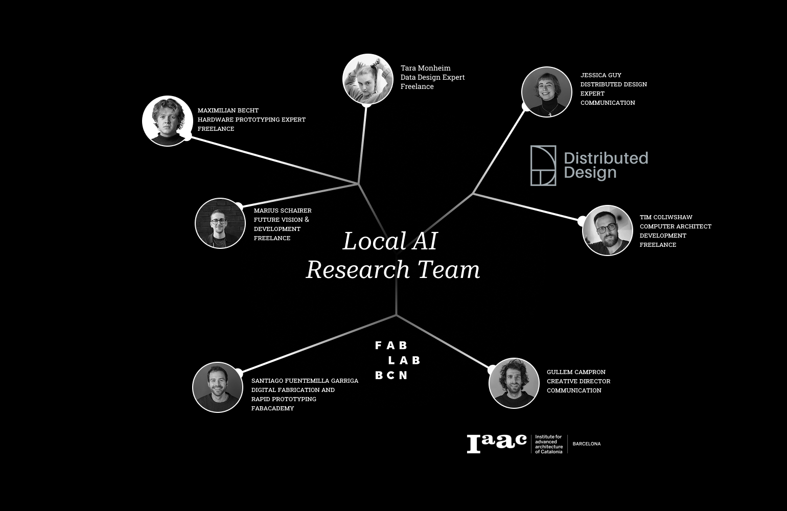
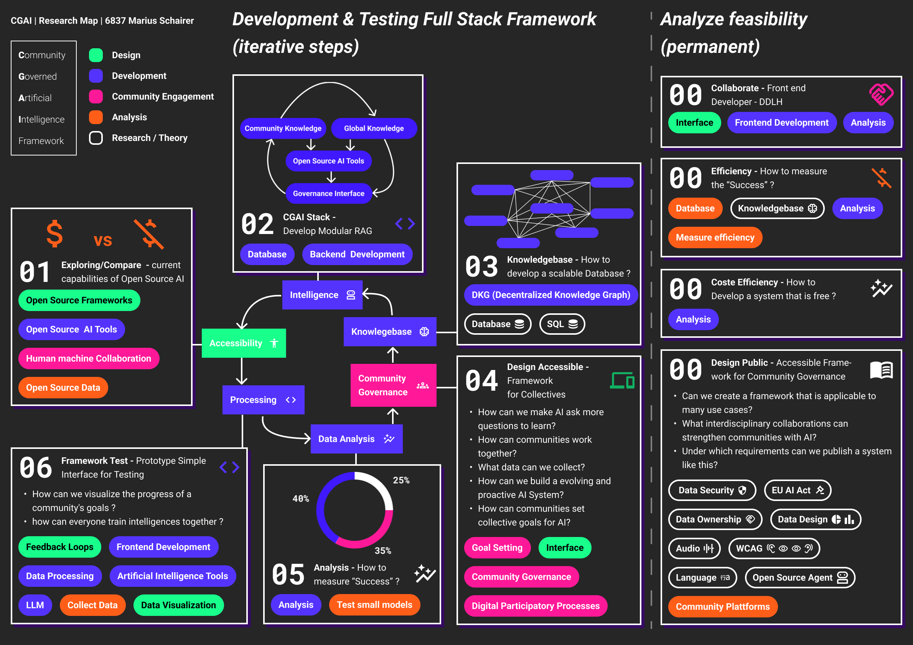
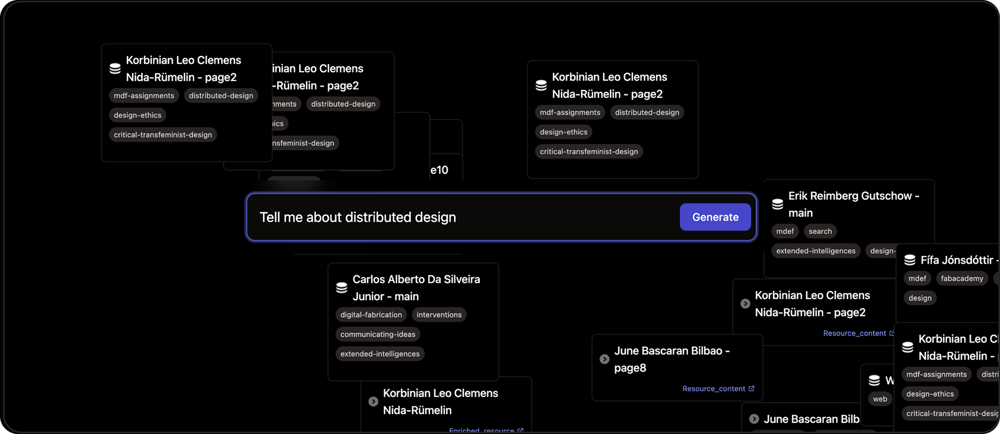

# Community-Governed AI Systems
*Democratizing artificial intelligence through federated knowledge networks*

## Research Overview

This thesis explores the development of **community-governed artificial intelligence systems** that prioritize local autonomy, democratic oversight, and federated knowledge sharing. Moving beyond centralized AI platforms, this research demonstrates how communities can deploy, control, and benefit from AI technologies while maintaining complete data sovereignty.

The work combines practical system development with theoretical frameworks, resulting in functional platforms like **Oatflake** that enable communities to create their own AI knowledge systems. Through distributed training, local processing, and democratic governance mechanisms, these systems prove that powerful AI capabilities can exist without sacrificing community control or privacy.

### Key Research Questions

- How can communities maintain democratic control over AI systems while preserving technical sophistication?
- What architectures enable federated knowledge sharing without compromising local data sovereignty?
- How do we design AI governance mechanisms that scale across diverse community contexts?
- What technical approaches make advanced AI accessible to communities without extensive technical resources?

---

## Thesis Documentation

    <a href="/MDEF_Documentation/thesis/howitworks/" class="content-tile">
        
        <h4>Core Concepts</h4>
        
Foundational ideas driving community-governed AI: distributed training, democratic oversight, federated networks, and local sovereignty.

    </a>
    <a href="/MDEF_Documentation/thesis/experiments/" class="content-tile">
        
        <h4>Experiments</h4>
        
Practical implementations and prototypes: Oatflake platform, LAIA project, LLUM exhibitions, and community validation studies.

    </a>
    <a href="/MDEF_Documentation/thesis/methodology/" class="content-tile">
        
        <h4>Research Methodology</h4>
        
Design research approaches, community engagement methods, technical validation processes, and iterative development cycles.

    </a>
    <a href="/MDEF_Documentation/thesis/research/" class="content-tile">
        
        <h4>Research Context</h4>
        
Academic foundations, related work, theoretical frameworks, and positioning within AI governance and decentralization literature.

    </a>
    <a href="/MDEF_Documentation/thesis/roadmap/" class="content-tile">
        
        <h4>Research Roadmap</h4>
        
Past achievements, current milestones, and future development plans for community-governed AI ecosystem expansion.

    </a>
    <a href="/MDEF_Documentation/thesis/thesis_playground/" class="content-tile">
        
        <h4>Interactive Playground</h4>
        
Live demonstration of Oatflake platform, GitHub repositories, community access, and hands-on experimentation space.

    </a>

---

## Research Impact

### Academic Contributions
This research contributes to multiple academic domains including **human-computer interaction**, **distributed systems**, **AI governance**, and **community-centered design**. The work bridges theoretical frameworks with practical implementations, providing both conceptual advances and functional systems.

### Technical Innovation
The development of **local AI processing pipelines**, **federated knowledge architectures**, and **democratic governance mechanisms** creates new technical approaches for community-controlled technology deployment.

### Social Innovation
By demonstrating that communities can successfully govern their own AI systems, this research provides pathways for **digital sovereignty**, **knowledge democratization**, and **community empowerment** in an increasingly AI-driven world.

---

## Complete Documentation

    <h3>📚 Documentation Status</h3>
    
<strong>Work in Progress:</strong> This documentation is actively being developed and updated. New sections, experiments, and insights are added regularly as the research evolves. Check back frequently for the latest developments in community-governed AI systems.

    
<em>Last Updated: June 2025</em>

    <iframe 
        src="https://mercurial-wormhole-ab6.notion.site/ebd/1cc5f971fb9880a7b596d6ed3f668633" 
        frameborder="0" 
        allowfullscreen>
        
Your browser doesn't support iframes. <a href="https://mercurial-wormhole-ab6.notion.site/ebd/1cc5f971fb9880a7b596d6ed3f668633" target="_blank">Access the documentation directly</a>

    </iframe>

    <a href="https://mercurial-wormhole-ab6.notion.site/ebd/1cc5f971fb9880a7b596d6ed3f668633" target="_blank" class="action-button secondary">
        Open in New Tab
    </a>

