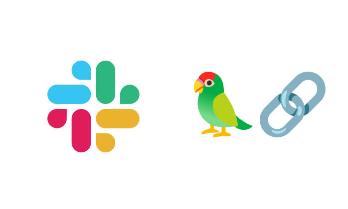
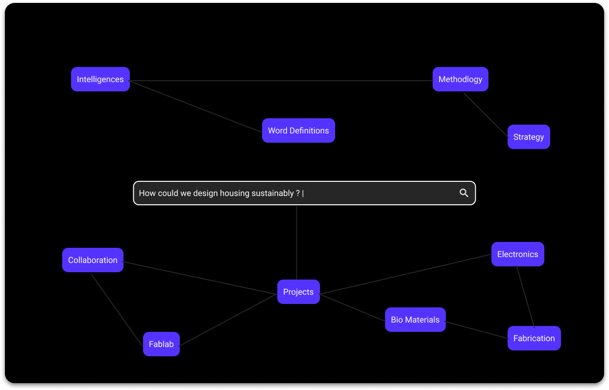
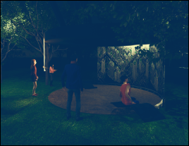
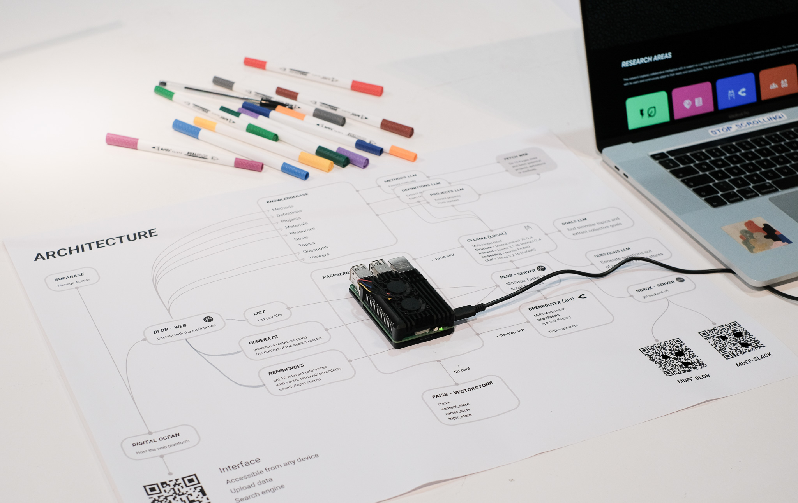
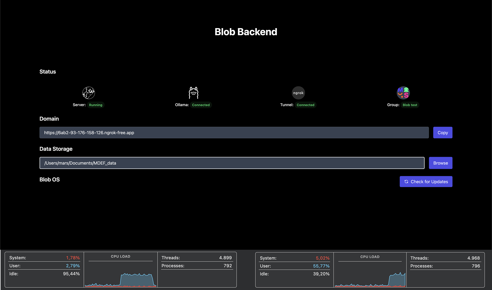

    <a href="/">Home</a> / 
    <a href="/MDEF_Docmentation/thesis">Thesis</a> / 
    Experiments

# Experiments

This research employs a series of iterative experiments to explore collaborative AI frameworks. Each experiment builds on previous learnings while testing different approaches to community-governed artificial intelligence.

The experiments follow a **Research through Design** methodology, where each prototype serves as both a technical proof-of-concept and a probe to understand community needs and governance challenges.

### Key Research Questions Explored:
- How can communities maintain meaningful control over AI systems?
- What interfaces make AI governance accessible to non-technical users?
- How do different deployment strategies affect community autonomy?
- What are the trade-offs between simplicity and functionality?

    <a class="content-tile large" href="../term3/LAIAProject/">
        
        

        
Community AI/

        <h4>LAIA Project</h4>
        
Local AI for All - 2024

        
Neighborhood intelligence platform using AI and crowdsourced data. Demonstrated potential of local AI solutions while highlighting challenges of language barriers and data scarcity. Collaboration with Nuria Vallès.

        

    </a>
    <a class="content-tile" href="slack-workspace/">
        
        

        
Interface/

        <h4>Slack Workspace</h4>
        
Platform Integration - 2024

        
Testing AI integration in existing community platforms. Revealed complexity of dependencies and API management, leading to questions about maintainability and community autonomy.

        

    </a>
    <a class="content-tile" href="blob/">
        
        

        
Framework/

        <h4>BLOB (Blob Browser)</h4>
        
Community-Driven Paradigm - 2024

        
Dramatic shift from city-scale to individual/community scale. Enables users to run AI models locally, collect data, and contribute to decentralized networks. Focus on energy consumption and infrastructure requirements.

        

    </a>
    <a class="content-tile large" href="../year2/InteractionPrototyping/">
        
        

        
Public Interaction/

        <h4>LLUM 2025</h4>
        
Local AI Installation - 2025

        
Interactive exhibit collecting and showcasing local, public data. Provided insights into data collection and presentation while raising concerns about energy consumption and scalability of running GPT and DALL-E on public installations.

        

    </a>
    <a class="content-tile large" href="oatflake/">
        
        

        
Local Deployment/

        <h4>Oatflake</h4>
        
Federated Knowledge Systems - 2025

        
Lightweight approach to local AI deployment, focusing on reducing technical barriers for community adoption. Enables cross-community exchange and builds upon learnings from previous experiments.

        

    </a>
    <a class="content-tile" href="../thesis/roadmap/">
        
        

        
Future Outlook/

        <h4>Research Roadmap</h4>
        
Scaling Strategies - 2025-2030

        
Future directions for community-governed AI ecosystems. Long-term vision for facilitating cross-community exchange, enabling users to build upon and learn from one another's local intelligence.

        

    </a>

## Experimental Journey

Inspired by projects like OpenStreetMap, Aïna, and Oio News, this exploration of local AI implementations follows an iterative path from neighborhood-scale solutions to federated community networks. Each experiment builds on previous learnings while testing different approaches to community-governed artificial intelligence.

The journey demonstrates a clear evolution: from **city-scale approaches** (LAIA) to **public installations** (LLUM 2025) to **individual/community-focused frameworks** (BLOB) and finally to **federated deployment systems** (Oatflake). This progression reveals the importance of iterating, adapting, and rethinking AI implementations to better suit local needs, constraints, and aspirations.

---

*Each experiment contributes to a growing understanding of how communities can meaningfully govern their own AI technologies while maintaining autonomy and reflecting local values.*