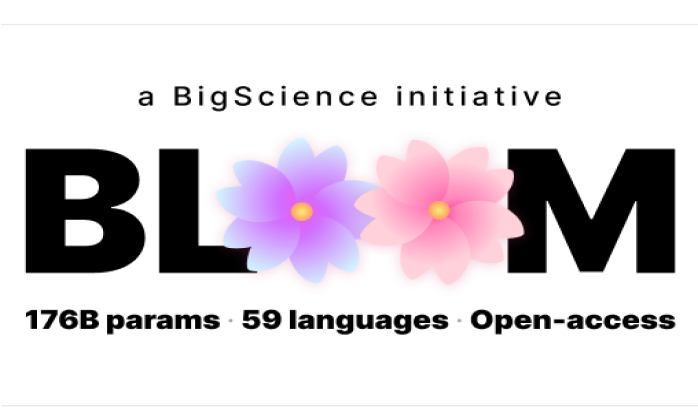
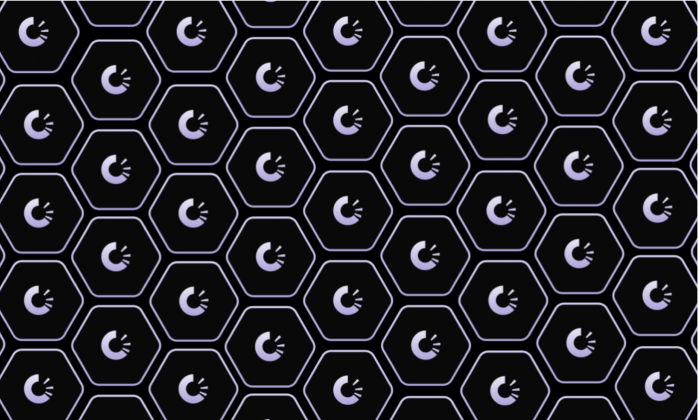
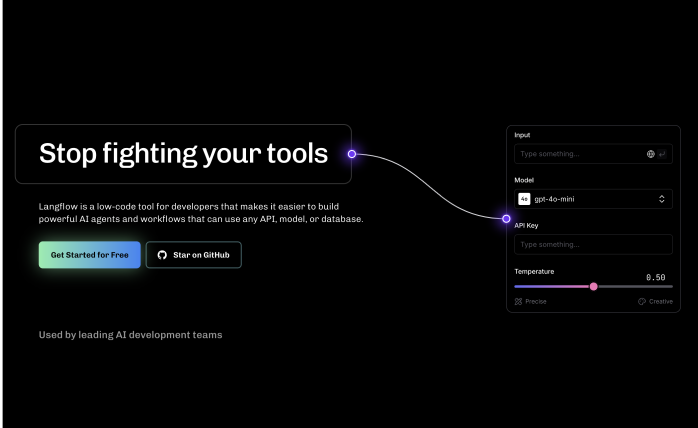
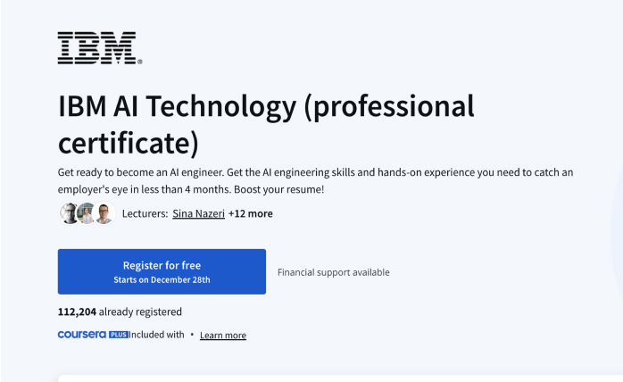

    <a href="/">Home</a> / 
    <a href="/MDEF_Docmentation/thesis">Thesis</a> / 
    Experiments

# Experiments
The initial exeriments of the research defined further steps for the testing prototype and framework development.Through recent explorations the Slack Stack turned to complex to get adapted by people without development experience and the community needs to know about the limitations of the connected model otherwise it can return many errors or empty messgages. (e.g. pdf upload not possible but the interface has it enabled). The exploration with different models shaped the further research but slack turned to be a limiting factor in interface design and accessibility.

## creating test environment

    <a class="content-tile large" href="https://github.com/marius-schairer">
        
        

        
my github ↗

        <h4>The initial setup which ended up too complex</h4>
        
find the code here

        

    </a>
    <a class="content-tile" href="https://ollama.com/">
        
        
ollama website ↗

        <h4>Llama</h4>
        
possible to run locally on CPU ✅

    </a>

    

        

            <h2>The first framework architecture</h2>
            
The initial architecture worked with many small 3rd party frameworks and tried to be as adaptable to the tools aready in use of the communities. The idea was to decentralize as much as possible so the framework would not have to carry a lot of maintainance work, but can just exist and get replicated via a github repository.

        

        
    

    

        
        

            <h2>Starting building with Slack</h2>
            
During previous explorations with ai development the experience to use Slack and Telegram as easy access interface to test was great because they offer remote access group chats and a variety of input possibilities. The setup showed many dependencies and ahandling of api keys of different 3rd party systes which made it a hard to maintain system.

        

    

## Further experiments

    <a class="content-tile" href="thesis/experiments/">
        
        
huggingface ↗

        <h4>Bloom big Science</h4>
        
couldn't run locally 🚫

    </a>
    <a class="content-tile" href="thesis/exhibition/">
        
        
DRAG website ↗

        <h4>DRAG</h4>
        
a concept for decentralized knowledge graphs

    </a>
    <a class="content-tile" href="thesis/exhibition/">
        
        
langflow website ↗

        <h4>Project Outcomes</h4>
        
Results and future directions

    </a>
    <a class="content-tile" href="thesis/exhibition/">
        
        
cursera website ↗

        <h4>State of the art AI Dev</h4>
        
It was interesting to see the current reccommendations of the industry and see it from a critical perspective

    </a>

