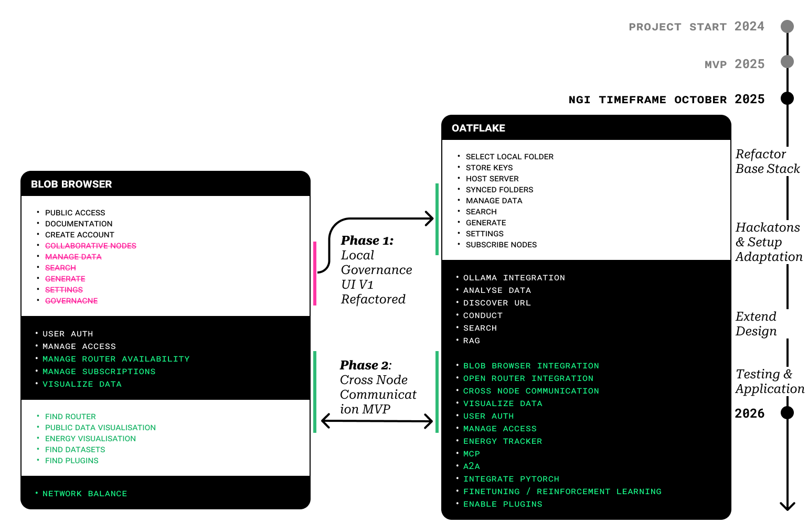
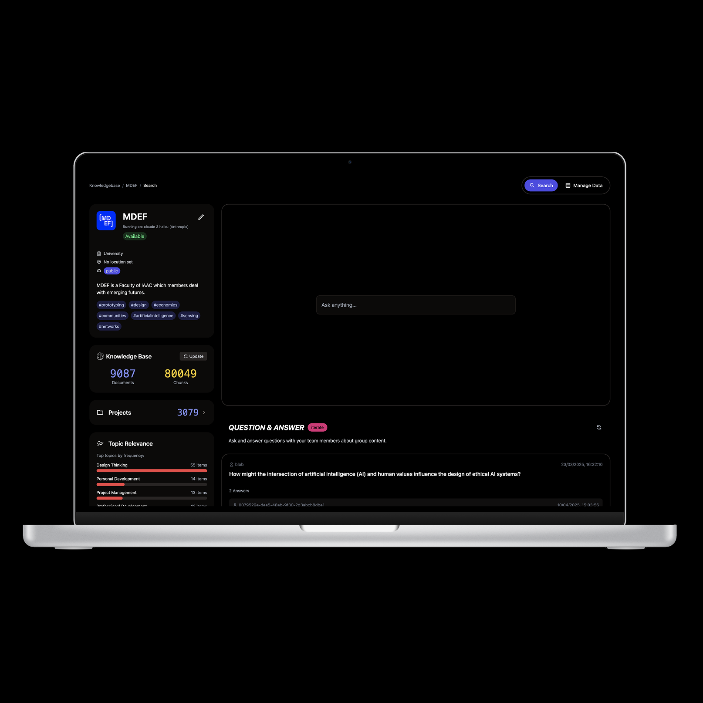
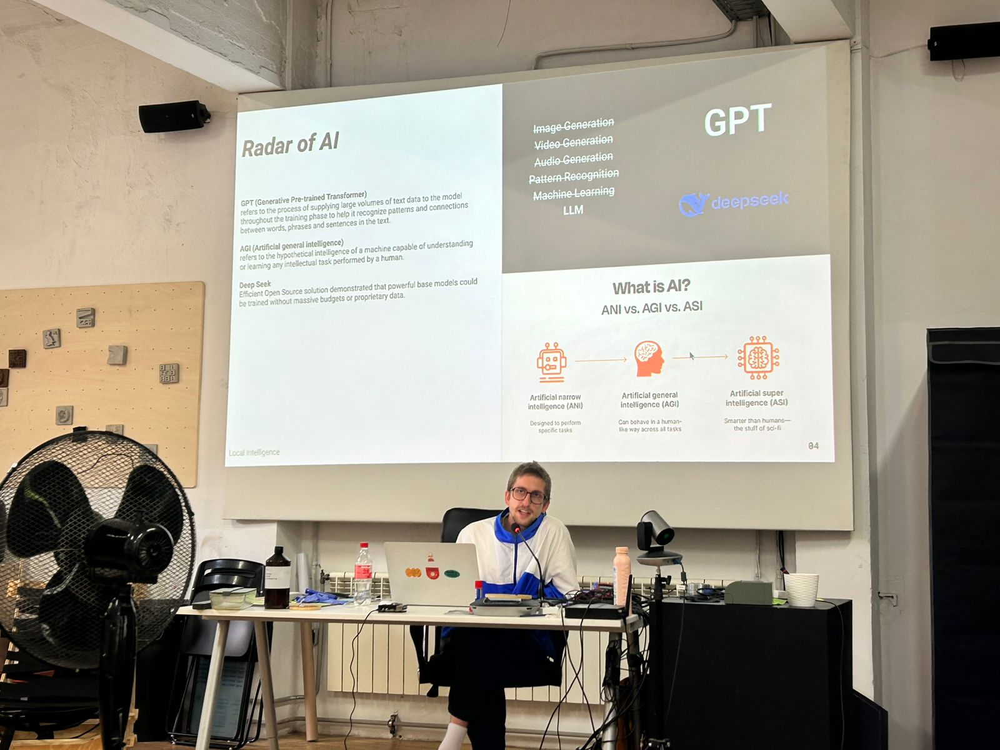

    <a href="/">Home</a> / 
    <a href="/MDEF_Docmentation/thesis">Thesis</a> / 
    <a href="/MDEF_Docmentation/thesis/experiments">Experiments</a> / 
    BLOB

# BLOB: Collaborative AI Framework

    

        <h2>Overview</h2>
        
BLOB (Building Local Open Bots) is a comprehensive framework for decentralized AI governance that emerged from learnings across multiple experiments. It represents a synthesis of technical infrastructure and governance mechanisms designed to support community-controlled AI systems.

        <h3>Concept</h3>
        
<strong>"A framework that enables communities to collectively govern AI systems while maintaining technical simplicity and community autonomy."</strong>

    

    

        
    

---

## Core Principles

    

        
    

    

        <h3>1. Community Sovereignty</h3>
        <ul>
            <li>Communities maintain full control over their AI systems</li>
            <li>No external dependencies for core governance functions</li>
            <li>Local data storage and processing capabilities</li>
        </ul>
        <h3>2. Adaptive Governance</h3>
        <ul>
            <li>Flexible governance structures that can evolve with community needs</li>
            <li>Transparent decision-making processes</li>
            <li>Clear mechanisms for community input and oversight</li>
        </ul>
        <h3>3. Technical Accessibility</h3>
        <ul>
            <li>Simplified deployment and maintenance</li>
            <li>Minimal technical expertise required for operation</li>
            <li>Clear documentation and support resources</li>
        </ul>
    

---

## Framework Architecture

    

        <h3>Governance Layer</h3>
        
<strong>Community Decision-Making Tools</strong>

        <ul>
            <li>Proposal and voting systems</li>
            <li>Model evaluation and selection processes</li>
            <li>Privacy and data handling policies</li>
            <li>Usage guidelines and community standards</li>
        </ul>
        
<strong>Transparency Mechanisms</strong>

        <ul>
            <li>Public logs of AI decisions and reasoning</li>
            <li>Community audit capabilities</li>
            <li>Model performance metrics and reporting</li>
            <li>Clear documentation of system limitations</li>
        </ul>
    

    

        
    

    

        
    

    

        <h3>Technical Layer</h3>
        
<strong>Local Infrastructure</strong>

        <ul>
            <li>Edge computing deployment options</li>
            <li>Model quantization for resource efficiency</li>
            <li>Containerized deployment for easy setup</li>
            <li>Backup and recovery systems</li>
        </ul>
        
<strong>Adaptability Features</strong>

        <ul>
            <li>Modular architecture for community customization</li>
            <li>Plugin system for extending functionality</li>
            <li>Integration capabilities with existing community tools</li>
            <li>Version control and update mechanisms</li>
        </ul>
    

---

## Implementation Strategy

    

        <h3>Phase 1: Core Framework Development</h3>
        <ul>
            <li>Basic governance interface</li>
            <li>Local AI model deployment</li>
            <li>Essential transparency tools</li>
            <li>Community testing and feedback</li>
        </ul>
        <h3>Phase 2: Community Pilot Programs</h3>
        <ul>
            <li>Partner with interested communities</li>
            <li>Real-world testing and iteration</li>
            <li>Documentation of best practices</li>
            <li>Training material development</li>
        </ul>
        <h3>Phase 3: Open Source Release</h3>
        <ul>
            <li>Full framework release under open license</li>
            <li>Community contribution guidelines</li>
            <li>Support network establishment</li>
            <li>Scaling and replication resources</li>
        </ul>
    

    

        
    

---

## Key Features

    

        
    

    

        <h3>Governance Interface</h3>
        
<strong>Community Dashboard</strong>

        <ul>
            <li>Overview of AI system status and usage</li>
            <li>Community voting and proposal tools</li>
            <li>Performance metrics and reports</li>
            <li>Configuration and policy management</li>
        </ul>
        
<strong>Decision-Making Tools</strong>

        <ul>
            <li>Structured proposal system</li>
            <li>Multi-stage voting processes</li>
            <li>Consensus-building mechanisms</li>
            <li>Conflict resolution procedures</li>
        </ul>
    

    

        <h3>Technical Components</h3>
        
<strong>Model Management</strong>

        <ul>
            <li>Local model deployment and updates</li>
            <li>Performance monitoring and optimization</li>
            <li>Resource usage tracking</li>
            <li>Security and privacy controls</li>
        </ul>
        
<strong>Data Governance</strong>

        <ul>
            <li>Local data storage and processing</li>
            <li>Privacy protection mechanisms</li>
            <li>Data retention and deletion policies</li>
            <li>Community data ownership enforcement</li>
        </ul>
    

    

        
    

---

## Research Questions Addressed

### How can communities maintain meaningful control?
- Through transparent governance interfaces
- Local deployment eliminating external dependencies
- Clear decision-making processes and documentation

### What makes AI governance accessible?
- Intuitive user interfaces for non-technical users
- Comprehensive documentation and training materials
- Community support networks and peer learning

### How do we balance simplicity with functionality?
- Modular architecture allowing gradual feature adoption
- Core functionality prioritizing essential governance needs
- Optional advanced features for communities ready to adopt them

## Current Development Status

### Completed Components
- Basic governance interface mockups
- Local AI deployment proof-of-concept
- Community consultation framework
- Initial documentation and guidelines

### In Development
- Full governance dashboard implementation
- Automated deployment system
- Community testing protocols
- Training and support materials

### Future Work
- Multi-community federation capabilities
- Advanced privacy protection features
- Economic sustainability models
- Long-term maintenance strategies

## Community Testing

    

        
    

    

        <h3>Pilot Community Characteristics</h3>
        <ul>
            <li>Small to medium-sized communities (50-500 members)</li>
            <li>Existing governance structures</li>
            <li>Interest in AI applications for community benefit</li>
            <li>Willingness to participate in iterative development</li>
        </ul>
        <h3>Testing Methodology</h3>
        <ul>
            <li>Participatory design sessions</li>
            <li>Regular feedback collection</li>
            <li>Performance monitoring</li>
            <li>Long-term sustainability assessment</li>
        </ul>
    

---

## Technical Specifications

### Deployment Requirements
- **Hardware**: Standard server or high-end desktop computer
- **Software**: Containerized deployment (Docker)
- **Network**: Standard internet connection
- **Maintenance**: Weekly check-ins, monthly updates

### Supported AI Models
- Local language models (Ollama, Hugging Face)
- Vision models for image processing
- Specialized models for community-specific applications
- Plugin architecture for custom model integration

## Connection to Other Experiments

    

        <h3>Building on Previous Work</h3>
        <ul>
            <li><strong>Slack Workspace</strong>: Informed simplicity requirements</li>
            <li><strong>LAIA</strong>: Demonstrated community-specific application needs</li>
            <li><strong>LLUM 2025</strong>: Explored public engagement possibilities</li>
            <li><strong>Oatflake</strong>: Validated local deployment approaches</li>
        </ul>
        <h3>Informing Future Development</h3>
        <ul>
            <li>Framework serves as foundation for community AI initiatives</li>
            <li>Governance principles applicable across different contexts</li>
            <li>Technical patterns reusable for various community needs</li>
        </ul>
    

    

        
    

---

## Impact and Implications

### For Communities
- Increased autonomy over AI technologies
- Reduced dependence on commercial platforms
- Enhanced capacity for collective decision-making
- Improved alignment between AI behavior and community values

### For AI Development
- Demonstrates viability of community-controlled AI
- Provides alternative to centralized AI governance
- Creates feedback loops between communities and developers
- Establishes new models for AI system ownership

## Conclusion

BLOB represents a comprehensive approach to collaborative AI governance that prioritizes community sovereignty while maintaining technical feasibility. By synthesizing learnings from multiple experiments, the framework offers a practical path toward AI systems that truly serve community interests and reflect local values.

The ongoing development of BLOB continues to be informed by community feedback and real-world testing, ensuring that the framework remains responsive to the needs of the communities it aims to serve.
