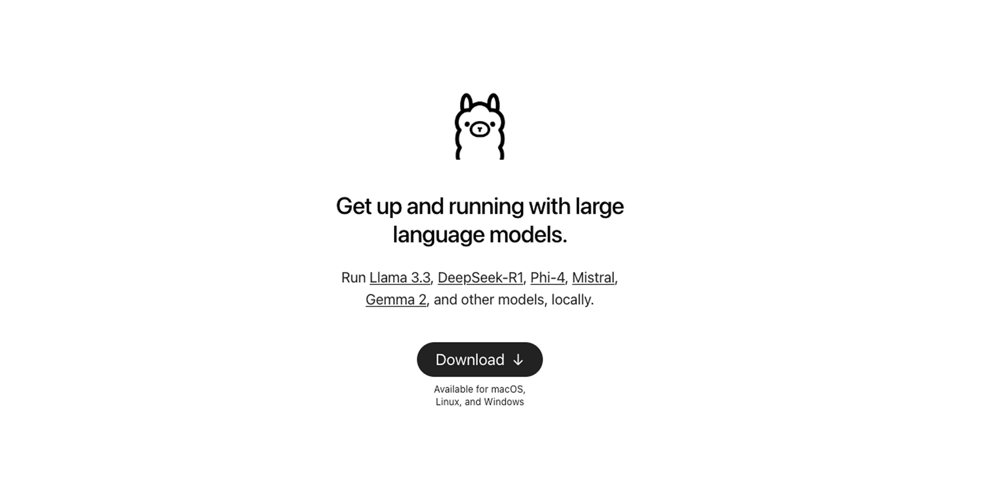

# Oatflake: Federated Knowledge Systems

*The breakthrough moment that shaped federated knowledge systems*

    

        Local AI
        Community Platform
        Federated Systems
        Data Sovereignty
    

    
    

        

            Timeline
            2024 - 2025
        

        

            Status
            Successfully Exhibited
        

        

            Exhibition
            Design Dialogues 2
        

    

## Project Overview
*The breakthrough moment that shaped federated knowledge systems*

    

        
    

    

        
Oatflake was exhibited at the 2025 Design Dialogues 2 of the MDEF faculty, marking a pivotal moment in community-driven AI development. Trained on student websites, it demonstrated comprehensive knowledge of projects, methods, resources, and definitions, enabling users to evaluate data through Q&A and voting while creating community servers for free.

        
This exhibition became the breaking moment that shaped our research toward federated knowledge-sharing systems. The success demonstrated that local AI communities could effectively manage and share knowledge while maintaining complete privacy and control over their data.

    

---

## Key Innovation

    

        <h3>🔧 Technical Stack</h3>
        
Combines Python, JavaScript, and HTML with Ollama and ngrok to create local community AI systems that operate entirely on-device, ensuring data sovereignty while enabling collaborative intelligence.

        
        <h3>📊 Data Processing</h3>
        
Integrates advanced file processing tools from LangChain to split and prepare text data, along with web scraping capabilities for resource analysis.

        
        <h3>🤝 Community Interface</h3>
        
Community members can add data through a remote interface (see BLOB Browser) and retrieve information for search and generation functionality.

    

    

        
    

---

## Dual-Track Architecture

    

        
    

    

        
Oatflake operates on two complementary tracks: <strong>live chat response</strong> for immediate user interaction and <strong>background learning</strong> for continuous model improvement. This design ensures real-time responsiveness while maintaining the system's learning capabilities through local processing with quantized models.

    

---

## Local Processing System
*Complete data sovereignty with responsive AI interactions*

    

        <h3>1. Local Model Hosting</h3>
        
Utilizes Ollama to run quantized language models locally on consumer hardware, eliminating the need for external API calls and ensuring complete privacy of conversations and data.

        
        <h3>2. Secure Tunneling</h3>
        
Integrates ngrok for secure community access, allowing remote users to interact with local AI systems through encrypted tunnels while maintaining host control and privacy.

        
        <h3>3. Data Processing Pipeline</h3>
        
Leverages LangChain for advanced text processing, document splitting, and web scraping capabilities, enabling sophisticated data ingestion and preparation for local AI models.

        
        <h3>4. Community Integration</h3>
        
Supports Q&A functionality and voting mechanisms for content evaluation, enabling communities to collaboratively assess and improve their knowledge systems.

    

    

        
    

    

        
    

    

        <h3>Federated Knowledge Sharing</h3>
        
The system enables communities to create autonomous knowledge-sharing networks where each node maintains full control over its data while contributing to collective intelligence through voluntary participation and transparent evaluation processes.

    

---

## Exhibition Results
*Real-world testing and community validation*

    

        
The Design Dialogues 2 exhibition demonstrated Oatflake's effectiveness in real community knowledge scenarios, validating our approach to local AI systems:

        
        
<strong>📚 Knowledge Base</strong> 
        Successfully trained on comprehensive MDEF student website data, demonstrating accurate knowledge retrieval across projects and resources

        
        
<strong>🔒 Local Processing</strong> 
        100% local operation with quantized models - no external API dependencies or data transmission required

        
        
<strong>💻 Device Compatibility</strong> 
        Runs efficiently on consumer hardware through Ollama, making advanced AI accessible to community organizers

        
        
<strong>🌐 Community Features</strong> 
        Integrated Q&A and voting systems enable collaborative content evaluation and continuous improvement

        
        <h3>Breakthrough Moment</h3>
        
The exhibition marked a pivotal moment in our research, demonstrating that local AI communities can effectively manage knowledge while maintaining complete autonomy. This success directly influenced our transition toward federated knowledge-sharing systems that prioritize community control and data sovereignty.

    

    

        
    

---

## Future Development
*Building the federated knowledge ecosystem*

    

        
    

    

        <h3>Research Direction</h3>
        
The success of Oatflake at Design Dialogues 2 has shaped our research toward comprehensive federated knowledge-sharing systems that preserve community autonomy while enabling collaborative intelligence.

        
        
<strong>Enhanced Local Processing</strong>: Improved quantized model efficiency and expanded language model support through Ollama integration

        
        
<strong>Community Tools</strong>: Advanced voting mechanisms, content curation systems, and collaborative knowledge validation features

        
        
<strong>Cross-Platform Integration</strong>: Seamless integration with BLOB Browser for enhanced data management and sharing

        
        
<strong>Privacy-First Architecture</strong>: Advanced secure tunneling and encrypted communication protocols for distributed communities

    

---

---

*This experiment continues to evolve based on community feedback and technical discoveries. Regular updates reflect ongoing learnings and adaptations.*
