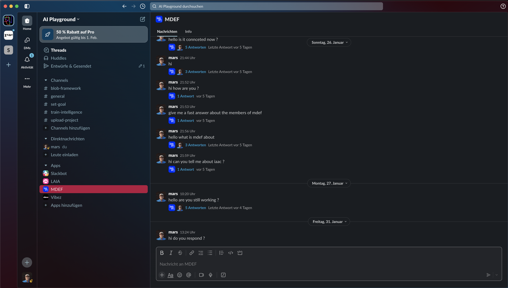

    <a href="/">Home</a> / 
    <a href="/MDEF_Docmentation/thesis">Thesis</a> / 
    <a href="/MDEF_Docmentation/thesis/experiments">Experiments</a> / 
    Slack Workspace

# Slack Workspace Experiment

## Overview

The Slack Workspace experiment explored integrating AI capabilities into existing community communication platforms. The goal was to test whether established tools could serve as accessible interfaces for community AI governance.

## Hypothesis

**"Existing community platforms like Slack can serve as intuitive interfaces for AI interaction, reducing barriers to adoption by leveraging familiar tools."**

## Technical Implementation

### Architecture
- **Platform**: Slack workspace with custom bot integration
- **AI Backend**: Multiple model connections (Ollama, OpenAI)
- **Data Handling**: File uploads, conversation history
- **Governance**: Channel-based permissions and moderation

### Key Features Tested
- Natural language interaction with AI models
- File upload and processing capabilities
- Group conversation with AI participation
- Model switching and configuration
- Privacy controls and data management

## Setup Process

The implementation required:
### 1. **Slack App Configuration**: Custom bot permissions and OAuth setup
### 2. **API Management**: Multiple third-party service integrations
### 3. **Model Deployment**: Local and cloud-based AI model access
### 4. **Security Configuration**: API key management and user permissions

## Results and Findings

### Technical Challenges

**Complexity Barrier**
- Multiple API keys and service dependencies
- Complex setup process requiring developer knowledge
- Maintenance burden for keeping integrations updated

**Interface Limitations**
- Slack's UI constraints limited governance interface design
- File handling restrictions (e.g., PDF uploads shown but not functional)
- Limited customization for community-specific needs

**Dependency Issues**
- Reliance on multiple third-party services
- Potential for service disruptions affecting community access
- Vendor lock-in concerns for long-term community autonomy

### Community Insights

**Positive Aspects**
- Familiar interface reduced learning curve
- Group conversation dynamics worked well
- Real-time interaction felt natural

**Concerns Raised**
- Lack of transparency in AI decision-making
- Difficulty understanding system limitations
- Questions about data privacy and control

## Key Learnings

### 1. Complexity vs. Accessibility Trade-off
While feature-rich integrations are technically possible, they often create barriers that exclude community members without technical expertise.

### 2. Platform Dependence
Using existing platforms limits community control and creates dependencies that may conflict with governance goals.

### 3. Interface Design Constraints
Third-party platforms impose design limitations that can hinder the development of effective governance interfaces.

### 4. Maintenance Burden
Complex integrations require ongoing technical maintenance that communities may not be able to sustain.

## Impact on Research Direction

This experiment led to several important shifts in approach:

### Towards Simplicity
Recognition that reducing technical complexity is crucial for community adoption.

### Platform Independence
Need for solutions that don't depend on third-party commercial platforms.

### Governance-First Design
Importance of designing governance interfaces from the ground up rather than adapting existing tools.

## Technical Documentation

### Code Repository
The implementation code is available on [GitHub](https://github.com/marius-schairer) with setup instructions and configuration examples.

### Dependencies Used
- Slack Bolt framework
- Ollama API integration
- OpenAI API
- Custom middleware for governance features

## Transition to Next Experiments

The findings from this experiment directly informed:
- **LAIA**: Focus on community-specific applications
- **BLOB**: Development of independent governance framework
- **Oatflake**: Simplified local deployment strategies

## Conclusion

While the Slack Workspace experiment demonstrated the technical feasibility of AI integration in existing platforms, it revealed significant barriers to community governance and long-term sustainability. The complexity of setup and maintenance, combined with platform dependencies, suggested the need for purpose-built solutions that prioritize community autonomy and governance transparency.

This experiment was crucial in establishing the principle that **accessibility and community control must be prioritized over technical sophistication** in collaborative AI frameworks.
