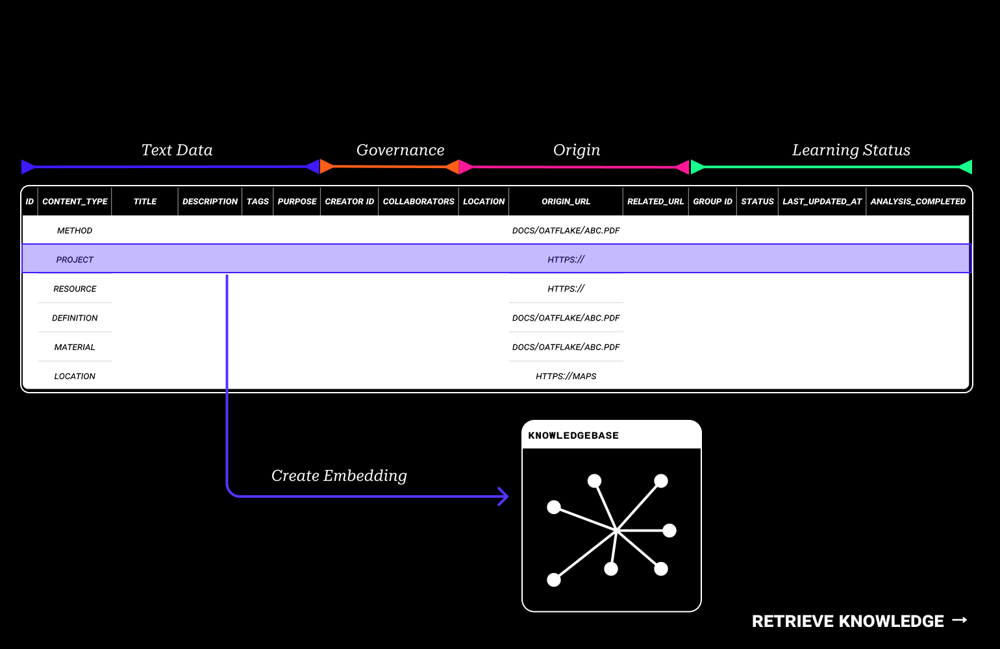

    <a href="/">Home</a> / 
    <a href="/MDEF_Docmentation/thesis">Thesis</a> / 
    Core Concepts

# Core Concepts
*Foundational ideas driving community-governed AI systems*

This research has developed several interconnected concepts that form the foundation of community-controlled artificial intelligence. Each concept addresses specific challenges in current AI systems while building toward a more democratic and distributed future.

---

    

        <h2>Distributed Knowledge Training</h2>
        
<em>Decentralizing AI learning across community nodes</em>

        
Rather than centralizing AI training in massive data centers, distributed knowledge training spreads the computational load across community devices. Each node contributes processing power while maintaining local data sovereignty.

        <h4>Key Principles:</h4>
        <ul>
            <li><strong>Local Processing</strong>: Models train on community hardware</li>
            <li><strong>Federated Learning</strong>: Knowledge sharing without data movement</li>
            <li><strong>Resource Efficiency</strong>: Utilizing existing community infrastructure</li>
            <li><strong>Privacy Preservation</strong>: Data never leaves community control</li>
        </ul>
    

    

        
    

---

    

        
    

    

        <h2>Community Governed Intelligence</h2>
        
<em>Democratic control over AI decision-making</em>

        
        
Communities gain meaningful control over their AI systems through transparent governance mechanisms. Moving beyond black-box algorithms to participatory decision-making processes.

        
        <h4>Governance Mechanisms:</h4>
        <ul>
            <li><strong>Collective Decision-Making</strong>: Community votes on model behavior</li>
            <li><strong>Transparent Operations</strong>: Open access to AI reasoning processes</li>
            <li><strong>Democratic Oversight</strong>: Regular review and adjustment cycles</li>
            <li><strong>Local Autonomy</strong>: Communities set their own AI policies</li>
        </ul>
    

---

    

        <h2>Internet of Agents</h2>
        
<em>Networked AI systems for collaborative intelligence</em>

        
        
Individual AI agents connect across communities, creating a decentralized network of specialized intelligences. Each agent serves specific community needs while contributing to broader collective knowledge.

        
        <h4>Network Features:</h4>
        <ul>
            <li><strong>Specialized Agents</strong>: Each AI focuses on community expertise</li>
            <li><strong>Inter-Agent Communication</strong>: Collaborative problem-solving</li>
            <li><strong>Emergent Intelligence</strong>: Network effects amplify capabilities</li>
            <li><strong>Resilient Architecture</strong>: No single points of failure</li>
        </ul>
    

    

        
    

---

    

        
        
Standardized interface enabling cross-system knowledge retrieval and interoperability

    

    

        <h2>Universal RAG Table</h2>
        
<em>Standardized knowledge retrieval across all systems</em>

        
A universal interface for Retrieval-Augmented Generation that works across different AI models, data sources, and community systems. This standardization enables interoperability while preserving local autonomy.

    

---

    

        <h2>Scalable Search</h2>
        
<em>Efficient knowledge discovery in distributed systems</em>

        
Advanced search capabilities that scale across distributed knowledge networks without compromising speed or relevance. Combines local expertise with network-wide knowledge discovery.

    

    

        
    

---

    

        <h2>NFT Agent Future Steps</h2>
        
<em>Cryptographic identity and ownership for AI systems</em>

        
        
Each AI agent possesses a unique cryptographic identity that enables ownership tracking, capability verification, and secure interactions across the network. NFTs provide provenance and accountability.

        
        

            

                <h4>🔐 Cryptographic Identity</h4>
                
Unique, verifiable agent signatures

            

            

                <h4>📜 Capability Tracking</h4>
                
Transparent record of agent abilities

            

            

                <h4>🤝 Trust Networks</h4>
                
Reputation-based agent interactions

            

            

                <h4>💰 Economic Incentives</h4>
                
Value exchange for AI services

            

        

    

---

    

        <h2>Blockchain Infrastructure Future Steps</h2>
        
<em>Decentralized coordination and trust mechanisms</em>

        
        
Blockchain technology provides the trust layer for community-governed AI, enabling transparent governance, secure transactions, and verifiable consensus without centralized authorities.

        
        

            

                <h4>🗳️ Governance Voting</h4>
                
Transparent, tamper-proof decision records

            

            

                <h4>🔒 Security Layer</h4>
                
Cryptographic protection for all operations

            

            

                <h4>📋 Smart Contracts</h4>
                
Automated execution of community rules

            

            

                <h4>🌊 Consensus Mechanisms</h4>
                
Democratic agreement on network changes

            

        

    

---

## Integration Vision
*How concepts work together*

These concepts form an integrated ecosystem where community-governed AI agents operate across a distributed network, sharing knowledge through universal interfaces while maintaining local autonomy through blockchain-secured governance.

    

        <h4>1. Local Training</h4>
        
Communities train specialized agents using distributed knowledge training

    

    
→

    

        <h4>2. Network Connection</h4>
        
Agents join the Internet of Agents with NFT identities

    

    
→

    

        <h4>3. Knowledge Sharing</h4>
        
Universal RAG enables cross-system knowledge access

    

    
→

    

        <h4>4. Democratic Governance</h4>
        
Blockchain-secured voting guides network evolution

    

<a href="https://blob-browser.net/" target="_blank" class="cta-section-link">
    

        <h2>Experience the Concepts at Blob-Browser →</h2>
    

</a>

