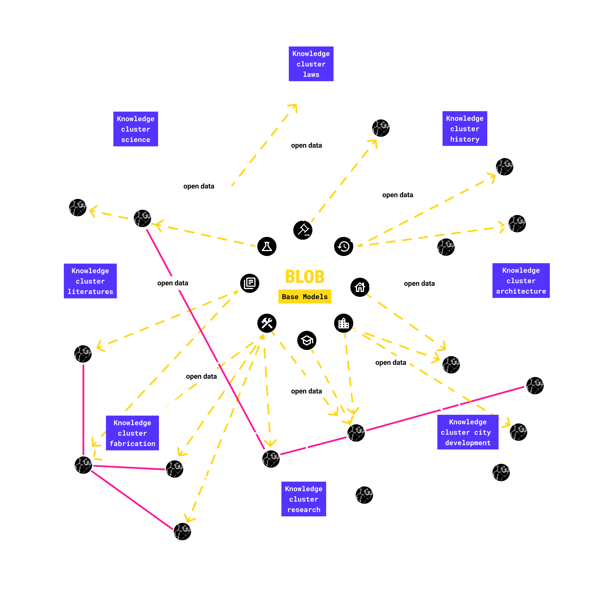

    <a href="/">Home</a> / 
    <a href="/MDEF_Docmentation/thesis">Thesis</a> / 
    How it works

# The idea behind

    

        <h2>Open access framework</h2>
        
moving from a modular open source stack degreased the development effort, brought up many new oportunities in controlling the Intelligence and to display interactions better than in a chat environment. The user can now be specificly guided what is possible and what not. Everyone can access without development effort

    

    

    
    

        <h2>Decentralized server</h2>
        
This approach is focusing on reducing the need of processing power and storage capacity on the Plattform side, enable data security and transparency. Through that the weight of heavy energy consumption and cost production for the processing of ai tasks gets distributed to already existing devices.

    

    

        <h2>Knowledge Cluster</h2>
        
Through th analysis of the public data it might be possible to train small models specialized on fields which users can include again. Groups might be able to exchange knowledge in their clusters.

    

    

<a href="/MDEF_Documentation/thesis/thesis_playground/" target="_blank" class="social-link">
    Try it out soon ↗
</a>

