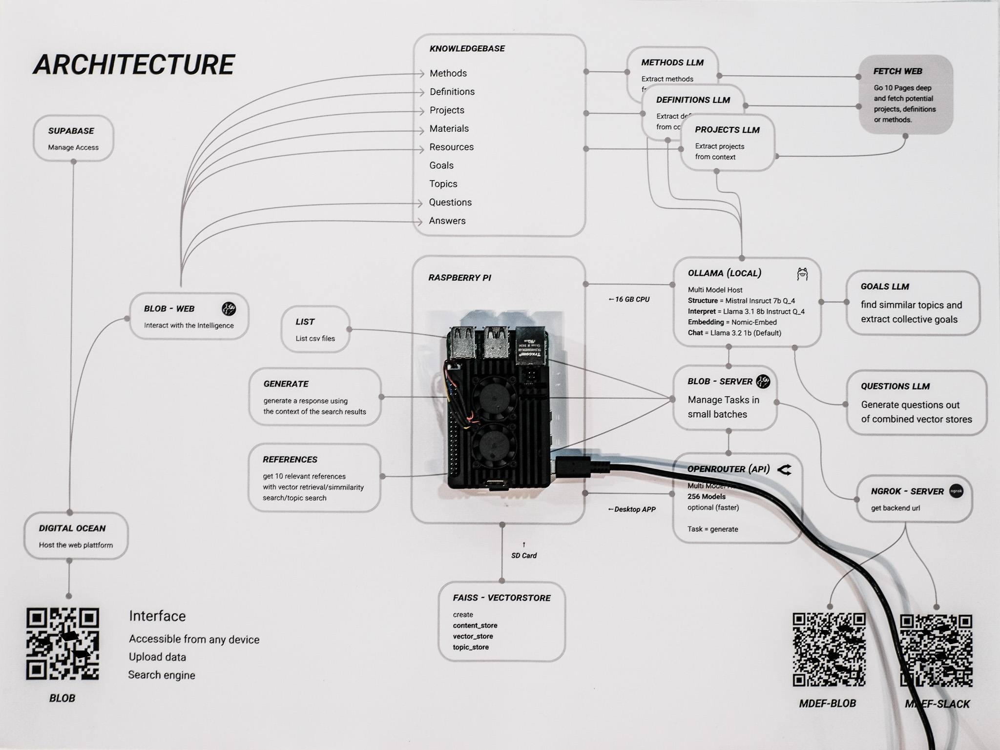
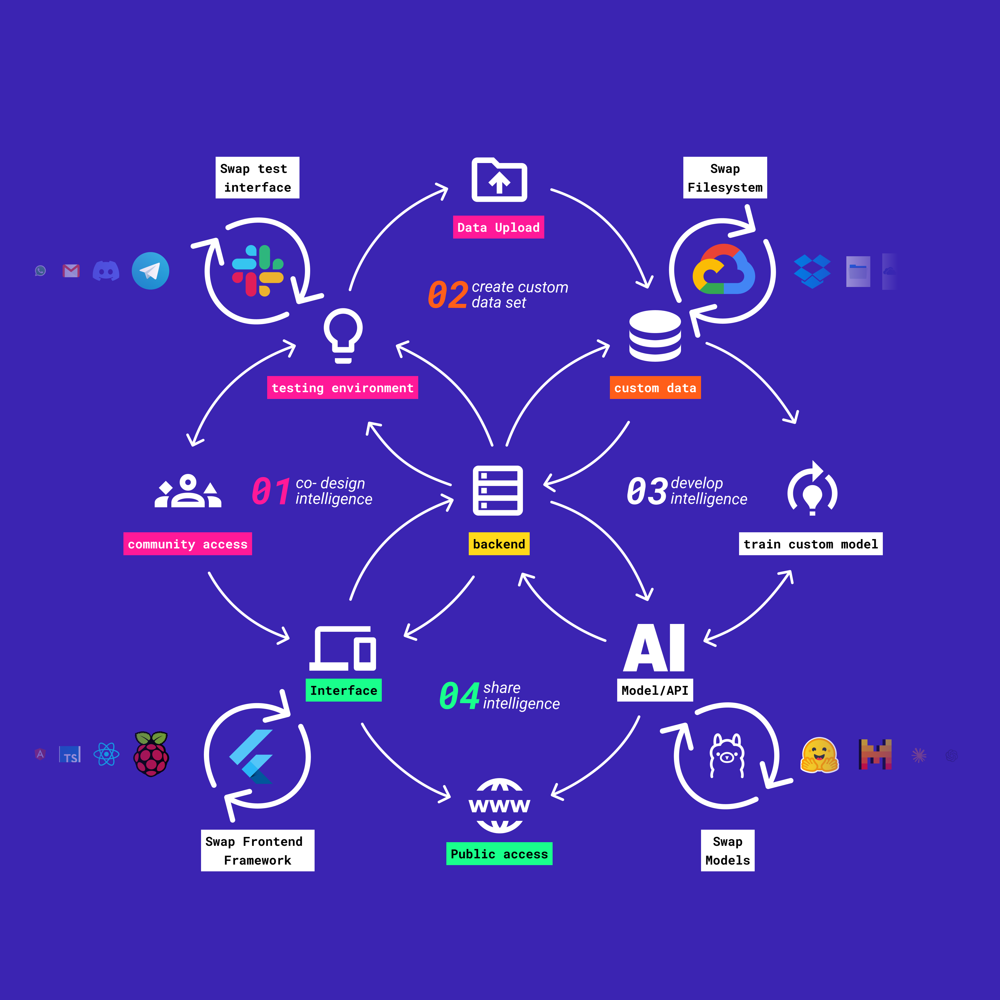
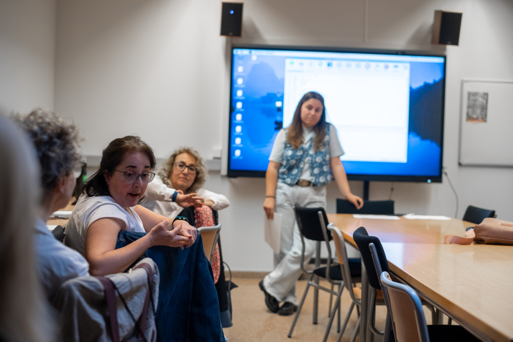
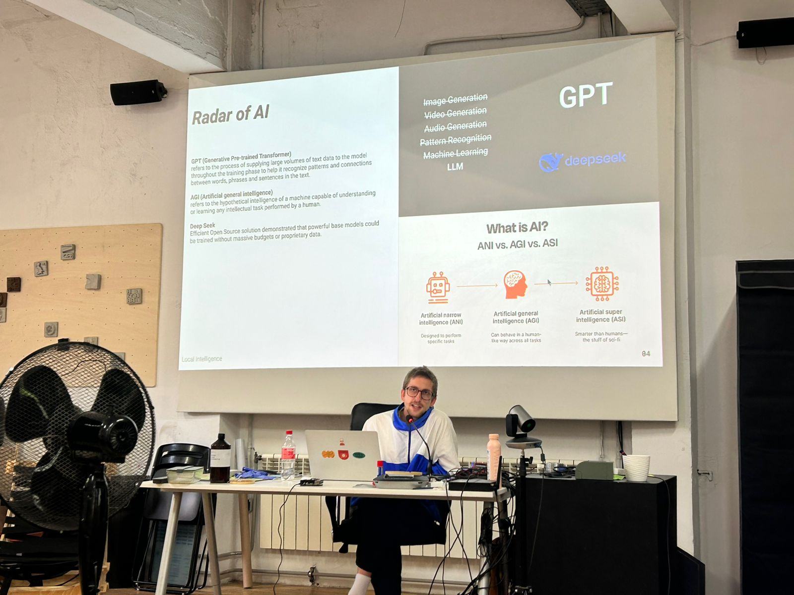
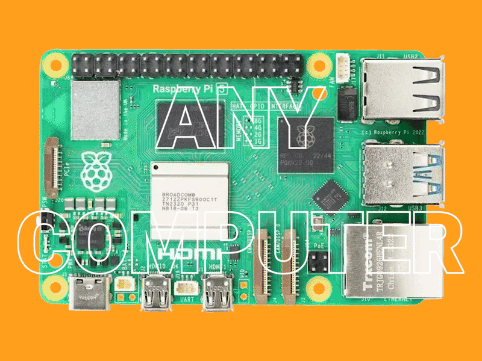
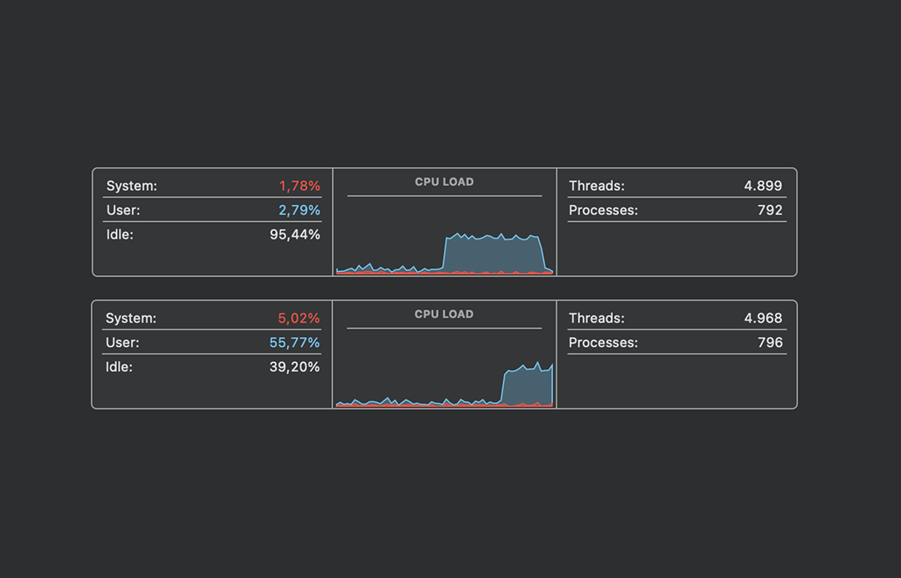
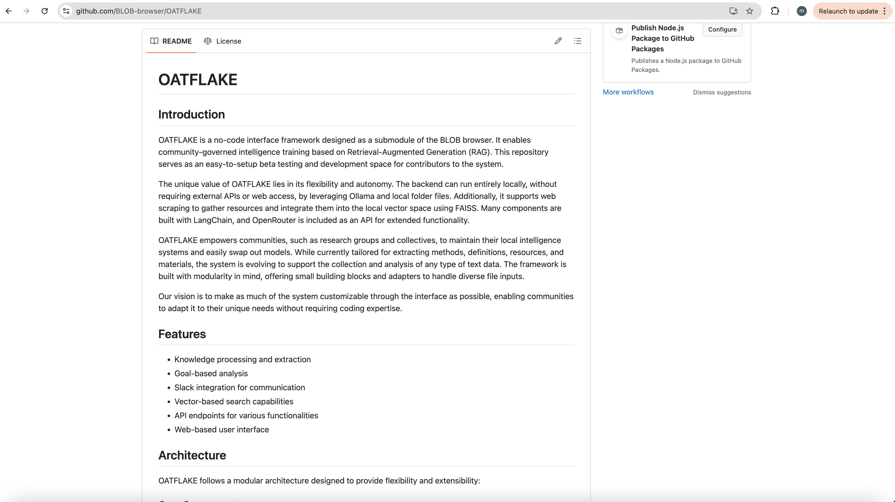

    <a href="/">Home</a> / 
    <a href="/MDEF_Docmentation/thesis">Thesis</a> / 
    Approaches

# Research Approaches

This research employs multiple complementary approaches to understand and develop collaborative AI frameworks. Each approach brings unique insights to the complex challenge of community-governed artificial intelligence.

## Comparative Framework Analysis

A systematic comparison of different AI frameworks, architectures, and governance models to identify optimal patterns for community control. This approach involves:

- **Framework evaluation**: Comparing open-source AI tools (Ollama, LangChain, Open-WebUI) for community adaptability
- **Architecture assessment**: Analyzing centralized vs. distributed AI deployment strategies
- **Governance model comparison**: Studying different approaches to democratic AI oversight
- **Learning in progress**: Iteratively refining approaches based on comparative insights

### Reflection: Learning Through Comparison

The comparative approach proved essential for understanding the trade-offs inherent in different technical and governance choices. By systematically evaluating frameworks like **Ollama's local deployment** against **cloud-based solutions**, we identified specific advantages of edge computing for community sovereignty. Similarly, comparing **centralized platforms** (like existing civic tech tools) with **federated architectures** revealed how technical infrastructure directly shapes democratic participation possibilities.

This methodology enabled evidence-based decision-making rather than theoretical speculation, ensuring that Oatflake's architecture reflects proven advantages rather than untested assumptions.

## Research Through Design

The primary methodology follows a **Research through Design** approach, where the development of technical prototypes generates knowledge about participatory AI systems. This iterative process involves:

- **Prototyping as inquiry**: Building functional AI systems to test governance concepts
- **Community engagement**: Involving stakeholders in design and evaluation processes
- **Reflective practice**: Documenting insights that emerge from making and testing

### Reflection: Making as Knowledge Generation

Research through Design proved fundamental to understanding the practical challenges of community AI governance. Building actual prototypes like **LAIA** and **Oatflake** revealed implementation complexities that purely theoretical approaches would miss. The act of making forced confrontation with real technical constraints, user needs, and governance challenges.

Each prototype became a **thinking tool** that generated new questions and insights. For example, developing Oatflake's voting interface revealed how technical design choices can either enable or hinder democratic participation, leading to iterative refinements based on community feedback.

## Action Research

Working directly with communities to implement and refine AI governance structures. This participatory approach ensures:

    
    

- **Co-creation processes**: Communities as partners, not subjects
- **Iterative development**: Continuous feedback loops between research and practice
- **Real-world validation**: Testing concepts in authentic contexts

### Reflection: Community as Co-Researchers

Action research transformed community members from research subjects into active co-investigators of AI governance. Working with **neighborhood communities** in the LAIA project and **maker spaces** through fablab connections revealed how different contexts require different approaches to democratic participation.

This methodology highlighted the importance of **cultural sensitivity** in AI design - what works for tech-savvy communities may not translate to other contexts. The iterative feedback loops ensured that theoretical concepts were continuously tested against lived community experiences.

## Critical Design Practice

Examining the power structures and assumptions embedded in AI systems through:

- **Questioning existing paradigms**: Challenging centralized AI development models
- **Speculative prototyping**: Exploring alternative futures for AI governance
- **Ethical reflection**: Considering implications of different design choices

### Reflection: Interrogating AI Power Structures

Critical design practice forced continuous examination of whose interests are served by different technical choices. This approach revealed how seemingly neutral technical decisions - like choosing cloud vs. local processing - actually embed political assumptions about data ownership and community autonomy.

**Speculative prototyping** allowed exploration of alternative futures where communities genuinely control their AI systems, challenging the dominant narrative that sophisticated AI requires centralized infrastructure. This critical lens was essential for developing truly democratic alternatives to existing AI paradigms.

## Technical Investigation

Exploring the technical infrastructure necessary for community-controlled AI:

- **Local deployment strategies**: Investigating edge computing and quantization
- **Governance mechanisms**: Developing tools for collective decision-making
- **Adaptability frameworks**: Creating systems that can evolve with community needs

### Reflection: Bridging Technical and Social Requirements

Technical investigation revealed that community governance requires specific technical affordances - systems must be **transparent, modifiable, and locally controllable**. Exploring quantization techniques and edge computing proved that sophisticated AI doesn't require massive infrastructure, democratizing access to advanced capabilities.

The challenge was balancing **technical sophistication with accessibility**. Community-governed AI must be powerful enough to be useful while remaining simple enough for non-technical users to understand and control. This tension drove innovations in interface design and system architecture.

## MSCW Prioritization Framework

Using the MoSCoW method to prioritize features and requirements:

- **Must have**: Core functionality for basic community AI governance
- **Should have**: Important features that enhance usability and control
- **Could have**: Desirable features that add value but aren't essential
- **Won't have**: Features explicitly excluded from current scope

### Reflection: Focusing on Essential Community Needs

The MSCW framework proved crucial for maintaining focus on **community empowerment over technical sophistication**. By prioritizing governance transparency and local control as "Must have" features, we avoided the common trap of building technically impressive but democratically limited systems.

This prioritization revealed that many features considered essential in commercial AI (like advanced analytics) are less important for community governance than basic transparency and user control. The framework helped maintain **community-centered design principles** throughout development.

## Scenario Planning

Exploring different futures through structured scenario development:

This framework helps anticipate different pathways for AI development and their implications for community governance.

### Reflection: Preparing for Multiple AI Futures

Scenario planning helped navigate the uncertainty inherent in rapidly evolving AI landscapes. By exploring different futures - from **highly centralized corporate control** to **fully distributed community networks** - we could design systems robust enough to function across multiple potential outcomes.

The 2x2 scenario matrix revealed that **adaptability** is more valuable than optimization for any single future. This insight drove the focus on **modular, flexible architectures** that can evolve with changing technological and social contexts rather than betting on specific technological trajectories.

## Interdisciplinary Integration

Drawing insights from multiple fields:

- **Computer Science**: Technical implementation and system architecture
- **Design Research**: User-centered design and participatory methods
- **Political Science**: Governance theory and democratic participation
- **Anthropology**: Community dynamics and cultural considerations
- **Ethics**: Moral implications of AI systems and governance structures

### Reflection: Synthesizing Diverse Knowledge Domains

Interdisciplinary integration proved essential for addressing the complexity of community-governed AI. **Technical solutions alone** couldn't address governance challenges, while **social approaches without technical understanding** remained impractical. The synthesis created novel approaches that neither field could generate independently.

Working across disciplines required developing **boundary objects** - concepts and prototypes that could communicate across different knowledge communities. Oatflake itself became such a boundary object, enabling conversations between technologists, community organizers, and policy researchers.

## Documentation and Iteration

Systematic documentation of the research process enables:

- **Learning capture**: Recording insights as they emerge
- **Reproducibility**: Enabling others to build on this work
- **Community feedback**: Sharing progress for ongoing input
- **Academic contribution**: Contributing to scholarly discourse on participatory AI

### Reflection: Knowledge as Community Resource

Documentation became more than just academic requirement - it served as a **community resource** enabling others to adapt and extend the research. Open documentation of failures and challenges proved as valuable as success stories, helping others avoid similar pitfalls.

The iterative documentation process revealed how **transparent research practices** mirror the democratic values embedded in community-governed AI. Making research processes visible enables community participation in knowledge creation, not just knowledge consumption.

---

These complementary approaches create a robust framework for investigating collaborative AI systems, ensuring both theoretical rigor and practical relevance to communities seeking to govern their own AI technologies.
