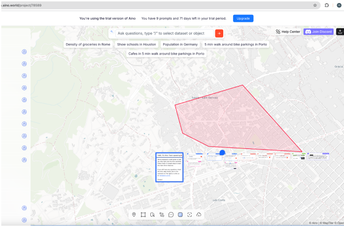

    <a href="/">Home</a> / 
    <a href="/MDEF_Docmentation/thesis">Thesis</a> / 
    Research

# Research 

## Collaborative AI Frameworks

    <a class="content-tile" href="thesis/research/">
        
        
Research/

        <h4>Research 1</h4>
        
Literature review and methodology

    </a>
    <a class="content-tile" href="thesis/thesis_playground/">
        
        
Development/

        <h4>Research 2</h4>
        
Technical implementation and iterations

    </a>
    <a class="content-tile" href="thesis/experiments/">
        
        
Workshops/

        <h4>Research 3</h4>
        
Testing and feedback sessions

    </a>
    <a class="content-tile" href="thesis/exhibition/">
        
        
Outcomes/

        <h4>Project Outcomes</h4>
        
Results and future directions

    </a>

## Papers

    <a class="content-tile" href="thesis/research/">
        
        
Research/

        <h4>Research 1</h4>
        
Literature review and methodology

    </a>
    <a class="content-tile" href="thesis/development/">
        
        
Development/

        <h4>Research 2</h4>
        
Technical implementation and iterations

    </a>
    <a class="content-tile" href="thesis/workshops/">
        
        
Workshops/

        <h4>Research 3</h4>
        
Testing and feedback sessions

    </a>
    <a class="content-tile" href="thesis/outcomes/">
        
        
Outcomes/

        <h4>Project Outcomes</h4>
        
Results and future directions

    </a>

