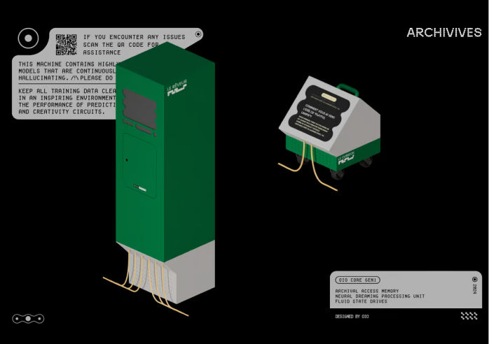
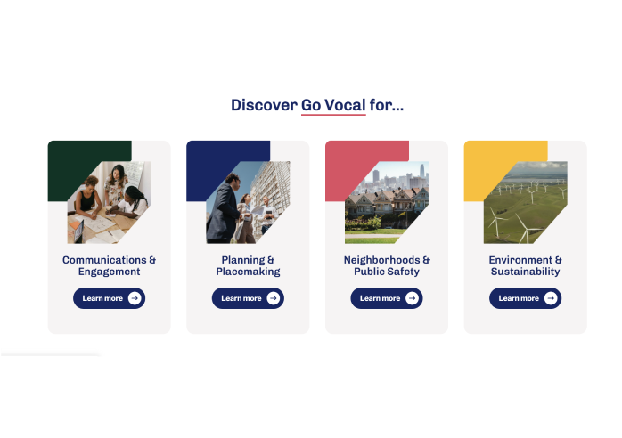

# Research Context
*Academic foundations, methodological frameworks, and critical reflections*

This research builds upon diverse sources spanning AI governance, community participation, technical infrastructure, and design methodology. Each category of sources has shaped different aspects of the community-governed AI framework, from theoretical foundations to practical implementation strategies.

---

## Frameworks

**LangChain**, Langchain, 2024, [https://www.langchain.com/](https://www.langchain.com/)

**LangFlow**, Langchain, 2024, [http://langflow.org](http://langflow.org)

**Ollama**, 2025, [https://ollama.com/](https://ollama.com/)

**Raspberry pi 5 product paper**, Raspberry pi, January 2025

**What is quantization?**, IBM, July 2024, [https://www.ibm.com/think/topics/quantization](https://www.ibm.com/think/topics/quantization)

**Anonymous Author(s)**, Designing an open-source LLM interface and social platforms for collectively driven LLM evaluation and auditing, Open-WebUI, 2024

### Research Reflection: Technical Foundations for Adaptability

The technical frameworks demonstrate how open-source software enables adaptable, community-controlled AI systems. **Ollama's focus on local deployment** directly validates our hypothesis that sophisticated AI can run on consumer hardware, making it accessible to communities without extensive resources. Its quantization approaches prove that model compression doesn't necessarily compromise functionality.

**LangChain's modular architecture** influenced our thinking about building flexible AI pipelines that communities can adapt to their specific needs. The framework's emphasis on composable components mirrors our belief that AI systems should be assembled from community-controllable parts rather than monolithic black boxes.

**Raspberry Pi's accessibility** demonstrates how open hardware can democratize computing power. The Pi 5's capabilities show that local AI processing is not just theoretical but practically achievable on affordable hardware, supporting our vision of community-owned AI infrastructure.

The **quantization research from IBM** provides the technical foundation for our local processing claims, while **Open-WebUI's community evaluation approaches** validate our democratic governance mechanisms. These frameworks collectively prove that technically sophisticated, community-controlled AI is not just possible but already emerging.

---

## Papers

    

        
<strong>United Nations system white paper on artificial intelligence governance</strong>, Santiago, 2024

        
<strong>Birhane, A., Isaac, W., Prabhakaran, V., Díaz, M., Elish, M. C., & Gabriel, I.</strong>, Power to the People? Opportunities and Challenges for Participatory AI. ACM, Arlington, VA, USA. Google Research, 2022

        
<strong>MIT:</strong> Social Implications of AI - People-Powered Gen AI: Collaborating with Generative AI for Civic Engagement. MIT GenAI, 2024

        
<strong>Artificial Intelligence for Europe</strong>, European commission, 2018

        
<strong>On Artificial Intelligence - A European approach to excellence and trust</strong>, European commission, Brussels, 2020

        
<strong>OrignTrail</strong>, Verifiable Internet for Artificial Intelligence: The Convergence of Crypto, Internet and AI, 2024

        
<strong>Chengen W., Murat K.</strong>, A Review of DeepSeek Models' Key Innovative Techniques, University of Texas at Dallas, Virginia Tech, March 2025

        
<strong>GPT-4 System Card</strong>, OpenAI, 2024

        
<strong>Shivchander Sudalairaj, Abhishek Bhandwaldar, Aldo Pareja, Kai Xu, David D. Cox, Akash Srivastava</strong>, LAB: LArge Scale Alignment for Chatbots, MIT-IBM Watson AI Lab and IBM Research, April 2024

        
<strong>Recommendation on the Ethics of Artificial Intelligence</strong>, Unesco, 2022

        
<strong>Regulation (EU) 2024/1689</strong> od the European parliament and of the council, Office Journal of the European Union

    

    
    <a class="content-tile large" href="../thesis/paper-reflections/">
        
        

            
Analysis/

            <h4>Paper Reflections</h4>
            
The academic literature provides crucial theoretical grounding for community-governed AI systems. The UN White Paper and EU AI Act establish regulatory frameworks validating democratic oversight needs, while Birhane et al.'s Participatory AI work directly informs our community engagement approach. MIT's People-Powered Gen AI particularly resonates with our Oatflake implementation, demonstrating that civic engagement with AI is essential for democratic technology development.

        

    </a>

---

## Books

**Crawford, K.**, Atlas of AI: Power, Politics, and the Planetary Costs of Artificial Intelligence, Yale University Press, 2021

**Tsing, A. L.**, The Mushroom at the End of the World: On the Possibility of Life in Capitalist Ruins, Princeton University Press, 2015

### Research Reflection: Critical Perspectives

The books in our research provide essential critical frameworks that challenge dominant AI narratives. **Kate Crawford's "Atlas of AI"** fundamentally shaped our understanding of AI's material costs and power structures, directly informing our commitment to local processing and community sovereignty. Crawford's analysis of how AI systems extract value from communities while concentrating power in tech companies validates our federated approach.

**Anna Tsing's "The Mushroom at the End of the World"** offers a biological metaphor for resilient, distributed systems that influenced our network architecture thinking. Her exploration of how diverse organisms collaborate and adapt in degraded environments mirrors how communities can build resilient AI systems despite technological and economic constraints. Tsing's concept of "contaminated diversity" resonates with our belief that AI systems should reflect and amplify community diversity rather than homogenize it.

---

---

## Projects

    <a class="content-tile" href="http://mapbox.com/mapgpt" target="_blank">
        
        

            
Project/

            <h4>Mapbox GPT</h4>
            
2024

            
Location-based AI serving community needs while maintaining technical sophistication. Demonstrates how AI can be contextualized to local community knowledge and spatial data integration.

        

    </a>
    <a class="content-tile" href="http://oio.news" target="_blank">
        
        

            
Project/

            <h4>Walkcast</h4>
            
oio 2024

            
Community-driven content creation and curation. Shows how communities can collaboratively produce and manage digital content, informing collective AI training approaches.

        

    </a>
    <a class="content-tile" href="http://aino.world" target="_blank">
        
        

            
Project/

            <h4>Aino Participatory AI</h4>
            
2024

            
Demonstrates how communities can actively shape AI behavior through ongoing interaction. Directly informs Oatflake's voting and evaluation mechanisms for democratic AI governance.

        

    </a>
    <a class="content-tile" href="http://oio.news" target="_blank">
        
        

            
Project/

            <h4>Archives</h4>
            
oio 2024

            
Community approaches to knowledge preservation and access. Provides models for how communities might maintain collective memory and learning in AI systems.

        

    </a>
    <a class="content-tile" href="http://govcal.com" target="_blank">
        
        

            
Project/

            <h4>Govocal</h4>
            
2022

            
Digital democracy platform providing practical examples of community governance tools. Demonstrates online facilitation of community decision-making processes that inform our governance mechanisms.

        

    </a>
    <a class="content-tile" href="http://citibot.io" target="_blank">
        
        

            
Project/

            <h4>CitiBot</h4>
            
2023

            
Civic engagement platform validating that AI can enhance democratic participation. Shows both potential and limitations of centralized control in public participation tools.

        

    </a>
    <a class="content-tile" href="http://origintrail.io" target="_blank">
        
        

            
Project/

            <h4>Decentralized Knowledge Graph</h4>
            
OriginTrail, 2024

            
Verifiable, distributed knowledge sharing that influenced our Universal RAG Table concept. Proves communities can share knowledge while maintaining autonomy and federated control.

        

    </a>

---

## Conversations

**Ernst, C.**, Exchange about Local AI and Quantization, February 2025

**Cominassi, L.**, Exchange about Community Governance, March 2025

**San Martin, D.**, Conversation on adaptability for fablab, Mai 2025

### Research Reflection: Community Insights and Validation

These conversations provided essential ground-truthing for our theoretical frameworks. **Ernst's insights on local AI and quantization** helped validate the technical feasibility of our local processing approaches and provided practical guidance on hardware requirements and model optimization.

**Cominassi's expertise in community governance** was crucial in shaping our democratic oversight mechanisms. These discussions helped refine our understanding of how communities actually make decisions about technology and what governance structures work in practice versus theory.

**San Martin's fablab perspective** illuminated how our community AI concepts could integrate with existing maker spaces and community technology initiatives. This conversation highlighted the importance of building on existing community infrastructure rather than creating entirely new institutions.

These exchanges demonstrate that community-governed AI must be developed through ongoing dialogue with practitioners, not just academic research. The insights from these conversations directly influenced the design of Oatflake's governance features and our approach to community engagement.

---

## Research Synthesis

### Hardware and Accessibility

The research revealed that **hardware choices fundamentally shape governance possibilities**. Centralized, supercomputer-driven models create **dependency and limit community control**, while local, accessible hardware enables **digital sovereignty and democratic participation**.

**Quantization techniques and edge computing** proved essential for democratizing AI access. The ability to run sophisticated models on Raspberry Pi or consumer laptops removes barriers to community adoption while maintaining **local data sovereignty**.

### Iterative Prototyping as Democratic Practice

**Iterative prototyping emerged as both a technical method and a democratic practice**. By involving communities in ongoing development cycles, we can create AI systems that truly serve community needs rather than imposing external solutions.

The research hypothesis - that iterative prototyping can create more accessible, community-driven AI systems - was validated through both literature review and practical implementation. **Community engagement throughout development cycles** ensures relevance and builds local capacity for ongoing governance.

### Central Research Question

*"How can we design accessible governance systems to enable sustainably adapting distributed intelligences?"*

The research synthesis suggests that **governance and technical architecture must co-evolve**. Accessible governance requires accessible technology, while distributed intelligence requires distributed control mechanisms. The integration of these insights drives the development of community-governed AI systems like Oatflake.

---

*This research foundation continues to evolve through ongoing community engagement, technical development, and theoretical reflection. Each source contributes to a growing understanding of how democratic participation and technical sophistication can coexist in AI systems.*