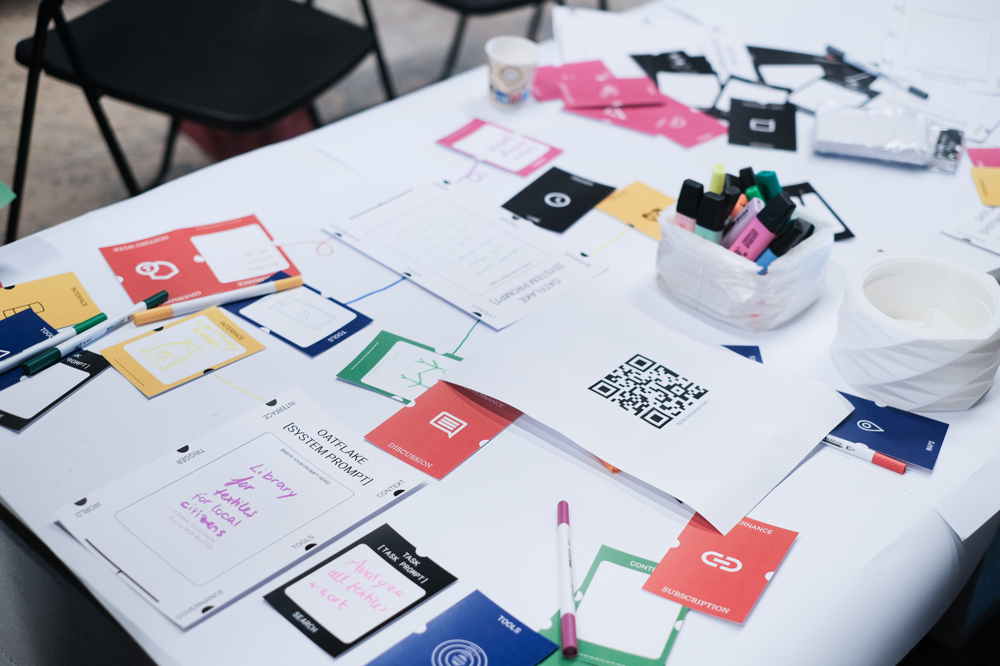

# Research Roadmap
*The journey from LAIA -> CGAI FRamework -> Blob-Browser & Oatflake -> Local AI Research*

This journey shows how comparative approaches get applied to find local AI solutions

---

    

        
February 2024 - November 2024

        <h2>The LAIA Project</h2>
        
Everything started with the Learning AI Infrastructure Assistant (LAIA) - my first attempt at building a community-governed AI system. Working within the MDEF framework, I developed the theoretical foundation for how communities could democratically manage AI systems while maintaining data sovereignty.

        <h4>Key Achievements:</h4>
        <ul>
            <li><strong>Theoretical Framework</strong>: Established core concepts for community AI</li>
            <li><strong>Local Processing</strong>: Proved Ollama integration worked on consumer hardware</li>
            <li><strong>Academic Integration</strong>: Connected design thinking with AI governance</li>
            <li><strong>Technical Foundation</strong>: Built the base for all future developments</li>
        </ul>
        

            <a href="../term3/LAIAProject.md" class="action-button primary">
                View LAIA Project ↗
            </a>
        

    

    

        
    

---

    

        
    

    

        
November 2024 - February 2025

        <h2>Miralls del dema</h2>
        
The changing moment was at LLUM 2025, where interactive prototypes validated massive community interest in federated AI concepts. Then Design Dialogues 2 provided the perfect testing ground - Oatflake proved that local AI communities could manage knowledge while maintaining complete data sovereignty.

        <h4>Validation Points:</h4>
        <ul>
            <li><strong>Community Interest</strong>: Real users engaged with federated AI concepts</li>
            <li><strong>Technical Proof</strong>: Oatflake demonstrated practical viability</li>
            <li><strong>Social Success</strong>: People embraced democratic AI governance</li>
            <li><strong>Exhibition Impact</strong>: Public validation of the research direction</li>
        </ul>
        

            <a href="../year2/InteractionPrototyping.md" class="action-button primary">
                View Exhibition ↗
            </a>
        

    

---

    

        
November 2024 - April 2025

        <h2>Building the Test Environment</h2>
        
From these experiments, a real research community emerged. The Slack workspace connected researchers, developers, and practitioners worldwide, all working toward the same vision of community-governed AI systems.

        <h4>Network Growth:</h4>
        <ul>
            <li><strong>Global Community</strong>: Slack workspace connecting worldwide researchers</li>
            <li><strong>Interdisciplinary Approach</strong>: Design thinking meets AI development</li>
            <li><strong>Open Source Ethos</strong>: Shared code and collaborative development</li>
            <li><strong>Academic Connections</strong>: Integration with MDEF and research institutions</li>
        </ul>
        

            <a href="experiments/slack-workspace.md" class="action-button primary">
                Join Slack Community ↗
            </a>
        

    

    

        
    

---

    

        <video src="../../images/Thesis/Blob-Record.mp4" alt="Current Deployment Dashboard" autoplay loop muted playsinline style="width: 100%; border-radius: 8px;">
            Your browser does not support the video tag.
        </video>
    

    

        
April 2025 - Now

        <h2>Active Blob-Browser Plattform</h2>
        
Today, we have a production deployment running at blob-7z6z9.ondigitalocean.app with active user communities creating and managing knowledge bases. The comprehensive documentation site with interactive elements makes the core concepts accessible to anyone interested in community-governed AI.

        <h4>Live Achievements:</h4>
        <ul>
            <li><strong>Production Platform</strong>: Active users creating knowledge communities</li>
            <li><strong>Local AI Processing</strong>: 100% data sovereignty with sophisticated capabilities</li>
            <li><strong>Democratic Tools</strong>: Voting, Q&A, and governance systems that work</li>
            <li><strong>Open Documentation</strong>: Accessible research and interactive playground</li>
        </ul>
        

            <a href="https://blob-browser.net/" target="_blank" class="action-button primary">
                See Live Platform ↗
            </a>
        

    

---

    

        
Now - October 2025

        <h2>Forming Local AI Research Group</h2>
        
The current focus is forming a local AI research group within the MDEF and Fablab Barcelona community. We're building on the proven Oatflake platform to create a testbed for advanced community governance mechanisms and federated learning approaches.

        <h4>Local Initiative:</h4>
        <ul>
            <li><strong>Barcelona Community</strong>: MDEF and Fablab collaboration testbed</li>
            <li><strong>Research Laboratory</strong>: Testing governance models in real settings</li>
            <li><strong>Experimental Platform</strong>: New features and community tools</li>
            <li><strong>Documentation Hub</strong>: Recording what works and what doesn't</li>
        </ul>
        

            <a href="experiments/slack-workspace.md" class="action-button primary">
                Join Slack Group ↗
            </a>
        

    

    

        
        

            
            
        

        
    

---

    

        
    

    

        
2025 - 2026

        <h2>Go fully local</h2>
        
The immediate roadmap focuses on enhanced local processing with improved quantized model efficiency, advanced community features including sophisticated voting mechanisms, and network effects enabling inter-community knowledge sharing.

        <h4>Development Priorities:</h4>
        <ul>
            <li><strong>Enhanced Local Processing</strong>: Improved efficiency and model support</li>
            <li><strong>Advanced Community Features</strong>: Sophisticated governance mechanisms</li>
            <li><strong>Mobile Applications</strong>: Community participation from any device</li>
            <li><strong>Enterprise Integration</strong>: Organizational AI with democratic oversight</li>
        </ul>
        

            <a href="https://github.com/BLOB-browser/OATFLAKE" target="_blank" class="action-button primary">
                View Github repository ↗
            </a>
        

    

---

    

        
2025 - 2027

        <h2>Scale - Research Expansion</h2>
        
<em>Academic Partnerships</em>

        
Building on LAIA's success, formal partnerships with educational institutions will deploy community-governed AI systems in academic settings. The research community continues expanding globally, with contributions from diverse perspectives and use cases.

        <h4>Expansion Areas:</h4>
        <ul>
            <li><strong>Educational Partnerships</strong>: Formal academic institution deployments</li>
            <li><strong>Blockchain Integration</strong>: Transparent governance infrastructure</li>
            <li><strong>NFT Agent Development</strong>: Cryptographic identity systems</li>
            <li><strong>Universal RAG Table</strong>: Standardized knowledge interfaces</li>
        </ul>
    

    

        
    

---

    

        <h2>Local AI Research -> Future Steps</h2>
        
The ultimate goal is comprehensive democratic oversight mechanisms where communities vote on AI behavior, model updates, and network participation rules. Advanced distributed training will enable collaborative model improvement without sharing raw data.

        

            

                <h4>📍 Build Local Open Bots</h4>
                
Intitiative which will test the oatflake framework on a broughter scale

            

            

                <h4>🧠 Distribute Knowledge governance</h4>
                
Find further governance mechanisms

            

            

                <h4>🌍 Find Global Standards</h4>
                
Find Patterns to keep Data Trackable for ownership and universal usable

            

        

        

            

                <h4>🤝 Collaborative AI</h4>
                
Community empowerment and knowledge democratization

            

            

                <h4><> Develop full pipeline</h4>
                
Enable Communities to train Intelligences fully until finetuning or reinforcement learning based on their evaluation and make Retrieval Augmented generation only a temporary state. 

            

        

    

---

*This roadmap evolves continuously based on community feedback, technological developments, and new research discoveries. Join our Slack workspace to participate in shaping the future of community-governed artificial intelligence.*

---

## Join Our Research Community

*Connect with local AI researchers and practitioners*

    

        <h3>Local AI Research Team</h3>
        
We are forming a local AI research team focused on federated knowledge systems and community-governed AI. Join our Slack channel to participate in discussions, share discoveries, and collaborate on experiments.

        
        
The testing and knowledge exchange of this framework was developed through collaboration with the MDEF (Master in Design for Emergent Futures) and Fablab Barcelona communities, as well as the broader distributed design network.

        
        

            <a href="https://local-ai-research.slack.com" target="_blank" class="action-button primary">
                💬 Join #local-ai-research
            </a>
        

    

