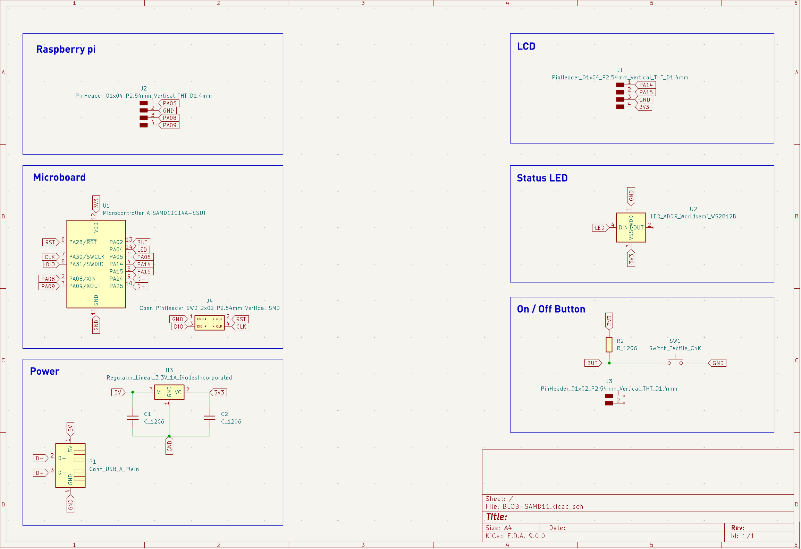
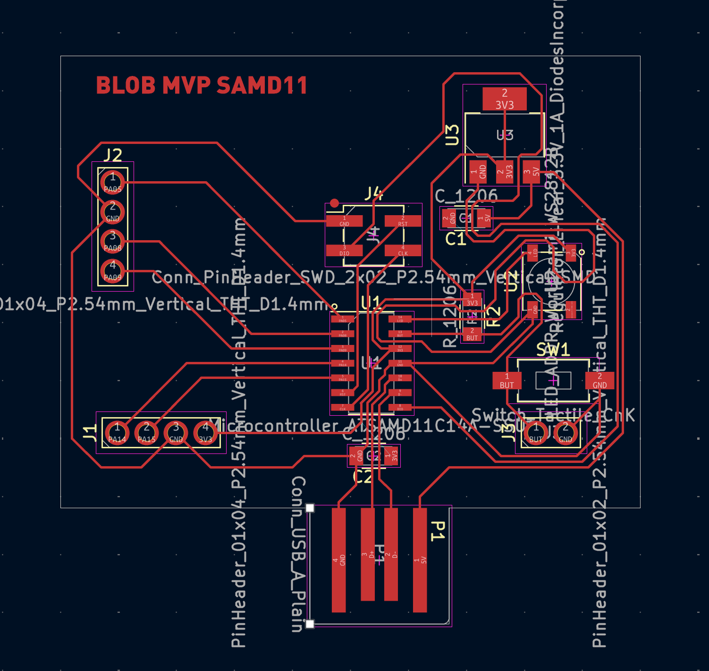
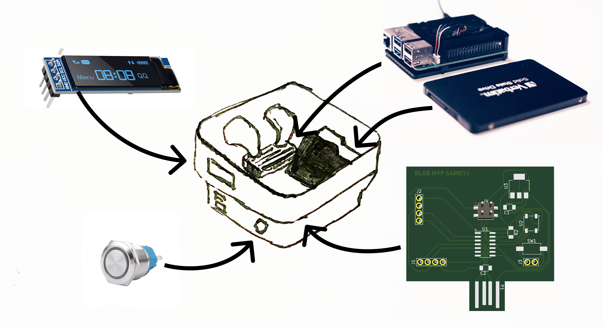

    <a href="/">Home</a> / 
    <a href="/MDEF_Docmentation/year2/Fabacademy/Electronics">Fabacademy</a> / 
    Electronics

# Electronics Design Reflection
This seminar lead by Daniel Mateos and Josep Martí gave me a initial understanding of PCB design, circuit programming, and component integration. Learning how to efficiently navigate KiCad’s tools helped streamline my design workflow. The process of transitioning from schematic design to PCB layout demonstrated the importance of careful planning and iteration. I gained a deeper appreciation for board constraints, such as track width and clearance, which impact both performance and manufacturability. A major takeaway was the importance of modularity in electronics. By referencing pin names instead of physical numbers, we ensured greater flexibility in design modifications. Additionally, exporting PCB layouts in **SVG format** allowed for better documentation and potential CNC milling compatibility.

## Inspiration:
<a href="https://fabacademy.org/2020/labs/ulb/students/quentin-bolsee/projects/raspi_openocd/" target="_blank" class="social-link">
            How to connect SAMD11 with Raspberry Pi ↗
        </a>
        
<a href="https://www.instructables.com/Build-a-Better-Raspberry-Pi-Power-Button/?amp_page=true" target="_blank" class="social-link">
            Turn on/off button for Raspberry Pi ↗
        </a>

## Electronics Seminar Summary

During the electronics seminar, We learned how to install the necessary libraries and configure the design tools for PCB development. The process involved installing libraries from a cloned repository, including Fab and Fab Pretty.

We practiced essential functions in KiCad, such as:
- **A**: Adding components
- **M**: Moving components
- **R**: Rotating components
- **Ctrl + L**: Adding labels
- **D**: Dragging components with wires

A key principle emphasized was ensuring all components share the same ground connection. When designing a circuit, programming the SAMD microcontroller requires an SWD interface. Once the schematic was created, I learned how to transfer it to a PCB layout by selecting **"Update PCB from Schematic"**.

In the PCB design phase, I adjusted the board setup settings to:
- Clearance: **0.4mm**
- Track width: **0.35mm**
- Via size: **1.2mm**
- Via hole: **0.8mm**
- DP width: **0.35mm**
- DP gap: **0.4mm**

Best practices included avoiding sharp angles in PCB traces, ensuring sufficient spacing for soldering, and referencing pin names instead of physical pin numbers. Additionally, adjusting the grid size in KiCad allowed for more precise wire movements.

To define the PCB shape, I accessed the **Edge.Cuts** layer and adjusted its settings to **0.8mm**. Finally, exporting the board outline as an **SVG file** was done through the **Plot and Export** function.

## PCB Design
Through this project, I reinforced my skills in integrating **microcontrollers with AI-driven hardware**. The experience aligns well with my ongoing work on **local AI systems**, strengthening my ability to create compact, autonomous embedded solutions. Moving forward, I plan to refine my PCB layouts further, explore multi-layer designs, and improve power efficiency in future projects.

For the final project, I conceptualized a system integrating an **SAMD11 microcontroller with a Raspberry Pi**, featuring an **on/off button, status LED, and an LCD screen**. Once flashed, this system should function independently of a USB connection and operate within my **local AI server**, which I built for my thesis project.

