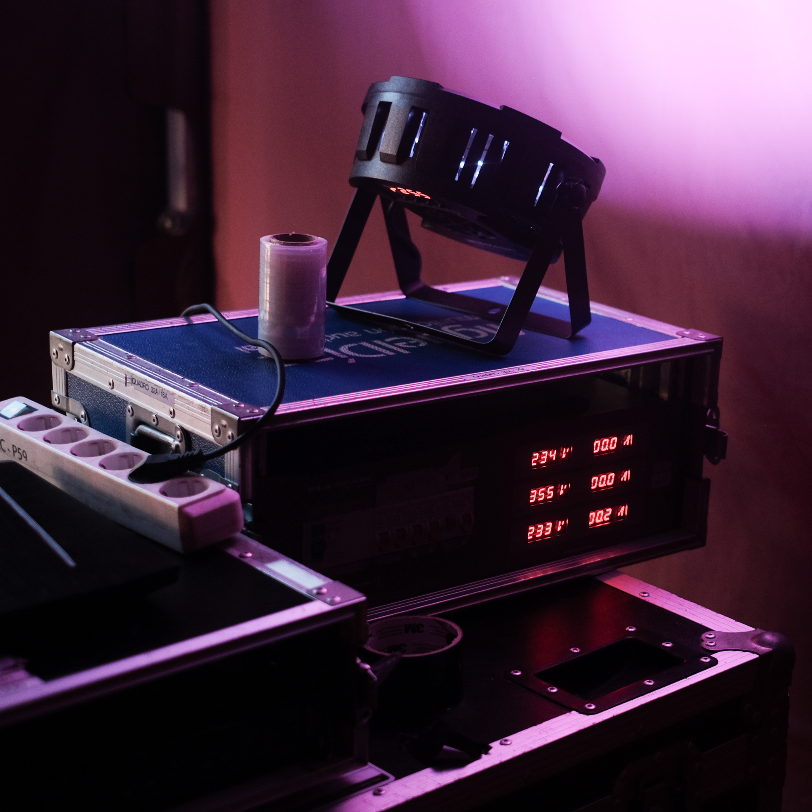
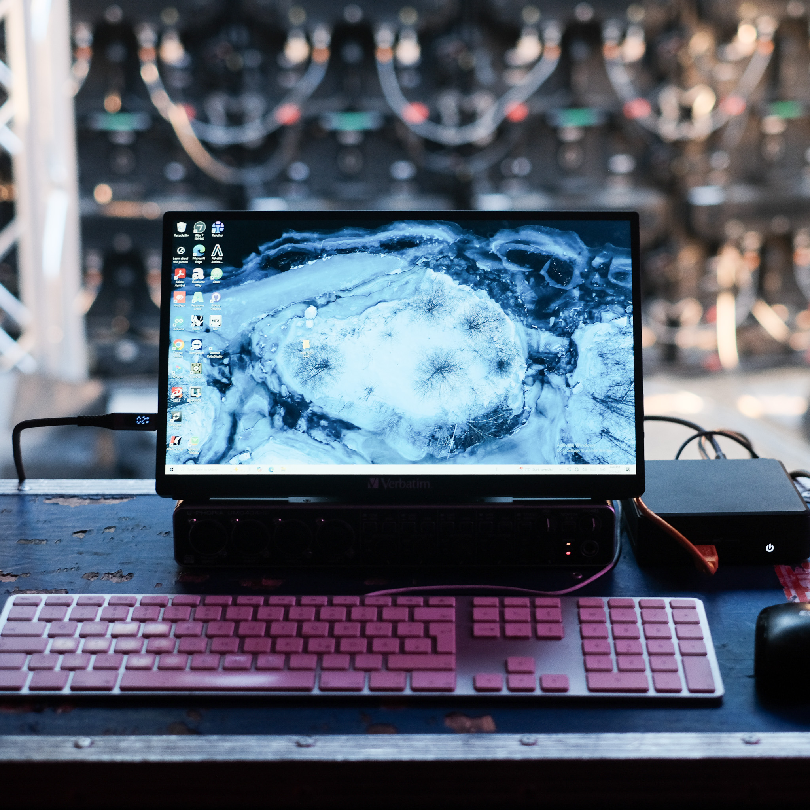
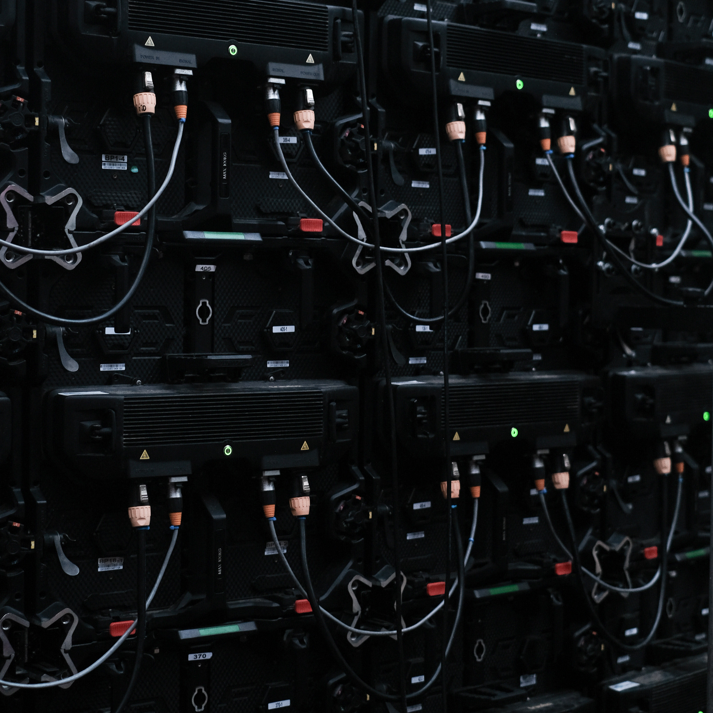

    <a href="/">Home</a> / 
    <a href="/year2">Year 2</a> / 
    LLUM 2025

# LLUM 2025
## Miralls del demà
*A public art installation during the Llum 2025 festival in Barcelona. This interactive project explored how people imagine their futures, using a unique fusion of technology, art, and collective creativity.*

    AI Processing
    Participative Installation
    Data Visualization
    Collaborative tool

    

        <strong>When?</strong> 
        2024 - 2025
    

    

        <strong>Stage</strong> 
        Exhibited
    

    

        <strong>GitHub</strong> 
        <a href="https://github.com/marius-schairer/LLUM2025_Miralls_del_Dema" target="_blank">Repository</a>
    

## Project Contributors

    

        <strong>IAAC</strong> 
        Hosting Institution 
        <em>Institute for Advanced Architecture</em>
    

    

        <strong>Ajuntament de Barcelona</strong> 
        Hosting Exhibition 
        <em>Municipality of Barcelona</em>
    

    

        <strong>MD Audiovisuales</strong> 
        Hardware Partner 
        <em>Technical Infrastructure</em>
    

    

        <strong>MDEF</strong> 
        Development & Design 
        <em>Master in Design for Emergent Futures</em>
    

    

        <strong>MRAC</strong> 
        Electronics & Hardware 
        <em>Master in Robotics and Advanced Construction</em>
    

    

        <strong>MAA</strong> 
        Communication & Management 
        <em>Master in Advanced Architecture</em>
    

## Vision
*Interactive mirrors reflecting collective futures*

"Miralls del demà" (Mirrors of Tomorrow) was conceived as an interactive mirror that reflects not just physical appearances, but hopes, dreams, and visions of the future. During the LLUM 2025 festival, we created a space where Barcelona residents could share what they imagine for tomorrow.

The installation combined physical interaction with AI processing to create a unique collective artwork. Each person's future vision was processed, analyzed, and integrated into a growing visual narrative that evolved throughout the festival.

By inviting participants to speak their hopes aloud, the project transformed individual dreams into collective data, creating a living archive of community aspirations during one of Barcelona's most celebrated cultural events.

    <iframe 
        width="70%" 
        height="500" 
        src="https://www.youtube.com/embed/wrTFjlEQWVI" 
        title="Time-lapse of the installation during LLUM 2025 festival" 
        frameborder="0" 
        allow="accelerometer; autoplay; clipboard-write; encrypted-media; gyroscope; picture-in-picture" 
        allowfullscreen>
    </iframe>

## Architecture
*Technical infrastructure and AI processing pipeline*

### Real-time Processing Pipeline
The technical architecture combined several innovative approaches to capture, process, and visualize spoken futures in real-time. Voice-to-text processing captured spoken visions while AI analysis performed semantic categorization of emerging themes.

**Voice-to-Text Processing**: Real-time capture of spoken future visions using advanced speech recognition  
**AI Analysis**: Semantic analysis and categorization of themes using natural language processing  
**Visual Generation**: Dynamic visualization of collective hopes and patterns  
**Interactive Display**: Large-scale public interface for community engagement

### Technical Implementation
The installation ran on an Intel NUC with optimized processing pipeline:

**1 question → 3 inputs → 1 output**

To ensure smooth public space experience:
- **Audio filtering** detected volume and transcribed speech
- **Content moderation** replaced inappropriate words with emojis before public display
- **LLM-generated description** enriched input for image generation model
- **ESP32 communication** over local WiFi controlled LED animations on microphone
- **Local website interface** synchronized with main processing script
- **Supabase integration** for data archiving and online capture

### Scalable Infrastructure
Built using modern web technologies and deployed on robust cloud infrastructure to handle the festival's high visitor volume. The system processed thousands of interactions while maintaining real-time responsiveness and data integrity.

  

## Exhibition
*Public installation and community engagement*

### Festival Integration
Located in Parc del Poblenou during LLUM 2025, the installation attracted thousands of participants over the festival weekend. The physical setup created an inviting space where technology met human expression.

### Technical Setup
The installation featured professional-grade equipment designed for outdoor festival conditions:

- Large interactive touchscreen displays with weather-resistant housing
- Professional audio capture system with noise cancellation
- Ambient lighting that responded to interaction patterns
- Real-time visualization of collective data trends

### Community Impact
The installation created a unique community space where strangers shared intimate hopes and dreams, fostering connection through technology and art. Participants reported feeling part of something larger than themselves.

    

        <iframe 
            width="100%" 
            height="100%" 
            src="https://www.youtube.com/embed/ZW35Tzpu3gU" 
            title="Exhibition Results and Community Engagement" 
            frameborder="0" 
            allow="accelerometer; autoplay; clipboard-write; encrypted-media; gyroscope; picture-in-picture" 
            allowfullscreen>
        </iframe>
    

## Insights & Impact
*Key learnings and community patterns*

### Future Vision Patterns
The project revealed fascinating patterns in how people envision their futures, providing insights into collective consciousness and community aspirations:

**Common Themes**: Family, environment, technology, and community featured prominently across all age groups  
**Language Patterns**: Hopes were expressed more concretely and specifically than fears or concerns  
**Cultural Diversity**: Multiple languages and cultural perspectives enriched the dataset  
**Intergenerational Differences**: Age groups showed distinct patterns in future concerns and aspirations

### Technology as Community Bridge
This project demonstrated how public art installations can serve as platforms for collective reflection and community building, while exploring the intersection of AI, creativity, and human expression. Technology became a medium for deeper human connection rather than a barrier.

Alongside countless playful visualizations and visions of the future, we observed a common tone towards a hopeful future that achieves possibilities through technology-driven systems and sustainable ways of living in shared habitats with other species.

### Festival Legacy
The installation's success at LLUM 2025 has sparked conversations about the role of interactive art in public spaces and how technology can be used to amplify rather than replace human creativity and community connection.

## Future Development
*Continuing the exploration*

Based on the exhibition success and community feedback, future development directions include:

- **Local Processing**: Implementing edge computing for complete data sovereignty
- **Real-time Diffusion**: Advanced AI processing for immediate visual generation
- **Enhanced Motion Interaction**: Expanding physical interaction modalities
- **Multilingual Support**: Improved processing for Barcelona's linguistic diversity

## Connect with Miralls del demà

<a href="https://www.instagram.com/miralls.del.dema/" target="_blank" class="social-link">
    Behind the Scenes on Instagram
</a>

<a href="https://github.com/marius-schairer/LLUM2025_Miralls_del_Dema" target="_blank" class="social-link">
    View Open Source Code
</a>

---

*Miralls del demà demonstrated how technology can serve as a mirror for collective imagination, creating spaces where individual dreams become community visions for the future.*
