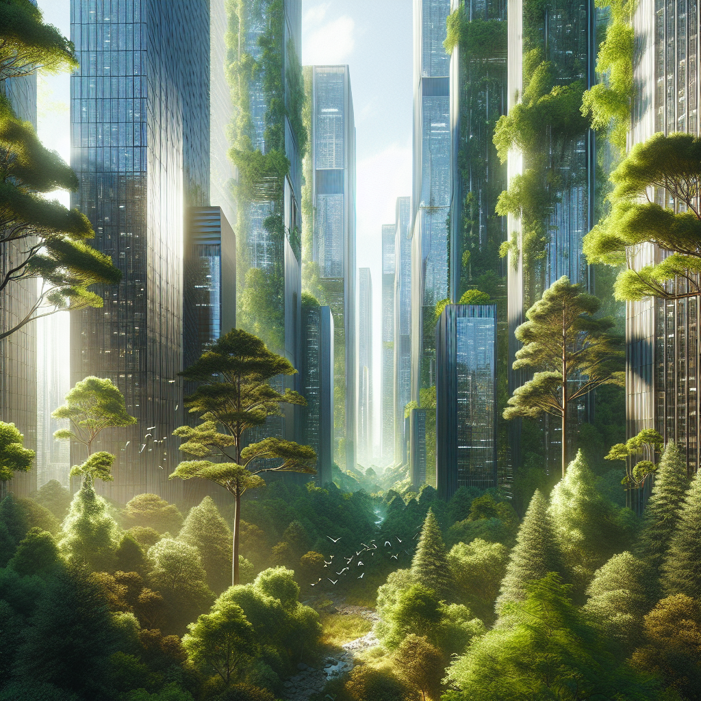

    <a href="/">Home</a> / 
    <a href="/year2">Year 2</a> / 
    Interaction Prototyping

# LLUM 2025

## Reflection
During the LLUM Barcelona festival, we had the opportunity to explore interactive installations and develop our own concepts. Working with light as a medium opened up new perspectives on how to create engaging public experiences.

## Project Description
Our installation focuses on creating an interactive light experience that responds to movement and sound. The concept revolves around making visible the invisible connections between people in public spaces.

## Technical Implementation

    <iframe 
        src="https://drive.google.com/file/d/1MFTaTX-OGJ3j6A6XIsWcwvvFo3iUxNI_/view?usp=sharing" 
        width="640" 
        height="360" 
        frameborder="0" 
        allowfullscreen
        allow="autoplay">
    </iframe>

### Hardware Setup
- Arduino Mega
- LED strips
- Motion sensors
- Sound sensors
- Power supply units

### Software Development
The system uses custom software to:
- Process sensor input
- Generate light patterns
- Create reactive behaviors

## Testing & Results

    <iframe 
        src="https://drive.google.com/file/d/1IMHka3Yf22ZOw6CNcUy7e4jElO3hFX4Q/view?usp=sharing" 
        width="640" 
        height="360" 
        frameborder="0" 
        allowfullscreen
        allow="autoplay">
    </iframe>

## Future Development
- Enhance responsiveness
- Add more interaction patterns
- Scale up for larger installations
