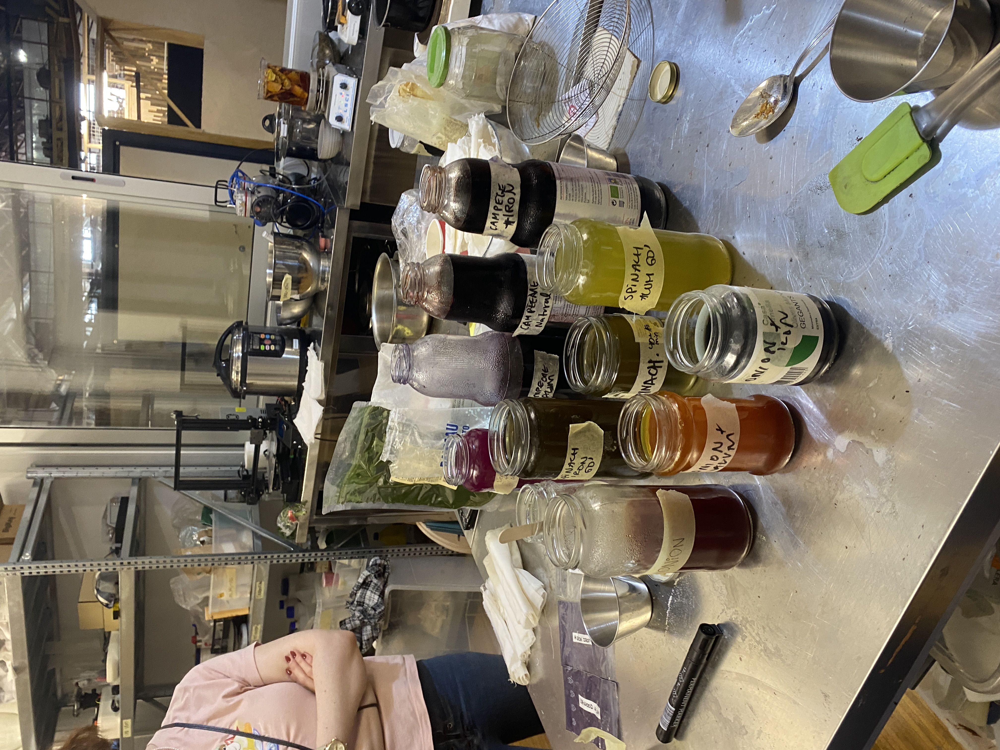

# Biochromes

'in progress'

## Reflection
The BioChromes seminar offered an engaging introduction to natural dyeing and sustainable pigment creation. While the hands-on approach and exploration of natural materials were fascinating, the course was not related with my current research. The context and creative experiments were insightful and refreshing. While having some fun exploration without laptop the seminar highlighted the potential of sustainable dyeing techniques.

## BioChromes
BioChromes are natural pigments found in plants, animals, and microorganisms. They serve as eco-friendly alternatives to synthetic dyes, which are linked to environmental harm through toxic waste and chemicals. By harnessing resources like leaves, fruit peels, fungi, and bacteria, BioChromes enable sustainable and interesting coloring for textiles.

### Key Benefits:
Sustainability: Reduces reliance on harmful synthetic processes. 
Versatility: Yields diverse colors using natural pH adjustments and mordants. 

## Proceses
01 Material Collection: Gathered organic waste like leaves, fruit peels, and vegetable scraps.  
02 Dyeing Process: Experimented with pH levels, temperatures, and natural mordants like alum, lemon, and iron to extract vibrant colors.  
03 Example: Red cabbage produced shades ranging from bright purple to soft blue depending on pH.  
04 Pigment Creation: Transformed leftover dye baths into pigments by mixing with alum and baking soda.  

## Takeaway
While not immediately useful for mypersonal research, the seminar emphasized the importance of sustainability in design and offered a deeper understanding of natural dyeing processes. These techniques could inspire future applications in creative and environmentally conscious projects and for my freetime asside from my personal research.

## Further Ideas 
My initial idea was to use Basil as the color not only might get a strong green but also might smell good. The result was brown color though.
As a Second idea i wanted to use the Ube fruit as it has a strong natural purple color and it even might change with the ph value like the cabbage but i couldn't find any fruit in the given timeframe. If one day i will find the fruit I will try it.